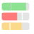
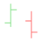
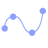
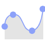
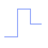

# Visualization Tutorials

Within this section, you will find basic, step-by-step tutorials for the
Analytics visualizations. All sections use the Data Visualizations data
source, which you can download using [this link](https://download.infragistics.com/slingshot/samples/Slingshot_Visualization_Tutorials.xlsx).
For specific information on what each visualization supports, visit the [Data Visualizations](~/docs/analytics/data-visualizations/overview.md) section of the documentation.

<table>
<colgroup>
<col style="width: 20%" />
<col style="width: 20%" />
<col style="width: 20%" />
<col style="width: 20%" />
<col style="width: 20%" />
</colgroup>
<tbody>
<tr class="odd">
<td>
 

<a href="simple-charts.md">Area</a> 

</td>
<td>
 

<a href="simple-charts.md">Bar</a> 

</td>
<td>
 

<a href="gauge-charts.md#creating-a-bullet-graph">Bullet Graph</a> 

</td>
<td>
 

<a href="candlestick-chart.md">Candlestick</a> 

</td>
<td>
 

<a href="gauge-charts.md#creating-a-circular-gauge">Circular</a> 

</td>
</tr>
<tr class="even">
<td>
 

<a href="simple-charts.md">Column</a> 

</td>
<td>
 

<a href="simple-charts.md">Doughnut</a> 

</td>
<td>
 

<a href="simple-charts.md">Funnel</a> 

</td>
<td>
 

<a href="image-chart.md">Image</a> 

</td>
<td>
 

<a href="kpi-gauge.md">KPI</a> 

</td>
</tr>
<tr class="odd">
<td>
 

<a href="simple-charts.md">Line</a> 

</td>
<td>
 

<a href="gauge-charts.md#creating-a-linear-gauge">Linear</a> 

</td>
<td>
 

<a href="ohlc-chart.md">OHLC</a> 

</td>
<td>
 

<a href="simple-charts.md">Pie</a> 

</td>
<td>
 

<a href="simple-charts.md">Radial</a> 

</td>
</tr>
<tr class="even">
<td>
 

<a href="sparkline-charts.md">Sparkline</a> 

</td>
<td>
 

<a href="simple-charts.md">Spline</a> 

</td>
<td>
 

<a href="simple-charts.md">Spline with Area</a> 

</td>
<td>
 

<a href="stacked-charts.md">Stacked Area</a> 

</td>
<td>
 

<a href="stacked-charts.md">Stacked Bar</a> 

</td>
</tr>
<tr class="odd">
<td>
 

<a href="stacked-charts.md">Stacked Column</a> 

</td>
<td>
 

<a href="simple-charts.md">Step Area</a> 

</td>
<td>
 

<a href="simple-charts.md">Step Line</a> 

</td>
<td>
 

<a href="gauge-charts#creating-a-text-gauge.md">Text</a> 

</td>
<td>
 

<a href="text-view.md">Text View</a> 

</td>
</tr>
</tbody>
</table>
