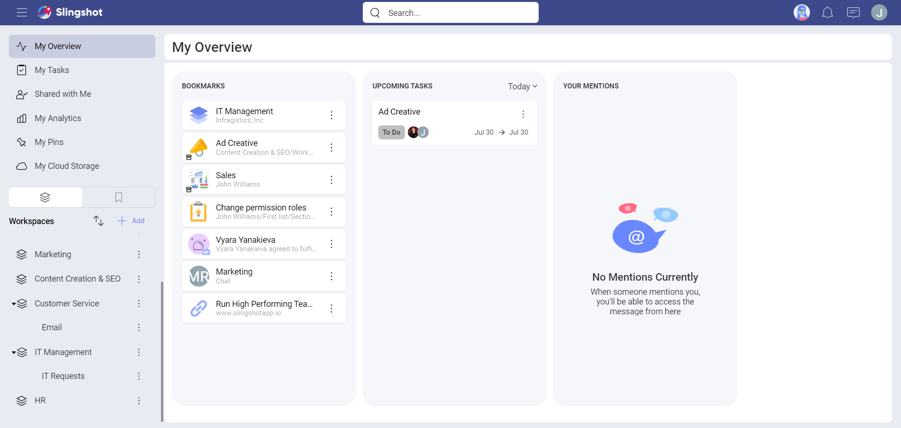
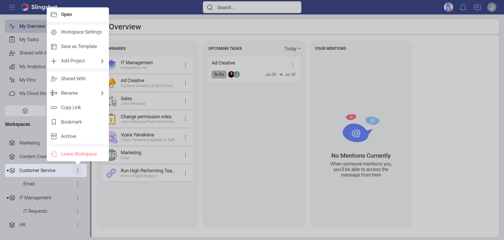
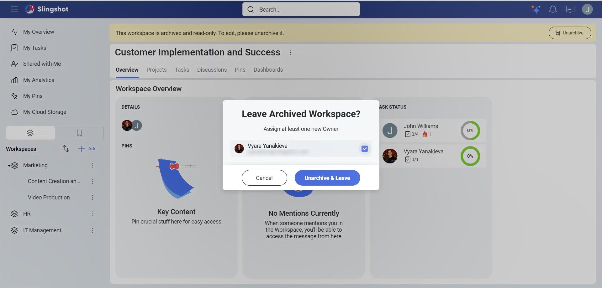
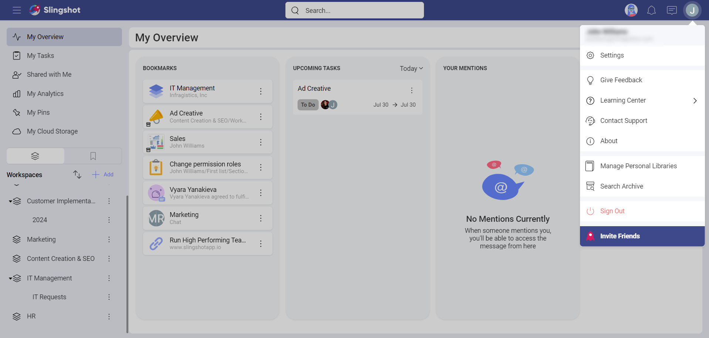
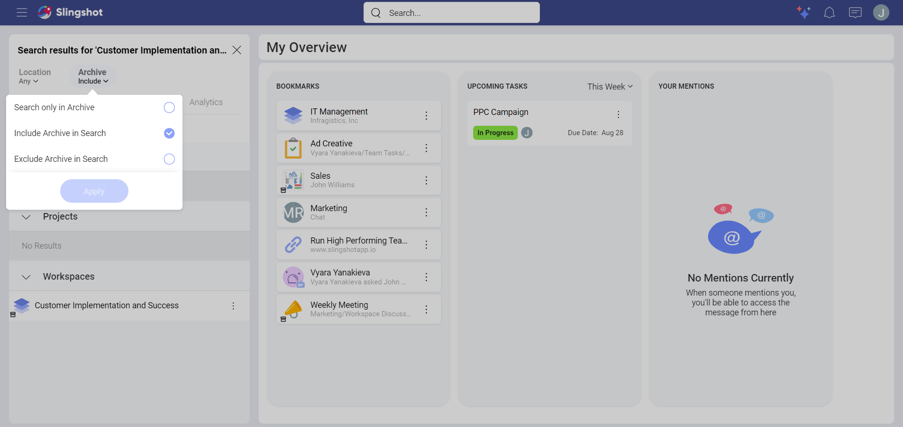
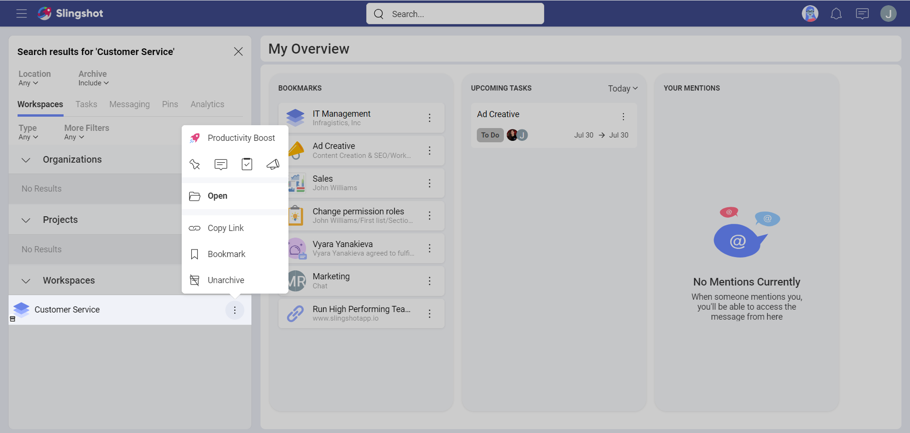
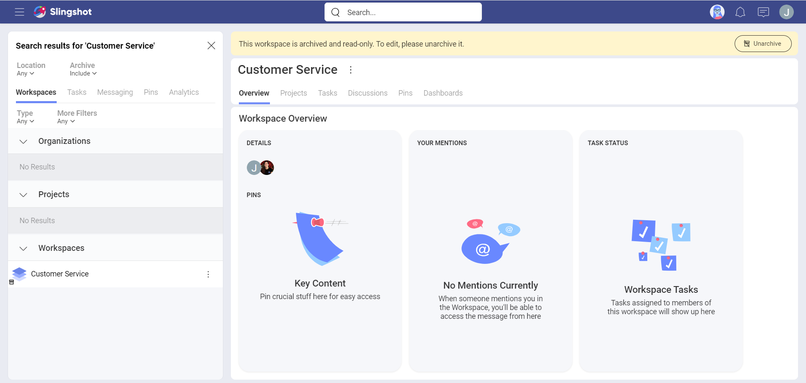
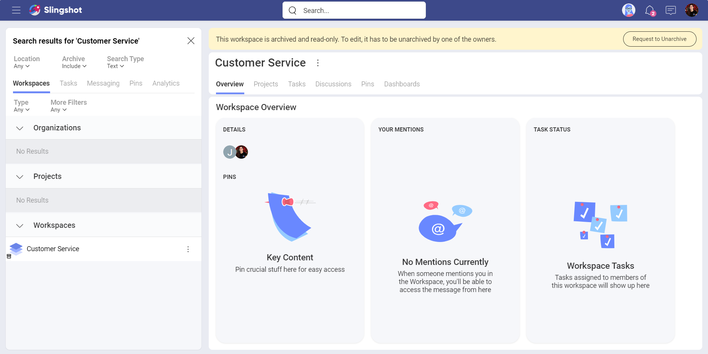
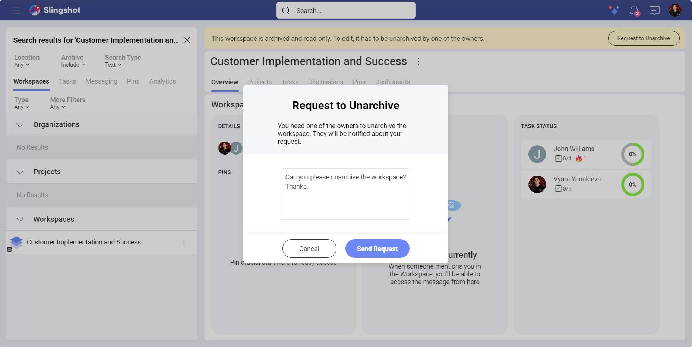

# Archives

With Archive, users with a paid subscription for Slingshot can hide different items from their view in order to keep their Slingshot organized and clean. 

## What can I archive?

You can archive workspaces, projects, lists, discussions, data sources and dashboards.

>[!Note] The organization's data catalog lists cannot be archived.

## How can I archive different items?

1.	Open the overflow menu next to the item you would like to archive.

2.	Click/tap on **Archive**. 

    

>[!Note] Archived workspaces cannot be edited. If you want to make changes, such as leaving a workspace as an owner, you need to unarchive it first, assign a new owner and then leave it.

## How can I find archived items?

In order to find an archived item, you can:

1.	Click/tap on **Search Archive** in your profile settings in order to open the search bar. Alternatively, you can directly start typing in the name of the item in the search bar.

    

2.	Choose to include *Archive* in your search or to search only for archived items. Note that, by default, the search results will exclude archived items.

    

## How can I unarchive different items? 

The steps for unarchiving an item are similar to the ones mentioned above.

To unarchive an item, you can:

1.	Enter the name of the archived item in the search bar.

2.	Choose to include *Archive* in your search or to search only for archived items.

    

3.	Click/tap on **Unarchive** from the overflow menu next to the item you would like to unarchive. 

    

Alternatively, you can click/tap on **Unarchive** in the banner.

## Who can archive? 

|Item| Workspace Owner| Contributor| Viewer|
-----|---|----|----|
|Workspace| :white_check_mark: | :x: | :x:|
|Project| :white_check_mark: | :x: | :x:|
|Workspace Discussion| :white_check_mark:| :x: | :x:  |
|Workspace Data Sources| :white_check_mark:| :x: | :x: |
|Workspace Lists| :white_check_mark: | :x: | :x: |
|Workspace Dashboards| :white_check_mark: | :x: | :x: |

|Item|Project Owner|Contributor|Viewer|
-----|---|----|----|
|Workspace| :x: | :x: | :x: |
|Project| :white_check_mark: | :x: | :x: |
|Project Discussion| :white_check_mark:| :x:| :x: |
|Project Data Sources| :white_check_mark:| :x: | :x: |
|Project Lists| :white_check_mark: | :x: | :x: |
|Project Dashboards| :white_check_mark: | :x: | :x: |

*Contributors* and *viewers* can request access from the owner of the item with the following steps:

1.	Open the archived item.

2.	Click/tap on **Request to Unarchive** in the banner. 

    

3. You will be presented with a dialog where you can leave a message for the owner. When you are ready, click/tap on **Send Request**.

   

4. The owner will get a notification. They can open it in order to unarchive the item.
