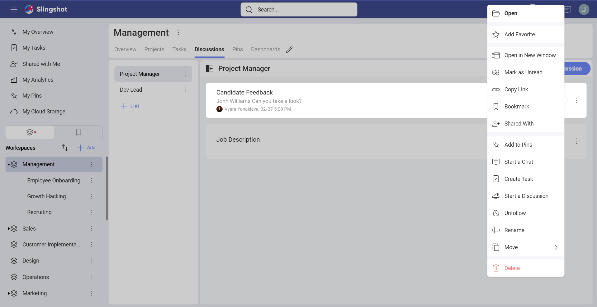
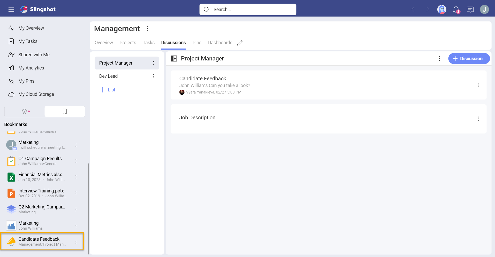
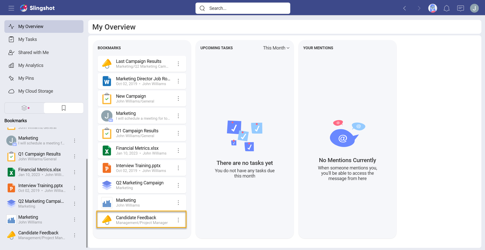
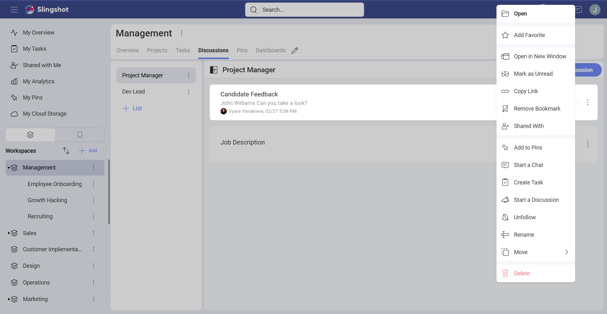

# Bookmarks

In our data-driven world we are constantly dealing with information. Our team members and friends share with us different types of content – from URLs and images to dashboards and data sources. It can get hard keeping track on all the information.

To save time and have the content that is important to you organized, you can quickly bookmark it with just a few steps.

## How can I use bookmarks?

1.	Open the overflow menu next to the content you would like to bookmark.

2.	From the provided options choose **Bookmark**. 

3.	After you have added, for example, a discussion to your bookmarks, you can find it under the **Bookmarks** section on the left side panel, next to your workspaces and groups (*[Enterprise feature](./slingshot-enterprise-subscription.md))*.

Alternatively, you can click/tap on **My Overview** to access your bookmarks.

If you have bookmarked different things, you can drag and drop them manually to organize the list the way you want it to appear.

## What can I bookmark?

You can bookmark everything you want to have quick access to - from task, links, chat messages and discussions, to workspaces, projects, data sources and dashboards. Once the item that you have saved is under **Bookmarks**, you can take different actions directly from the overflow menu depending on the saved item.

## How can I remove an item from the bookmarks list?

You can remove a bookmarked item with the following steps:

1.	Open the **Bookmarks** section.

2.	Open the overflow menu.

3.	Choose **Remove Bookmark**.

Alternatively, you can open the item and click/tap on the overflow menu and then choose **Remove Bookmark**. 

