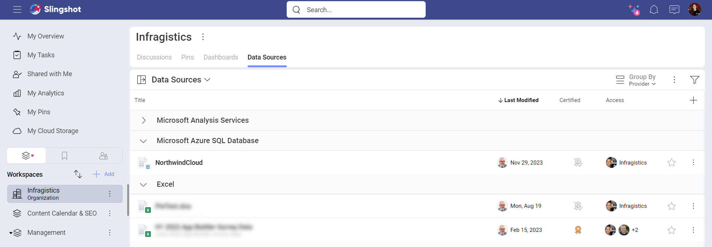
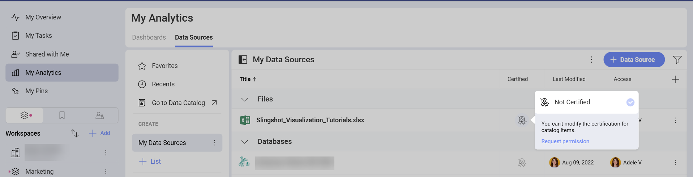

# Using Certifications

If you are part of an Organization in Slingshot, you may find that some of the data sources and dashboards in your lists are certified. Certifications help the Organization owners guide their users which data sources and dashboards are reliable and contain only verified information. 

Below, you will find how to recognize certified data sources and dashboards, what certification levels you can find, who can certify and how. 

## Who is This Topic for? 

Certification in *Analytics* is only available for users who have an   Organization in Slingshot. 

If you are a user with a personal account, you will not be able to use certificates for your data sources and dashboards. However, if you are invited in workspaces that are part of an Organization, you will be able to see certified data sources and dashboards in these workspaces' *Analytics*. 

## Finding Certified Data Sources or Dashboards

Among the data sources or dashboards of a workspace, you will find both certified and uncertified ones. When a data source or dashboard is certified, you will see a golden, silver or bronze colored badge next to it (see the screenshot below). 

If you don't see whether a data source or dashboard is certified or not, select the plus icon  at the right top of the list. Make sure the box for the *Certified* column is checked.  

## Who Can Certify?

Certification helps users find the data that is recommended and verified by their organization. That's why **certifiers** can be: 

*  Organization owners.
* Any user who is authorized by an Organization owner

To see who can certify data sources: 

1. Open the Organization workspace settings by selecting the three dots  next to it.
2. Select *Organization Settings*. 
3. Go to *Data Catalog*. 

Here you will find the three certification levels, their names and the users, who can certify.

If you are an *owner* in the Organization, you can: 

* Assign yourself as a certifier to any certification level.
* Add other users as certifiers - you can assign owners, members, viewers and even user outside of your Organization.
* Rename the certificates. By default, the certification levels are "*gold*", "*silver*" and "*bronze*". You can give them more descriptive names such as "Sales", "Marketing", "RND", etc.  

Users, who are not owners, can request permission to become certifiers. To do this: 

1. Go to the Data Sources list in any workspace or in your **My Analytics**.
2. Select the badge in the *Certified* column of any data source. 
3. Click/tap *Request Permission* (see the screenshot below).

    

4. An email will be sent to all Organization owners notifying them that the users asks to be authorized to certify data sources or dashboards. 

## The Certification Process

Each data source or dashboard can be certified individually in the workspace where it lives. To certify follow the steps below:

1. Go to the  workspace where you can find the data source or dashboard. 
2. Select the *Data Sources* or *Dashboards* tab. 
3. Click/tap the  badge icon for the data source or dashboard you want to certify and choose a badge from the dropdown menu. 

The certificates are hierarchical. This means that certifiers who are with  *Gold* will also see the  *Silver* and  *Bronze* badges available in the dropdown menu. And *Bronze* certifiers will only see the bronze badge available. 

>[!NOTE] Keep in mind that if two data source in two workspaces are named the same, the certifier has to certify them in each of the workspaces individually. The certificate will not be transferred automatically as the certifier has to first make sure they contain the same information.

## Moving and Copying Certified items

When you move a certified data source or dashboard from one workspace to another, the certificate will be kept in the destination workspace. 

When you copy a certified data source or dashboard from one workspace to another, the certificate will be lost. This gives you the opportunity to modify the data source or dashboard in the destination workspace. You can have it certified later if it still meets the certification criteria in your Organization.

## Defining the Certification Criteria

As the certification in *Analytics* is flexible, it is up to you to define your own certification criteria. You can decide what the Gold, Silver and Bronze badge mean to your Organization and even set new names for them. 

Keep in mind they are hierarchical as their names suggest and the hierarchy goes this way: *Gold* > *Silver* > *Bronze*.

>[!Tip] **Pro Tip!** Don't forget to write down the guidelines and distribute them among the users in your Organization! You can *pin* the Guidelines document to your Organization **Pins** section for more visibility. 

