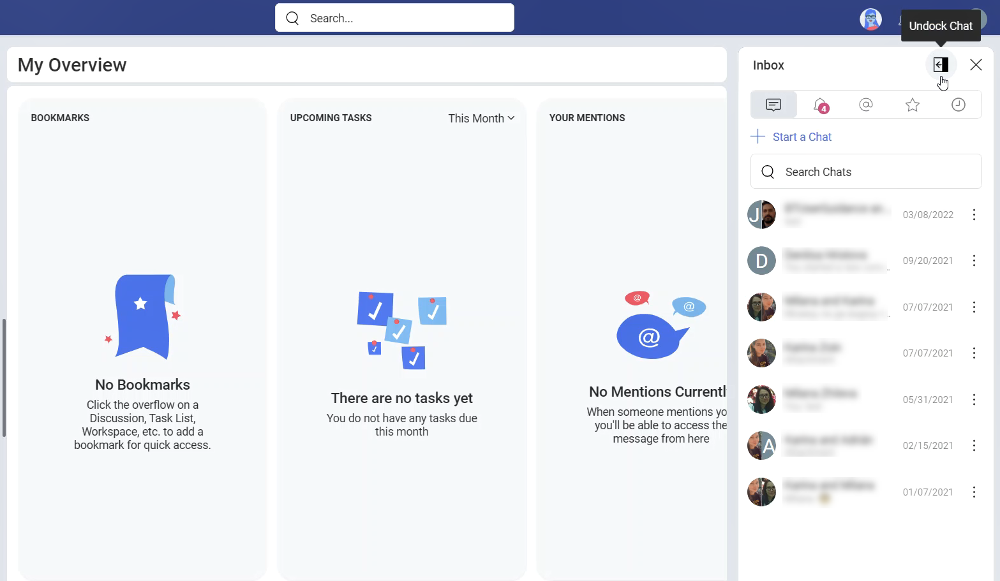
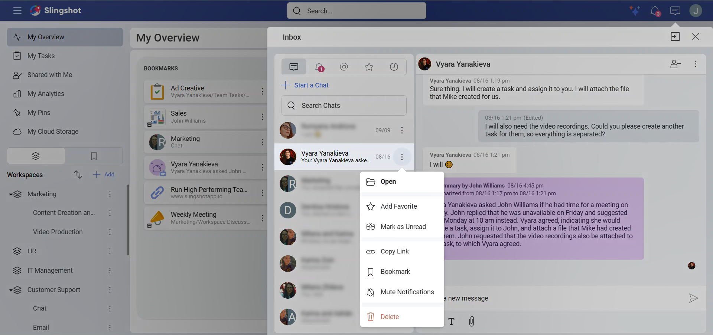
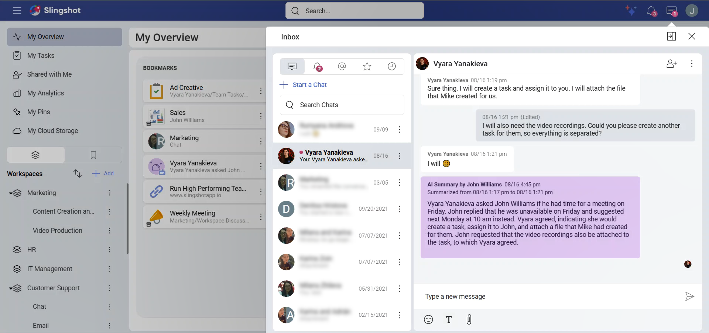
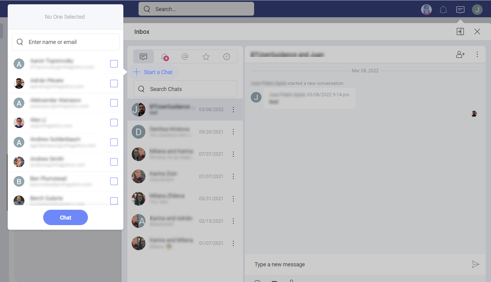
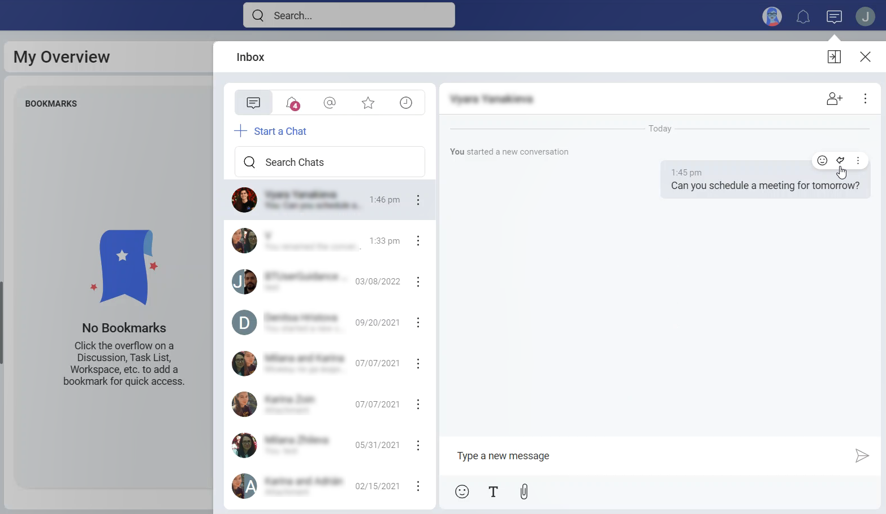
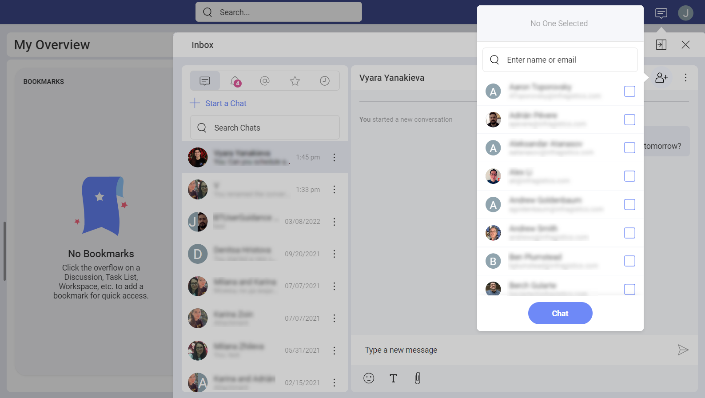
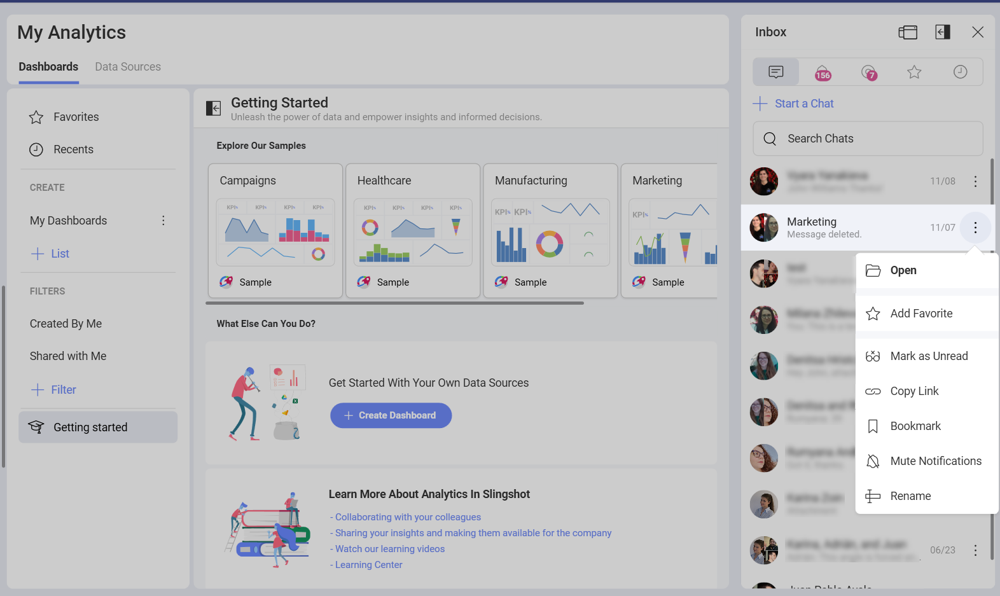
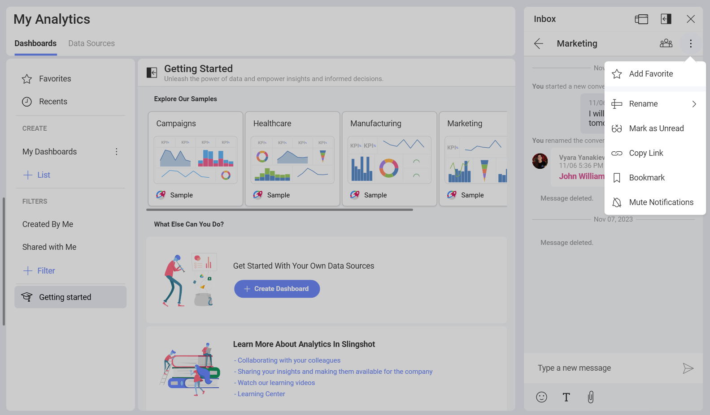
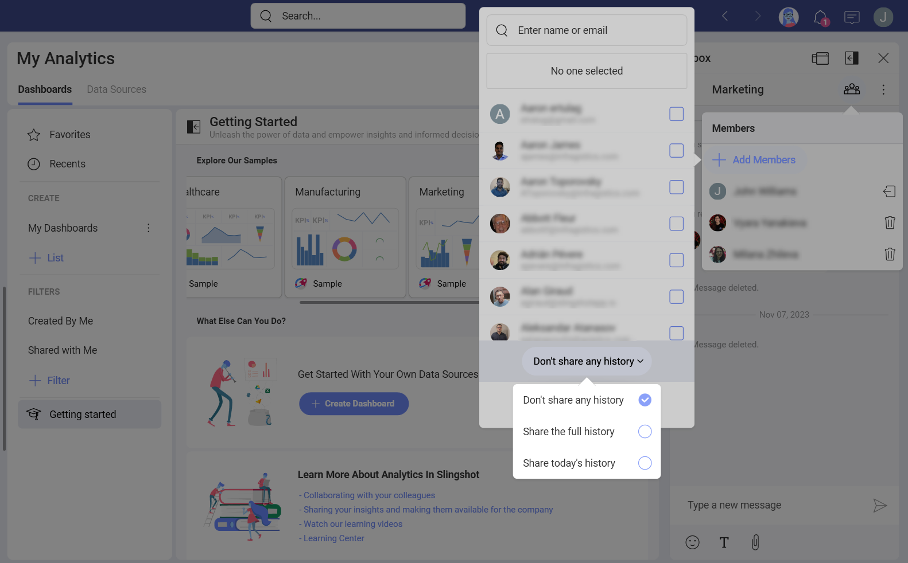

# Learn more about the Private Chat

Welcome! Read on to learn more about the private chat.

## Discussions vs Chat

In Slingshot, communication happens in discussions and private chats.

Each workspace and project can have its own *Discussions* tab. For more information, read [Discussions](discussions-faq.md). 

Unlike discussions, the private chat is workspace and project independent. This means you can chat with any Slingshot user or group of users. You can chat with users who are part of your Organization and users who are not. Learn below how to [chat with personal account users](#how-to-start-a-chat-with-users-with-personal-accounts). And, unlike discussions, your chats are *private* and can be accessed only by you and the users you are chatting with. 

## How Can I Access my Chat?

In the top bar, right next to your profile picture, you will see the **chat message icon**. Click/tap the icon to open the chat screen. 

## How Can I Keep the Chat Always Visible?

In Slingshot, you can keep your chat hidden or opened on the right while going through your tasks, for example. 
To switch from hidden to always opened and vice versa, select the *dock/undock* icon next to *Close* (see screenshot below).

When the chat is *docked*, you will always see it on the right. In this mode, you can see either the last chat room opened or the list of ongoing chats. 

## How can I mark a chat as *unread*?

In order to remind yourself that you need to respond in a chat, you can mark that chat as *unread*. You can do this by opening the overflow menu and choosing **Mark as unread**.

Once you have marked a chat as *unread*, it will show up in your notifications. A red dot will appear next to the chat indicating that it is *unread*.

You can always mark that chat as read when you open the overflow menu next to the chat and choose **Mark as Read**. Once you have opened a chat, it will be marked as *read*.

## How Can I Start a Private Chat?

To start a chat, open the chat screen. Then follow the steps below:

1. Click/tap on the **+ Start a Chat** blue button. 

2. Select a user from the list or type a name or email in the *search* box on top.

3. Click/tap on **Chat**. 

>[!NOTE] If you don't see the *Start a chat* button, check whether your chat is [docked](#how-can-i-keep-the-chat-always-visible). In this case, select the **undock** icon next to *Close*.

Keep in mind that you can also reply to your own messages or messages from other people by clicking/tapping on the reply arrow. It will show up when you hover over a message.

>[!NOTE] Reply threading is not supported.

## How Can I Start a Group Chat?

Starting a group chat is similar to [starting a private chat](#how-can-i-start-a-private-chat). The only difference is that you choose two or more people to create the group chat. Alternatively, you can use an existing Slingshot group and search it by name.

You can add more users to any ongoing chat (private or group) by opening it and selecting the *+ member* icon on top right (as shown below). 

>[!NOTE] If you create a new group chat by adding more people to a private chat, don't worry! The group chat will be opened in another chat room. Your private chat will be kept separately as well.

## Can I Rename a Chat?

You can rename your group chats to better differentiate between group chats with (almost) the same users. You will find the *rename* option in the *overflow* menu of a group chat (see below).

## How can I manage members in a Group Chat? 

You can manage the members of a group chat by selecting the *group* icon on top of your chat room. 

You will see the chat members in a dropdown. Use the *trash* icon next to their names if you want to remove somebody. Every participant in a group chat can remove other members from the chat. Removed members will continue seeing the history of the chat but they will not have access to new messages. 

Next to your name you will find the *leave* icon. You can leave a chat anytime. 

## Can I Make the History of a Group Chat Available for New Members?

When you are adding members to an ongoing group chat, you may want them to have access to part or the whole history of the chat. 

When adding members, you will notice a **History** setting at the bottom of the users list (see the screenshot below). 

The following 3 options appear in the dropdown when collapsed: 

- *Don't share any history*

- *Share the full history*

- *Share today's history*

*Invite with No Previous History* is the default history setting for new chat participants. You can use the other two history options to welcome new chat members and quickly introduce them to the topic!

When finished, select the **Add to Chat** blue button. 

## How can I start a chat with users with personal accounts?

All Slingshot users can take part in private and group chats, including the personal account users. 
However, [personal account users](roles-permissions-faq.html#what-about-users-with-no-organization) are not part of an Organization. That's why, after selecting **+ Start a Chat...**, if you have an Org, you will not see their names in the list of users. The list contains only your Organization members. You can chat with personal account users only if you add their emails manually in the search box.

Of course, if you don't have an Organization, then you will have to add all users you want to chat with like this.

## Leaving vs Muting a Chat

Once you lose interest, you can leave or mute a chat in Slingshot.  

**Leaving** a chat is an option for group chats only. Each member can leave a group chat when they decide they no longer need to participate in the conversation. The members, who left, cannot receive new messages anymore, but they still have access to the chat history. To leave a group chat, click/tap it to **open** ⇒ **Members icon on top** ⇒ **leave icon** next to your name.

Normally, the chat icon on top shows the total number of unread chat messages. When you **mute** a private or group chat, its new messages are no longer added to that count. This is the option for you if you do not want to follow the conversation anymore, but you still want to have access to it. 
To mute a chat, click on its **overflow menu** ⇒ **Mute Notifications**. 

## How Can I Share a File in the Chat?

In the Slingshot chat, you can share files from your device, cloud storage, or even from a workspace where these files are pinned.  

Select the paperclip icon to attach the file to your message. 
  
Slingshot does not store your files. When you share a file from your device, it will first be uploaded to your personal cloud storage (*OneDrive*, for example) and not to Slingshot directly. Then, to share it with others, Slingshot will just link to its location in your cloud storage.

## Sharing a File Pinned to a Workspace or Project

What about files that are pinned to a workspace or project? Sometimes you need to share these files with people who are not part of the workspace or project. Slingshot allows you to do this, by sending a link in the chat or by starting a chat directly from a pinned file. To do this, navigate to the file and open its overflow menu and start a chat.

Having said that, keep in mind that your workspace or project may include files with sensitive information. That's why when pinning a file to a workspace/project its owner can restrict the access by choosing different file permissions. 

Depending on the file permissions, there are two scenarios when you try to share a file in the chat. 

1. When the owner of the file has set **Request Access** permissions, this means they would like to fully control the access to the file. You can still share it with another user in the chat, but they will need to ask the owner of the file for permissions the first time they open it. 

2. When the owner has set **Automatic Access** or **All Can Access**, you can share the file in the chat and the other user can open it freely.