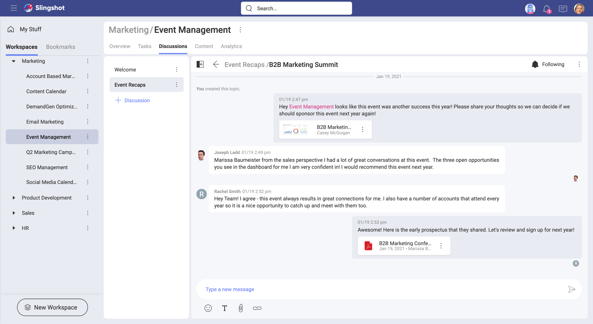
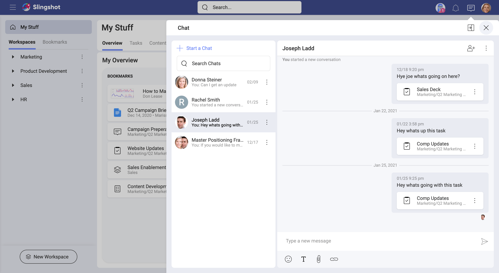

# Communication

While collaborating in teams or projects, people from different workspaces or even from outside the organization work together. Communication here is crucial to get things done in a productive way. Slingshot's approach with discussions and private chats was designed with all this in mind.

## What is a Slingshot Discussion?

It's a way of communication used by members of an organization, a workspace, or a project. Being organized in different threads, discussions ensure all your communication, and collaboration tools are in one place, making remote teams stay productive no matter where they are.

You can have multiple discussions going on at the same time while mixing in text formatting, attachments, emojis, and links. Plus you can react to conversations and even create [tasks](https://www.slingshotapp.io/en/help/docs/tasks) from messages.

## Lists of Discussions

Discussions are organized in different lists, ensuring side conversations are under control. The main discussion remains healthy and does not lose focus, as there is a place for every conversation.

Unlike lengthy email chains, members can follow or unfollow discussions. This is tied to notifications, as you get informed when someone sends a message to a discussion you follow.

## What is Slingshot's Chat? 

Your *[Chat](https://www.slingshotapp.io/en/help/docs/chat-faq)* is also a tool for communication, but unlike *[Discussions](https://www.slingshotapp.io/en/help/docs/discussions-faq)* it's not tied to any workspace or project. This means you can use it to chat with any Slingshot user, and even with users with personal accounts who are not part of your Organization.

## Chat from Multiple Devices

Slingshot delivers a seamless, almost identical experience no matter what device you are on. You can use a web browser or get native applications on iOS, Android, and Desktop.

Chat with one or multiple members, removing or adding members on demand. When writing your messages, you can copy, edit, or delete any message. And you can also express yourself by using emoticons and reactions. Finally, your chats support basic text formatting (bold, italic, underline, and strikethrough) plus the inclusion of attachments from your cloud storage providers.

## Getting notifications

With Slingshot notifications, you can get informed when someone sent a message to you or you are mentioned "@" in a discussion thread you're following. You can check the current *[Notification](https://www.slingshotapp.io/en/help/docs/notifications)* settings for messaging and tweak them as needed.  
