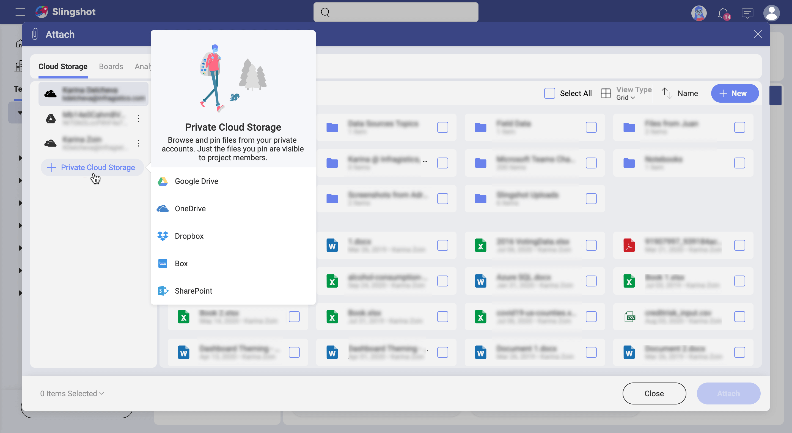
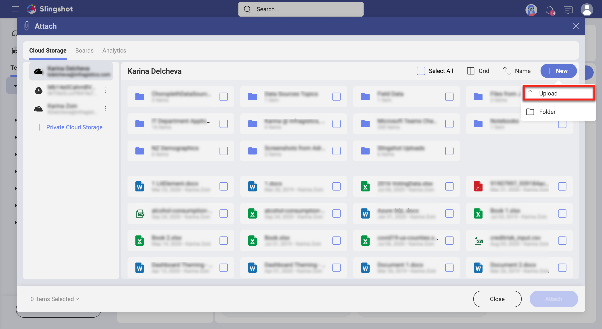
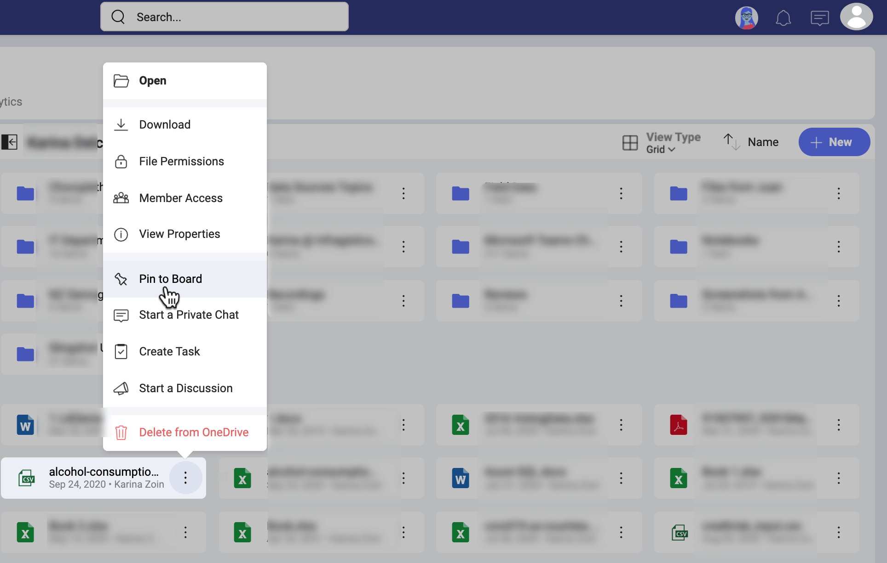
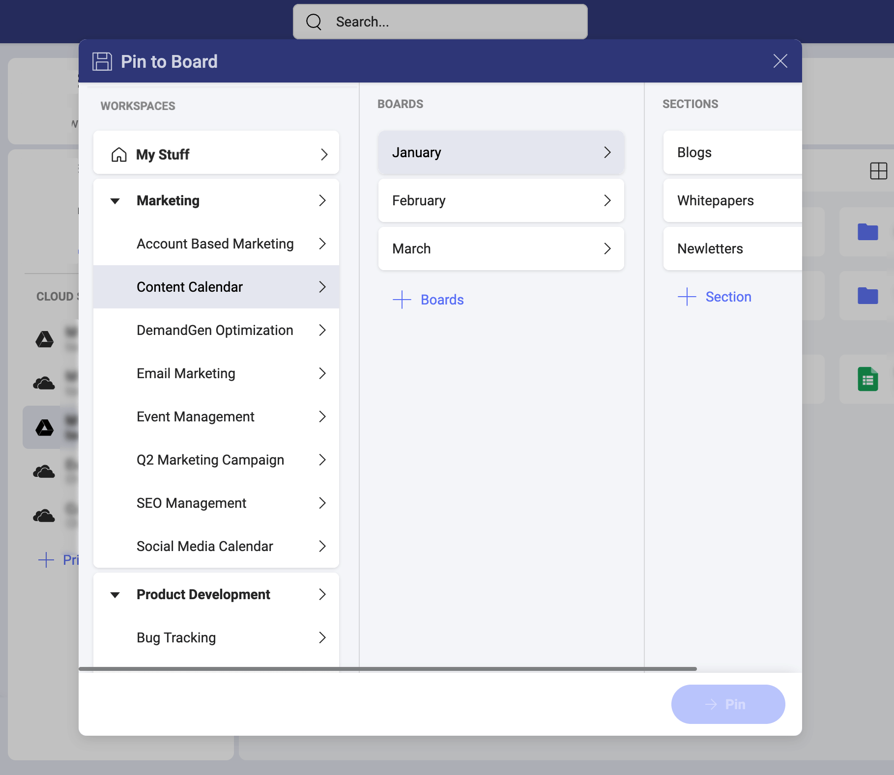

## Content & Boards

Content is really a broad term, but related to IT, is always about information made available by a digital or electronic medium.  The content that is relevant to you might be stored in different locations and, in today's digital world, probably in different cloud storages. Slingshot lets you access that content, share it, and organize it in boards.

Scrum boards and Kanban boards are well-known IT concepts that are both related to project management. Going for a broader concept, boards can also be just containers that help organize and manage content. That is the case of Slingshot, boards were created so you can have a place to organize your content.

### So, what's content within Slingshot?

Content refers to:

* files,
* *Analytics* dashboards, and 
* URLs

made available to you in the _Content_ tab. You will find a *Content* tab in _My Stuff_, each of your *Workspaces*, and in the *Organization* space. You can add content from your device or cloud storage.

### What are boards within Slingshot? 

Boards are basically containers, rich and flexible containers designed to organize, manage, and share your content. 
So, when you need to organize or share content from your cloud storages or device, just pin that content to a board, and later organize or share that board.

### Working with your content in Slingshot

Pinning content is how you make your content available in Slingshot. You just go to a board and choose _Pin_. 

As you can see below, your board is divided into sections (_My First Section_, _Section 2_ in the image), where your content is actually pinned. Sections are the most basic element used to organize content on your boards. 

To pin a file from your device, choose _Upload File_. 

If you select _Content_, you can pin: 

* files from your cloud storage,
* files that are already pinned to other boards in Slingshot, or 
* dashboards from Analytics.

If you choose to pin content from cloud storage, a dialog is shown where you can select existing cloud storage or add a new one.

Then, just choose the file or folder you want to pin to the board. Yes, you can pin either files or folders, plus you can even upload files from your device to the cloud storage on the fly (see below) and pin them.  

Alternatively, you can go to existing cloud storage in _My Stuff_  and choose _Pin to Board_ as shown below.

After choosing an option, you'll be prompted to select where to pin the file. 

Finally, you often will be editing your files. Depending on the platform, you may use different applications as Slingshot relies on invoking 3rd party applications to do the job.  
In addition, you can always download the file to your computer or device.

### Want to know more about Content & Boards?

Continue [here](content-faq.md)!
