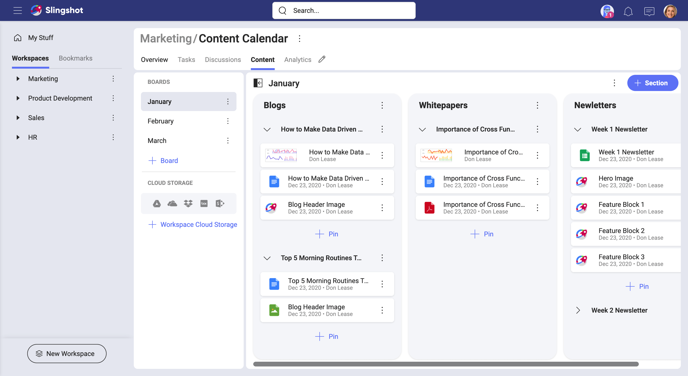
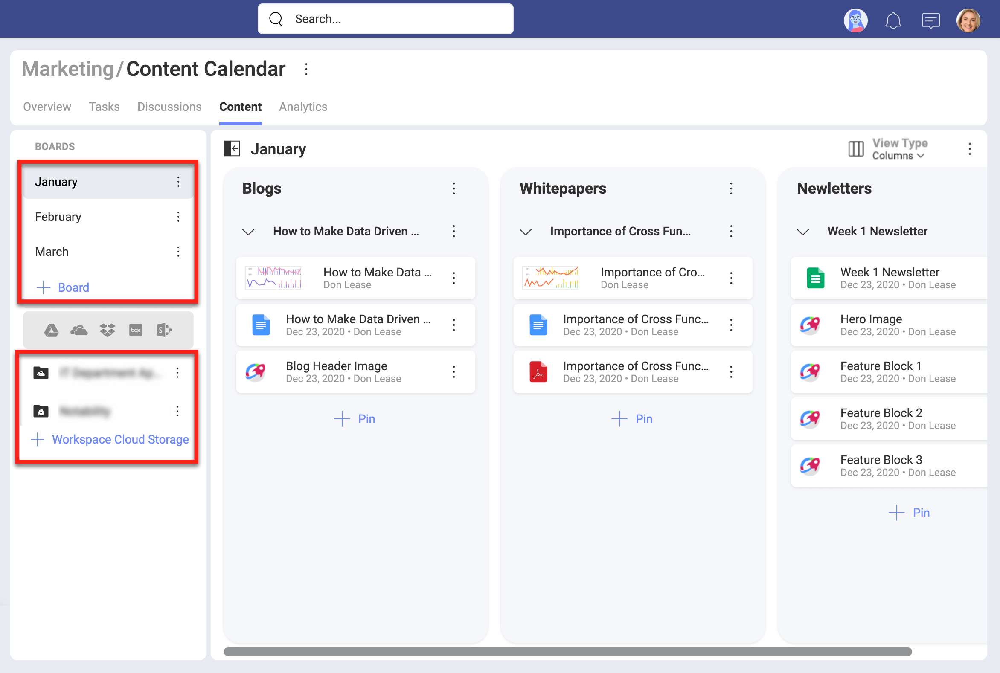
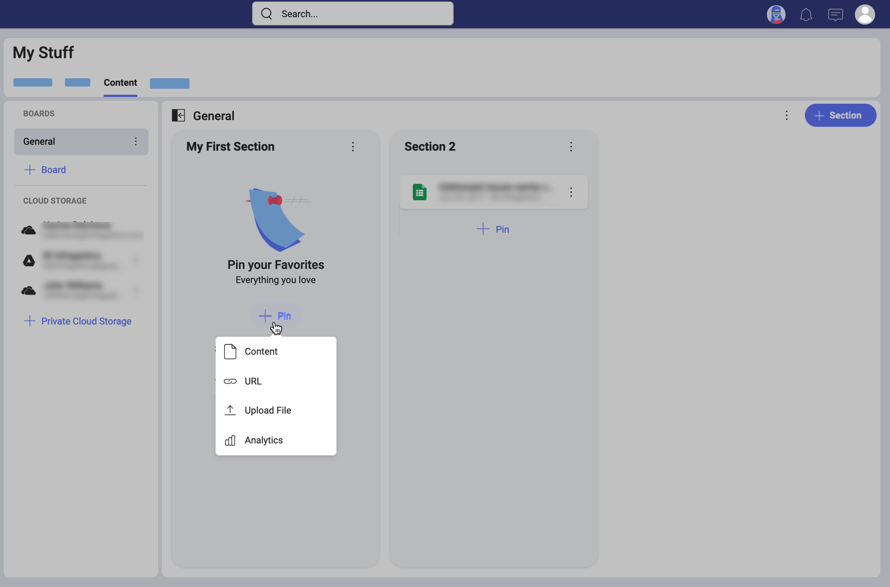
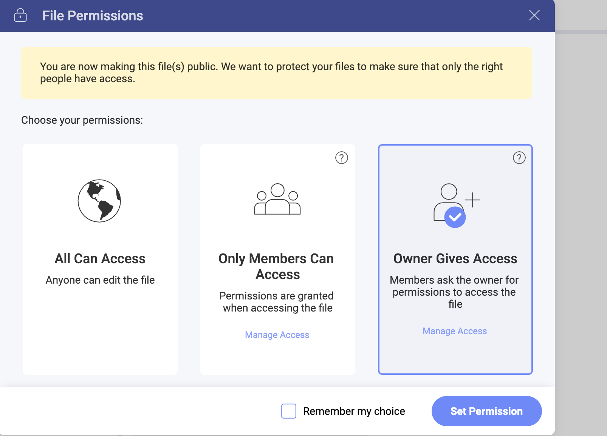
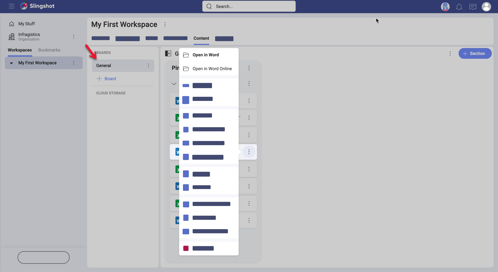
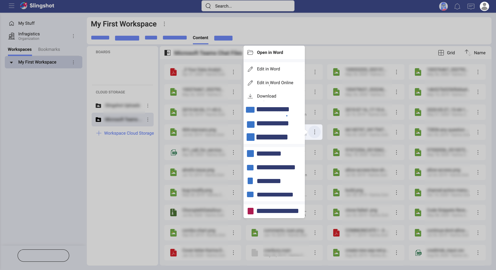
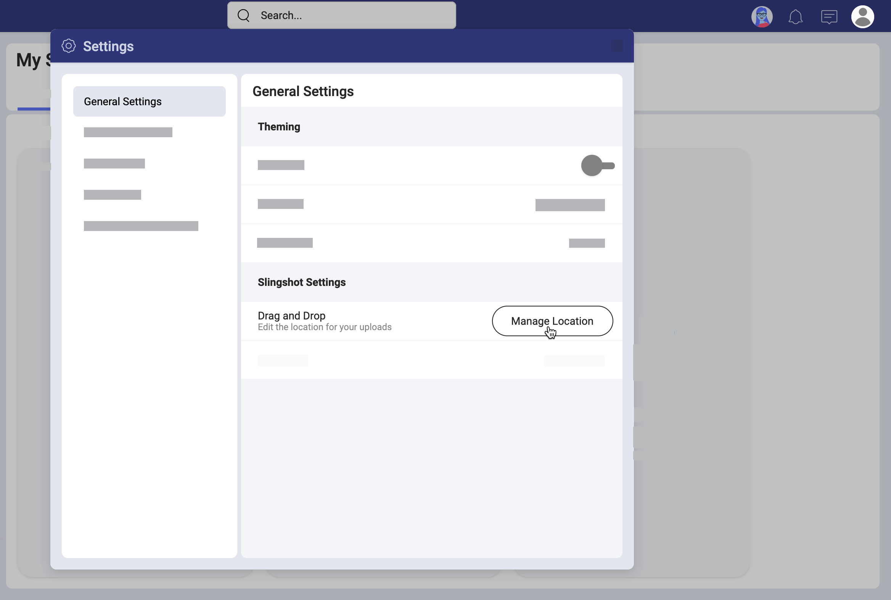

# Learn more about Content & Boards

Welcome! Read on to get answers to your questions about content and boards.

## Personal vs shared boards/cloud storages

Connections to cloud storages get you access to your content within Slingshot and boards help you organize and share it with others.
You can configure both personal and workspace boards and cloud storages, but they are meant to be used in different scenarios.

Only you have access to personal cloud storages and boards, creating and removing them whenever you want. Personal cloud storages and boards are both found in your personal space (**My Stuff**), in the _Content_ tab.  
That being said, you can share personal content with others if you want. When you pin content from a personal cloud storage to a workspace shared board, that specific content becomes available for everyone in the workspace.

All the members of a workspace have access to workspace cloud storages and boards. These shared connections and boards are in the _Content_ tab of that workspace.  And everyone within the workspace can manage the connection or pin content to any board whenever they want.

### Boards vs sections

If boards are just containers, then what are sections? Below you can see an examples of a board with sections.

As shown above, **sections** are designed to help organize boards. Sections are simply divisions of a board. You actually pin your content to sections. Boards can have one or more sections and you can scroll through them by clicking & dragging (laptop or PC) or using the swipe gesture (mobile devices).

Boards, and sections can be reorganized, and moved if needed. Some content boards and sections that you create will be more important than others, so make sure to prioritize those and move them around or on the top of a list by simply drag and drop.

### How can I access my boards/cloud storages?

You can access your boards and cloud storages by going to a workspace and looking for the **Content** tab on top. In the _Content_ tab you can find both boards and cloud storages (see the screenshot below). 

If you bookmark one of the boards to keep it at hand, you can also find it in your Personal Overview.  
Follow the links for further details about [overviews](overviews.md).

## Which cloud storages can I connect?

In Slingshot, you can add new connections to the following cloud storage providers:
- Google Drive
- OneDrive
- Dropbox
- Box
- SharePoint

> [!NOTE]
> When you add a new connection to **_SharePoint_**, you can choose between adding the root site or a specific sub site. You can also add a sub site later - search for this option in the overflow menu of your SharePoint connection.

## Which types of files are supported?

In Slingshot, file types are represented using different icons. The most common are:

|**ICON**|**FILE TYPE**|**ICON**|**FILE TYPE**|
|---|---|---|---|
|| Microsoft Word file|| Google Doc file|
|| Microsoft Excel file|| Google Sheet file|
|| Microsoft PowerPoint file||Image file|
||Adobe PDF file|| Video file|
|| Web link|| ZIP file|

## How to share files?

With Slingshot you can access files from different cloud storages, organize it in boards and also share those files with others.

To share files, basically you just pin the content you want to share to a board, discussion, or overview. This way the content will be available for others.  

Normally you'll use boards to share files, but if you are working within a workspace, you can pin relevant content to the overview. This will increase the visibility of that specific file. Additionally, you can also pin a file to a discussion to collaborate over it temporarily.

## How to set file permissions?

When you share files inside workspaces, you make these files available for the users inside the workspace. 
File permissions are meant to give the file owner control over who can access their files. Each time you pin a file, Slingshot will ask you what type of permission you want to set. You will see a dialog that looks like this: 

Here, you can choose between the following three permission types:

 - **All Can Access** - all Slingshot users can access the file.
 - **Automatic Access** - all users in the workspace can access the file.
 - **Request Access** -  all users, including the users in the workspace have to request access from the owner.

> [!NOTE] Giving access to a file in Slingshot means you give view and edit permissions to the file. 

Learn more about each file permissions type and how to manage members' access in [this topic](file-permissions-faq.md). 

## How to open files?

Opening a file in Slingshot is as easy as clicking/tapping on it. 

For MS Office files you can choose where to open them. They can be opened online or in the associated MS Office application on your device. To set the default application that will open your files, go to:

*your profile* > *Settings* > *General Settings* > *Open Files*

Then, in the dropdown choose between: 
* **Native app** - the file opens in the application on your device - MS Word for example;
*  **Online** - the file opens in the web application - MS Word, Excel, and PowerPoint Online. 

Files in personal and workspace cloud storages will be opened with the default application. However, for files that are pinned on a board in *Content*, you can always choose from their menu which application to use to open them (see the screenshot below). 

## How to edit files?

Depending on the platform you're on, you can use different applications to edit your files. As Slingshot relies on invoking 3rd party applications to do the job, it's entirely up to you.

In any case, you can always download the file to your computer or device.

### How to get quick access to content?

Sometimes you came across relevant content that you really want to keep at hand. In those cases, you can pin the file to a private board in your personal space (My Stuff).

### How to use drag & drop to quickly pin files?
By using the drag and drop gesture, you can quickly add files or links from an external source into Slingshot's boards.  
You actually pin content to sections. After all, boards are just containers that rely on sections to organize and divide content.

After adding a file to the board's section, Slingshot will prompt you to choose a cloud storage to upload the file to. You only need to do this once, though. Slingshot will create the _Slingshot Uploads_ folder in the selected cloud storage. All future drag and drop uploads will be added there.

You can change where drag & drop files are uploaded in _General Settings_ > _Manage Location_, as shown below:

### Can I rearrange boards and sections?

You can reorganize, and move around boards, sections, and pins if needed. This is very important as it makes it easy for you to focus on your work, not planning ahead which sections or boards you need. You will find the *Move* option of a board, section or pin by selecting the three dots menu  next to it. 

You can move boards, sections and pins between the sub-workspaces of the same parent workspace. You can also move boards from a [parent workspace](workspaces.html#using-workspaces-within-the-workspace) to a sub-workspace, and vice versa. 

#### Rearranging sections

Sections can be moved to improve your content arrangement after you have created your boards elements. The move option allows you to relocate the selected element to another board. You can move pins and sections only between the boards of connected workspaces - a main workspace and its sub-workspaces.

### Can I change how boards are displayed? 

By default your boards are displayed as columns. This view gives you more information about the pins you have with one look. The other view type available is *List*. The *List* view highlights sections and is ideal when you have to maintain boards with a lot of sections. 

To switch from *Column* to *List* view, navigate to a board, and click/tap the  View Type button located on top right of the columns. Select *List*. Your view is changed right away. 