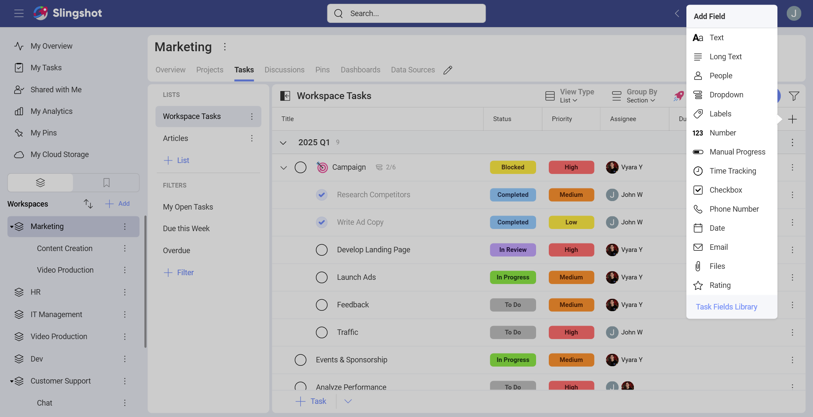
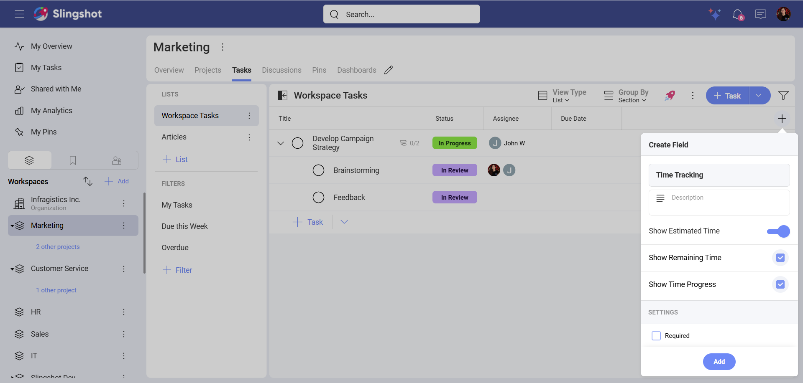
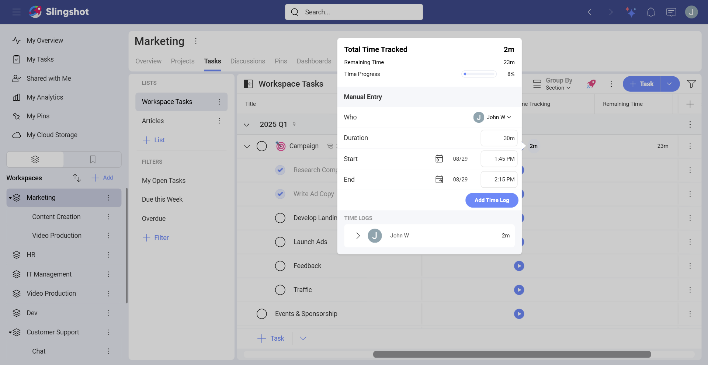
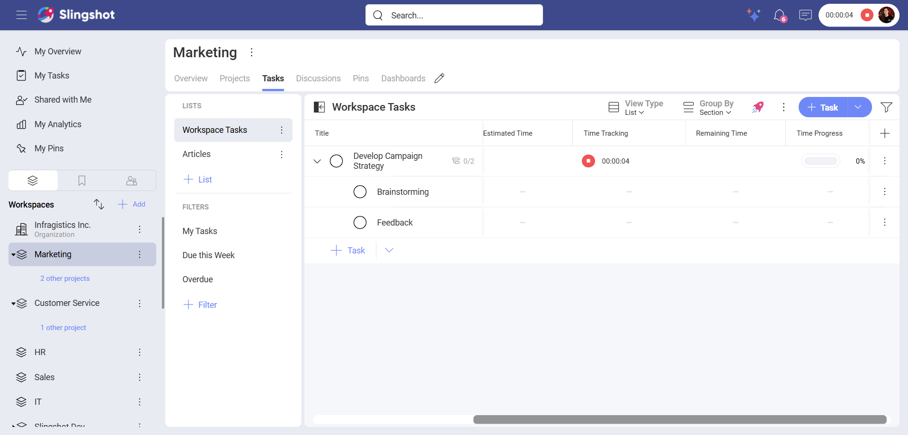
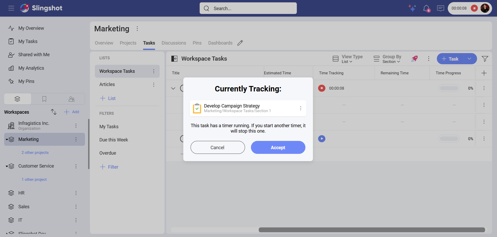
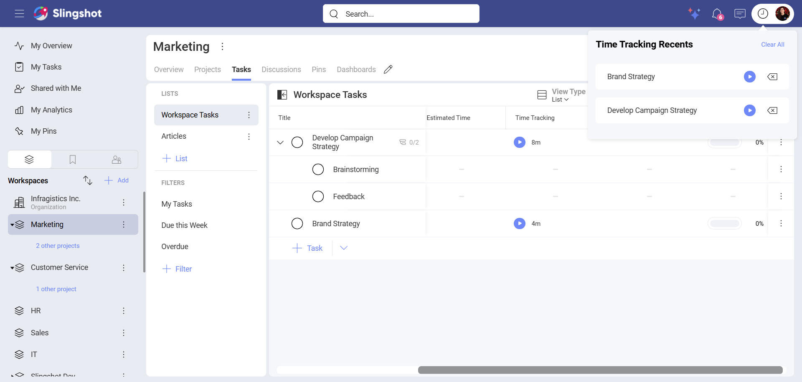
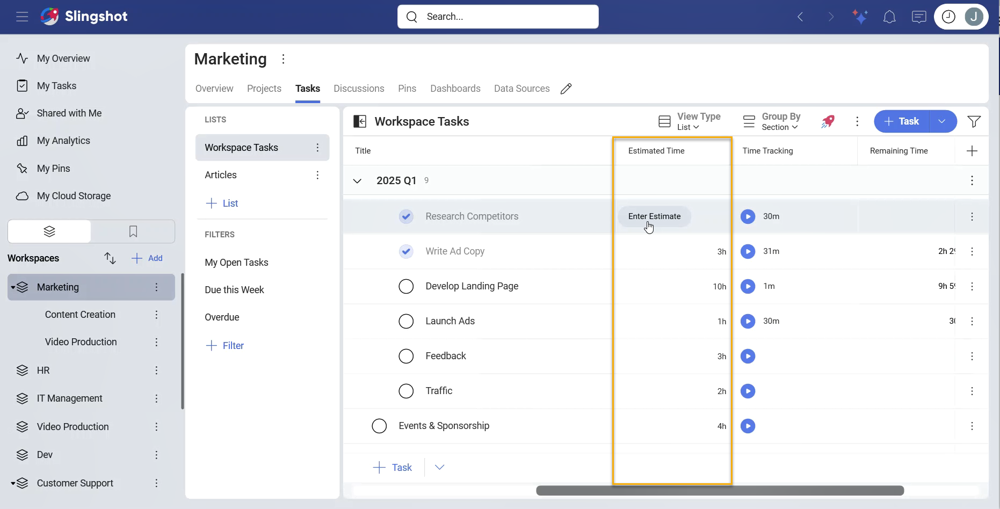
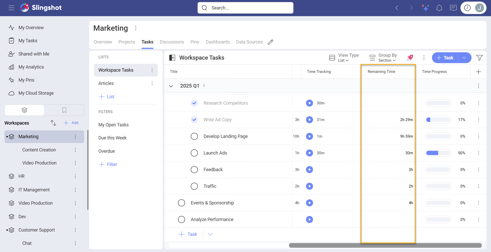
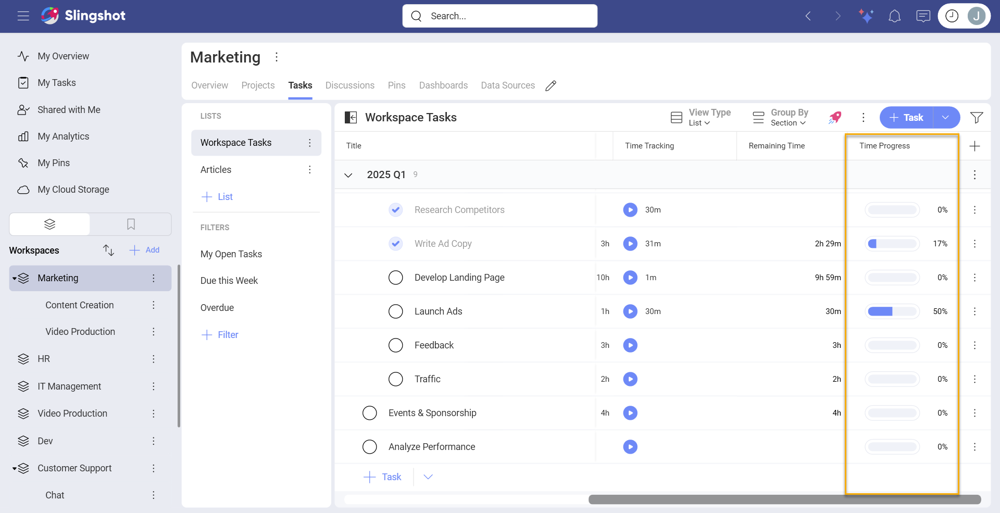

# Types of Custom Fields

We are constantly expanding the list of custom fields. Below you will find all the custom fields that are currently available in Slingshot. 

## List of Custom Field Types

| ***Type*** | ***Description*** | ***Use Case*** |
| ---- | ----------- | -------- |
| ***Text*** | It can be used in tasks where users want to add brief additional information. There is a limit of 255 characters. | Your customer support team needs a field for escalations. You can create a text field called **Escalations** so your team members can provide information, such as if the case was already escalated or needs to be escalated to another team. |
| ***Long Text***| It can be used in tasks where users need to provide as much information as possible. | You are a team manager of a customer support team, responsible for handling users' inquiries via email. You want to add a **Summary** field to your teams' tasks. That way, your team members can include detailed information about each support case. |
| ***People*** |  It can be used for scenarios where users want to keep an eye on the progress of a task without being assigned to it. | You are a Team Lead who wants to keep an eye on tasks regarding the web design of your product. You also want to include the QA team, so they can see when the new design has been implemented and is ready for testing. You can assign the tasks to the designer's team and include the QA team and yourself in the people field. |
| ***Dropdown*** | It can be used in tasks where users need to choose one option from a list of different options. | You are in charge of creating training materials and need to specify for which job level they are: entry-level, mid-level or senior level. You can create a dropdown field called **Job Level** and add the options. |
| ***Labels*** | It can be used in tasks where users want to categorize tasks based on specific criteria. | You have tasks for different marketing channels. You can set up a **Channel** field, with values such as *Email* and *Social Media*. This way your team members can categorize the tasks. |
| ***Number*** | It can be used in tasks where users want to include numeric data in their tasks. | You are a campaign manager who wants to keep an eye on the spending on a campaign. You can add an **Expenses** field with a specific currency value. |
| ***Manual Progress***| It can be used by users for tracking the progress of tasks. The manual progress field has a percentage value between 0 and 100. It can be adjusted by typing in a number or by using the field slider.| You are a Team Manager who is responsible for multiple projects in your company. To have a quick overview on the progress of the teams' tasks, you can add a manual progress custom field to different task lists.|
| ***Checkbox***| It can be used in tasks where users want to select/deselect options.| You are a campaign manager who needs to track the progress of a campaign through different stages. To do that, you can add an **Approved** custom field to your tasks. That way your team can make informed decisions.|
| ***Phone Number***| It can be used in tasks where users want to include phone numbers.| You are part of a human resources team and need to conduct an interview regarding an open job position. You can save candidates' phone numbers in order to contact them later during the recruitment process.|
| ***Date*** | It can be used in tasks where users want to add dates that are significant to the progress of a task. These dates can be different from the *Start Date* and the *Due Date*. | You are a technical writer who wants to keep an eye on the product release dates. With the date field, you can see when the release date is, so you can organize the documentation in time. |
| ***Email***| It can be used in tasks where users need to save email addresses.| You are a customer support representative who needs to reach out to a customer regarding their feature request. You can add their email address to your task in order to update them on the matter.|
| ***Files***| It can be used in tasks where users need to add information by attaching files and documents. Similarly to the *Attachments* field in a task, users can add tasks, discussions, documents, dashbords, data sources, URLs, or upload files from their device. The difference is that you can customize the *Files* field by giving it a name and a description.| You are an accountant who wants to organize your customers' invoices. To do that, you can create an **Invoice** file field for your tasks.|
| ***Rating***| It can be used in tasks where users want to rate tasks on a scale of stars. The default rating is from 1 to 5. Users can edit the number of stars to have a scale of 3, 4 or 5 stars.| You are a Team Lead who needs a way to visualize the impact of each new feature your team is working on. To do that, you can create a field called **Impact** and rate each task according to the company's internal processes.| 
| ***Time Tracking***| It can be used by users for tracking the time spent on completing a task. Users can save time logs and use them to analyze time data across projects and teams. For more information about the Time Tracking custom field please read [below](#time-tracking-custom-field).| You are a freelance designer who works on projects for different clients. You can add the time tracking field to your tasks and use its data to generate accurate invoices for your clients.|

## Time Tracking Custom Field

With the Time Tracking custom field, you can manage the workload of your team members and increase their productivity by identifying the tasks that may require additional resources in order to meet deadlines.

You can find the Time Tracking custom field when you:

1. Click/tap on the + field button in the task list in the top right corner.

2. From the drop down that appears,  click/tap on **+Add Field**.

3. Choose **Time Tracking**.

4. You will see the following dialog where you can:

- Add a description.

- Show the *Estimated Time* required to complete the task.

- Show the *Remaining time* to complete the task.

- Show the *Time Progress* of the task.

- Mark the field as required.

If you want to use only the Time Tracking field, you can toggle the *Show Estimated Time* subfield off. By default, this option is toggled on.

This will also hide the subfields for remaining time and the time progress.

The Time Tracking field consists of three subfields: *[Estimated Time](#estimated-time)*, *[Remaining Time](#remaining-time)* and *[Time Progress](#time-progress)*.

Once you have added the Time Tracking field to a task list or a [task type](task-types.md), you can manually:

- Add the person who worked on the task. 

- Input the duration of the time spent on the task. You can input the time by using hours and minutes. 

- Set specific start and end dates.

- Add the time log.

- Open the list of time logs. You can edit or remove them. If different people work on the same task, they need to be added separately. Once added, the total amount of time spent on a task will be automatically calculated.

If you don't want to manually add the information to the Time Tracking field, you can click/tap on the start button next to a task. This will start a timer that you can see in the upper right corner, next to your avatar. If you are using Slingshot on a mobile device, you can click/tap directly on your avatar to start or pause the timer.

>[!NOTE] If you stop the timer after less than a minute, you can choose to save the time entry log or to dismiss it. If you choose to save it, the time will be rounded up to one minute.

You can track only one task at a time. When you try to start tracking another task, you will get the following warning where you can choose to whether accept to track another task or to continue tracking the current one:

Different people can work on the same task simultaneously while the timer is running. Once they have stopped each of their timers, they can add the time spent on the task to the task logs.

When you click/tap on the time tracking icon next to your avatar, you will see the following dialog where you can:

- Open the task that is currently being tracked.

- Continue tracking a specific task from the list of already tracked tasks.

- Remove a specific task from the list of tracked tasks.

- Clear all the tasks that are being tracked. This will also remove the time tracking button. 

>[!NOTE] The timer will continue marking the time spent on a task even if the task is marked as completed.

### Estimated Time

With the Estimated Time subfield, you can create a baseline for measuring the actual time spent on tasks. You can manually add the time you think will be needed for the completion of a task. 

### Remaining Time

With Remaing Time subfield, you can see how long it is left until a task is completed. Slingshot automatically calculates the difference between the Estimated Time and the Time Tracking data. The Time Remaining field will show a negative red value if the time in the Time Tracking field exceeds the Estimated Time. You can always change the Estimated Time which will recalculate the Remaining Time.

### Time Progress

With the Time Progress subfield, you can see the task's completion percentage. It updates automatically as the percentage is based on the data from the *Estimated Time* field and the *Time Tracking* field.

