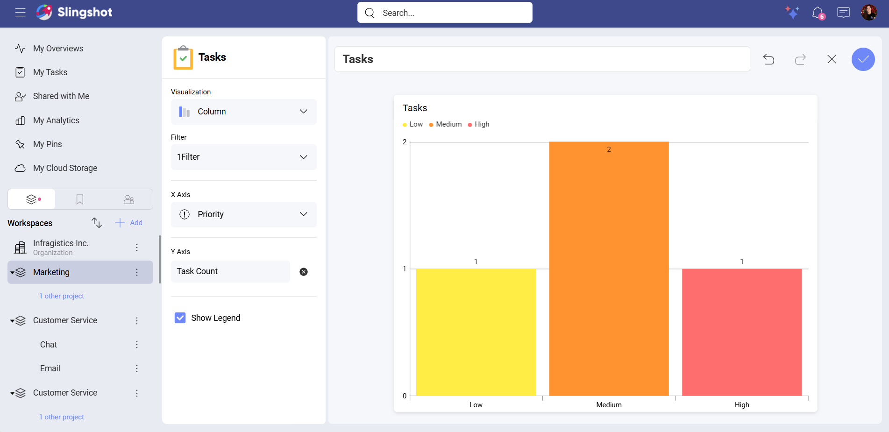
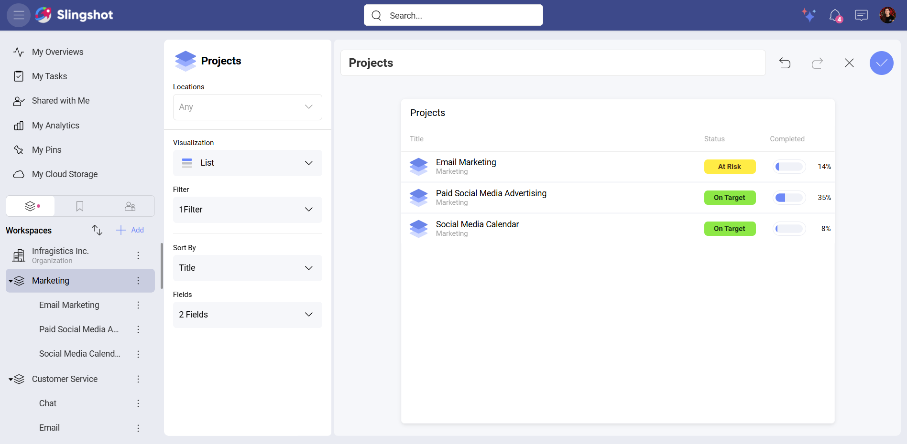
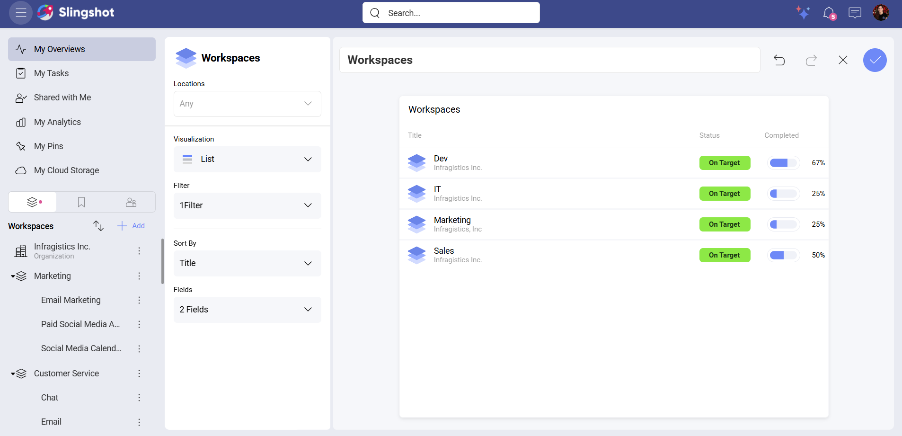
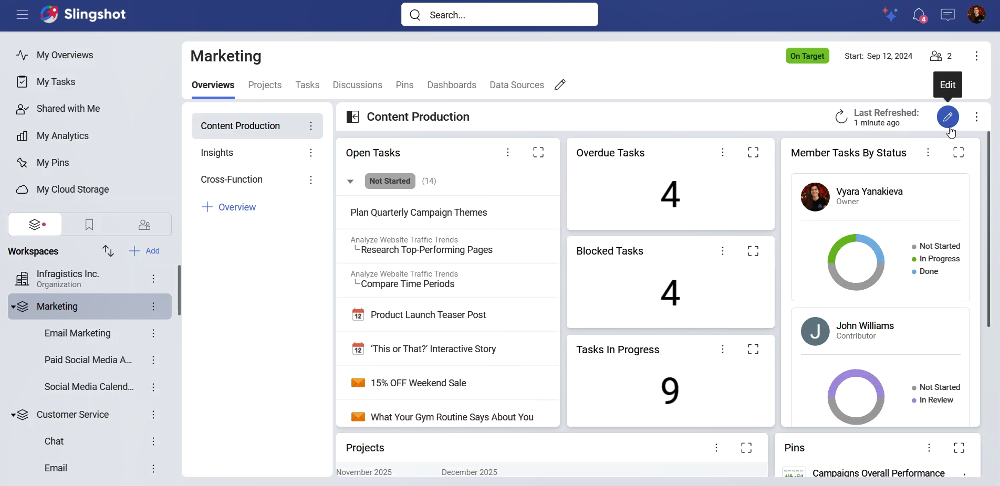
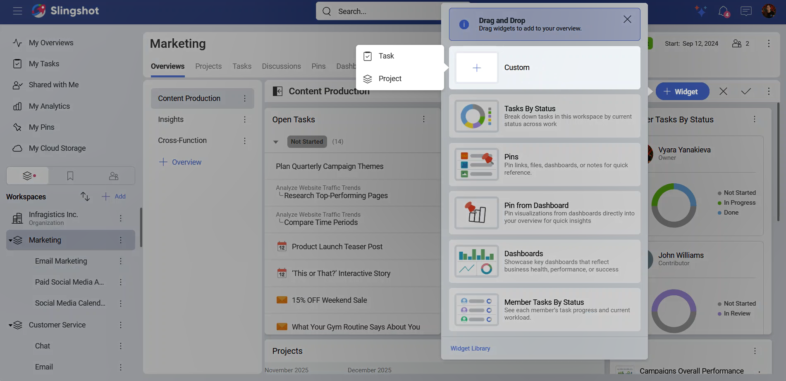
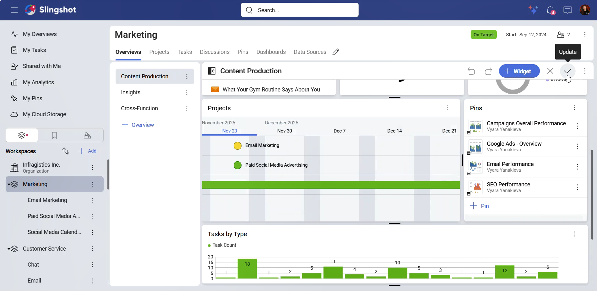
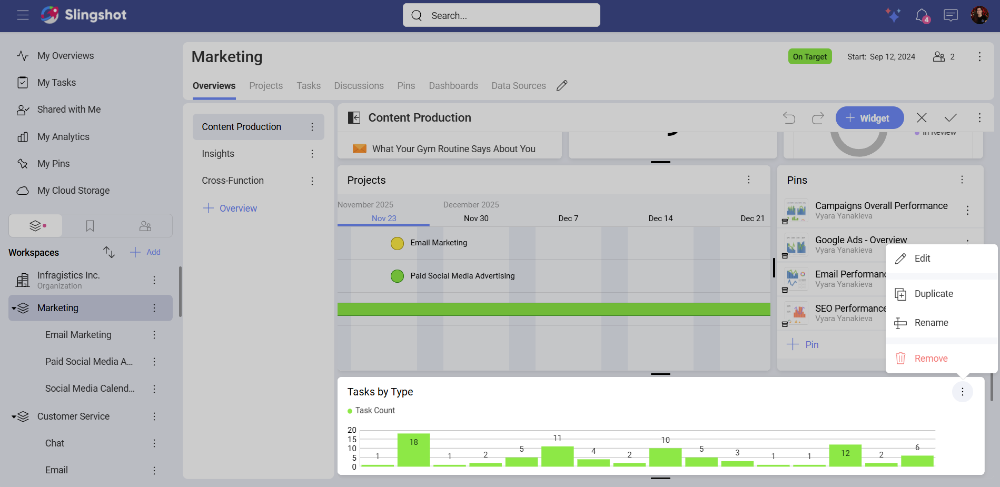

# Custom Widgets

With custom widgets, you can create widgets from scratch, without applied filters. This gives you the freedom to organize your work in a way that helps you and your team be efficient and well informed.

## Types of Custom Widgets 

There are three types of custom widgets:

-	**Tasks**: You can create task widgets in workspaces, projects and *My Overviews*.

-	**Projects**: You can create project widgets only in workspaces and *My Overviews*.

-	**Workspaces**: You can create workspace widgets only in *My Overviews*.

## Task widget 

When you create a custom task widget, you can:

-	Give a name to the task widget.

-	Undo/redo the changes you have made.

-	Save the widget in the overview.

-	Choose a [visualization type](overviews-visualization-types.md): Depending on which visualization type you choose, you will see different options to configure the widget. By default, the visualization type is set to *Column*.

-	Add a filter.

-	Show or hide the legend: This option is available to every visualization except *Number* and *List*.

>[!Note]
> When you are creating a task widget in *My Overviews* or a workspace, you can also filter by a *Location*.

## Project widget

When you create a project widget, you will be able to:

-	Give a name to the task widget.

-	Undo/redo the changes you have made.

-	Save the widget in the overview.

-	Filter by location.

-	Choose a [visualization type](overviews-visualization-types.md) : Depending on which visualization type you choose, you will see different options to configure the widget.

-	Add a filter.

-	Sort By a *Title*, *Status*, *Start Date*, *End Date*, or *None*.

-	Choose how many fields to show once the widget is added to the overview.

>[!Note]
> By default, the visualization type is set to *List*. You can always switch the type of visualization with another one.

## Workspace widget

When you create a custom workspace widget, you will be able to configure the same elements as the ones that are available for a project widget. 

>[!Note] 
>By default, the visualization type is set to *List*. You can always switch the type of visualization with another one.

## Managing a custom widget

If you have owner permissions, you can create, edit, duplicate, or remove a widget. 

As *My Overviews* is only accessible to you, you can always make changes to the widgets.

To create a custom widget, you can:

1.	Open *My Overviews*, an overview of a workspace or a project.

2.	Click/tap on the pencil button in the upper right corner to edit the overview.

3.	Click/tap on **+Widget**.

4.	Choose **Custom**.

5.	Choose a widget.

6.	You will be able to customize your widget to best fit your goals.

7.	Click/tap on the checkmark in the upper right corner to save your changes.

8.	Click/tap one more time on the checkmark in the upper right corner to update the overview.

To see the settings of a widget, you need to:

1.	Open *My Overviews*, or an overview of a workspace or a project.

2.	Click/tap on the pencil button on the upper right corner.

3.	Open the overflow menu of the widget you have in mind.

