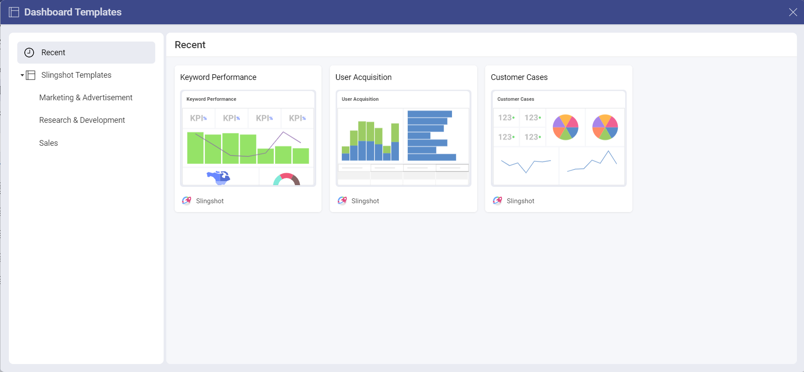
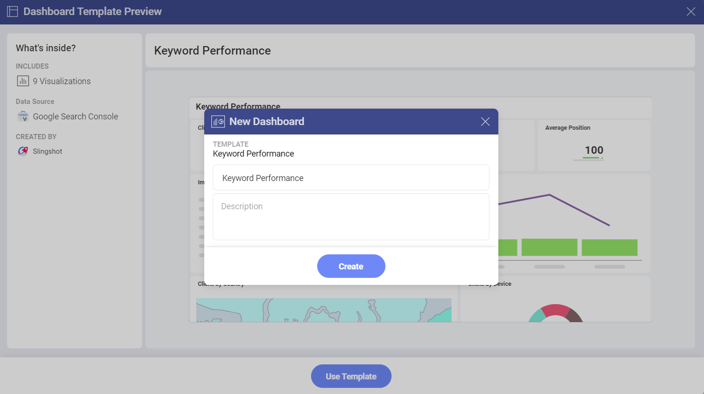
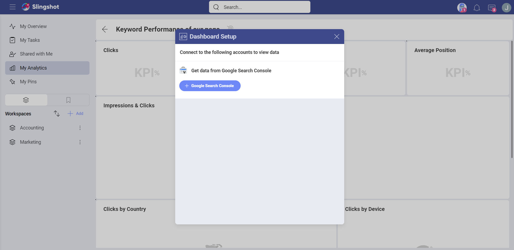
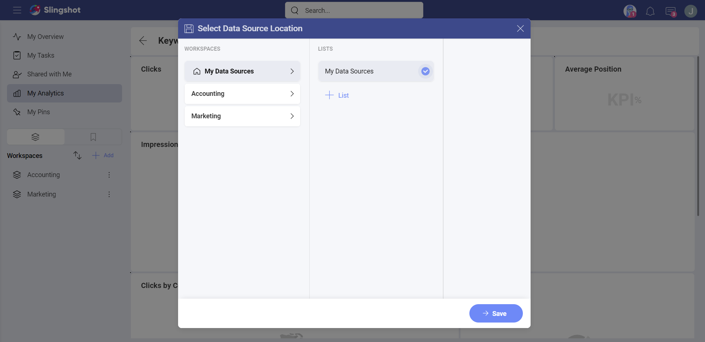
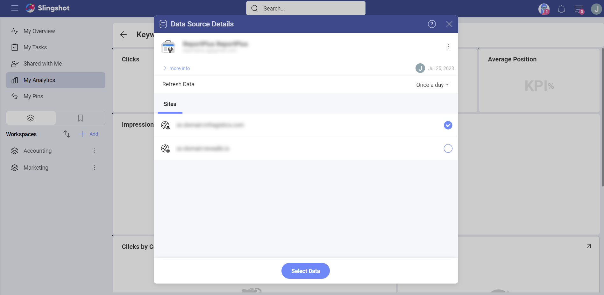

# Dashboard 

With Dashboard Templates, you and your team members can create dashboards faster and easier, with just a few clicks. 

## How can I access different Dashboard Templates lists?

In order to access the dashboard templates lists, you need to:

1.	Click/tap on the **+Dashboard** button that is under *My Analytics*.

2.	Click/tap on **See All Templates**.

3.  A dialog, where you can find all the dashboard templates ready for use, will pop up:

In the left panel you can:

- Check/use the templates that you have recently used.

- Check/use a template from the *Slingshot Templates*.

## How can I use a Dashboard Template?

The *Slingshot* templates are organized based on different industries/departments. To use a template, you need to: 

1.	Choose one of the lists of templates under **Slingshot Templates**.

2.	Click/tap on a template that best fits your needs. 

3.	You will be presented with a preview of how the dashboard will look like. In this case, we chose the **Keyword Performance** template that uses *Google Search Console* as a data source.

4.	Here you can check how many visualizations the dashboard contains, the type of data source that it uses, and see who created it. 

5.	When you are ready, click/tap on **Use Template**.

6.	You will be presented with a dialog where you can change the title of your dashboard and add a description by clicking/tapping on each text box.

7.	Before setting up the dashboard, you will need to connect the template to your data source. 

## Setting up your Data Source 

In order to set up your data source, in this case we chose Google Search Console, you need to:

1.	Click/tap on **+ Google Search Console**.

2.	Enter the credentials for your data source account.

3.	Click/tap on **Add Data Source**.

4. Select a location for your data source and click/tap on **Save**. In this case, we’ve selected **My Data Sources** as a location.

5.	Before creating the dashboard, you can choose which site to use. When you are ready, click/tap on **Select Data**, so the visualizations can be populated with the data.

>[!Note] You can create a dashboard with the help of a template without immediately connecting it to a data source. When you open the dashboard at a later point, you will be prompted to pick a data source in order to add the information and to create visualizations.

If you want to find more information about how you can create and use dashboards, head [here](./analytics/dashboards/overview.md).

