# Slingshot AI Data Analytics

With Slingshot AI-powered Analytics, you can spot opportunities faster and make data-driven decisions while removing the complexity of traditional analytics.

## What is Slingshot AI Data Analytics?

Slingshot AI Analytics uses your available data and business context to transform information directly into dashboards, making complex data easy to understand. 

It can generate, edit, and analyze dashboards and visualizations, providing actionable insights.

>[!Note]
> The Slingshot AI Data Analytics features are available to [Slingshot Enterprise](slingshot-enterprise-subscription.md) users.

### Access Slingshot AI dialog

When you click/tap on the **Slingshot AI** button next to *Notifications*, you will be presented with the *Slingshot AI* dialog.

On the left side, you can: 

A.	Browse through your previous conversations.

B.	Create a new conversation.

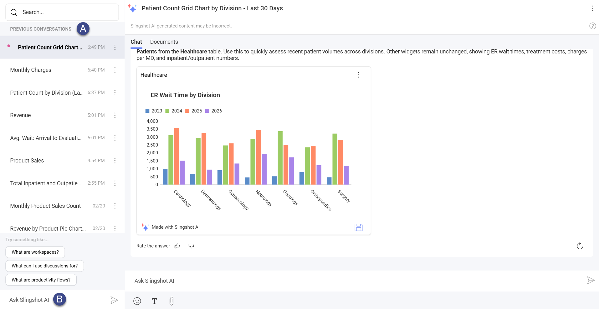

On the right side, you will see two sections: **Chat** and **Documents**. 

When you open **Chat**, you can: 

C.	Continue an existing conversation.

D. Give your feedback by rating the Slingshot AI message. 

E. Refresh the Slingshot AI message to generate a new message. 

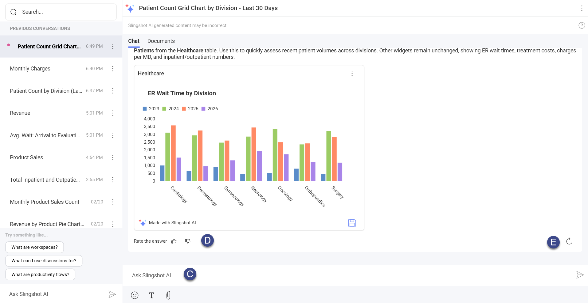

When you open **Documents**, you will see a list of all the dashboards the Slingshot AI has generated based on your inquiries as well the data sources it has used. 

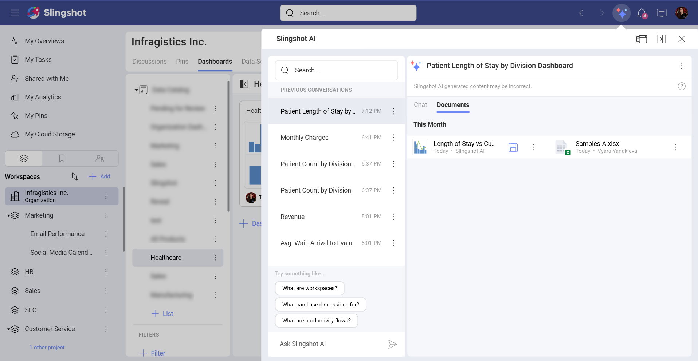

Each Slingshot AI response includes: 

- An explanation of the generated, modified, or analyzed dashboard.

- The dashboard itself.

You can use the overflow menu in the Slingshot AI response to: 

- Create a task

- Copy the message

- Copy the link 

- Bookmark the message

Each dashboard also has an overflow menu with options to:

- Add the dashboard to pins 

- Start a chat 

- Create a task 

- Start a discussion 

- Open the dashboard 

- Open the dashboard in a new window (desktop app)

- Copy the dashboard link 

- Bookmark the dashboard 

- Share the dashboard with other users 

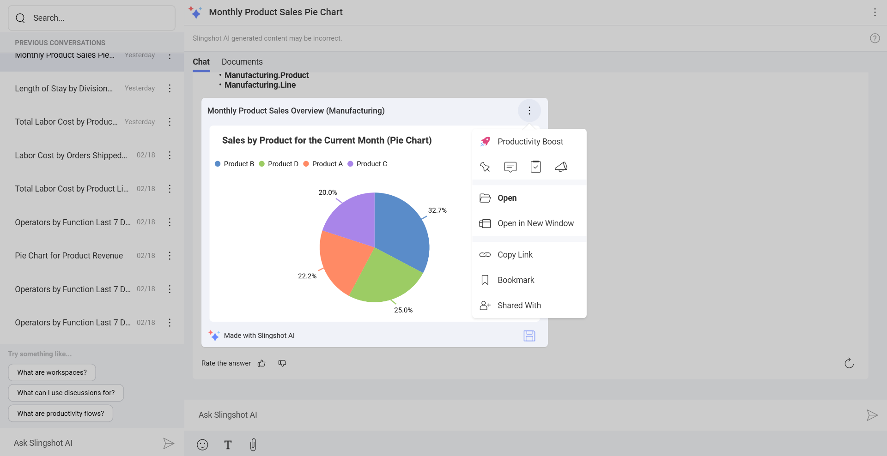

>[!Note]
> To save a copy of the dashboard in an organization, workspace, project or *My Analytics*, you can click/tap on **Save to location** button in the lower right corner of the dashboard dialog.

## Useful Tips

To get the best results from Slingshot AI, we recommend that you:

-	Start conversations using names and concepts already present in your data catalog. 

-	Use business-specific terminology.

-	Stay consistent with your wording throughout a conversation.

-	Use follow-up questions, including references to past inquiries. 

## Common Terms

Common terms that the Slingshot AI recognizes:

-	[Global Filters](./analytics/filters/dashboard-filters.md) (Dashboard Filters)

-	[Widget Filters](./analytics/data-visualizations/fields/field-filters-rules.md) (Data Filters)

-	[Calculated Field Functions](./analytics/data-visualizations/fields/calculated-fields/overview.md) (except Post-Calculated Fields) (only for Tabular sources)

-	[Visualization Types](./analytics/data-visualizations/overview.md)

-	[Date Fields](./analytics/data-visualizations/fields/field-filters-rules.md#rules-for-date-fields)

-	[Numeric Fields](./analytics/data-visualizations/fields/field-filters-rules.md#rules-for-numeric-fields)

-	[String Fields](./analytics/data-visualizations/fields/field-filters-rules.md#rules-for-string-fields)
 
## Generate dashboards with Slingshot AI 

>[!Note]
> Slingshot AI cannot make any changes to original dashboards. It only creates new modified dashboards based on the information provided. 

You can generate dashboards by: 

- Using gold-certified dashboards. 

- Attaching a dashboard to a conversation. 

- Attaching a data source to the Slingshot AI conversation. 

You can generate dashboards that use following types of data sources:  

-	Amazon Athena

-	CSV files (only as [Web Resources](./analytics/datasources/supported-data-sources/web-resource.md))

-	Excel files (only as [Web Resources](./analytics/datasources/supported-data-sources/web-resource.md))

-	Microsoft Analysis Services

-	Microsoft SQL Server 

-	MySQL

-	Oracle

-	PostgreSQL

-	Snowflake

### Gold-certified dashboards 

[Gold-certified](certifications.md) dashboards provide you with reliable and verified information that you can use to make fast and efficient business decisions.

**Example:**

You want to see how many sales each of your products has had this month, displayed in a pie chart.  

To achieve this, you can: 

1. Start a new Slingshot AI conversation by describing in detail the dashboard you wan Slingshot AI to generate. You can include the title of the dashboard you want to extract the data from, specify the time period the date filter should cover, as well as the chart type Slingshot AI should use to display the information.  

   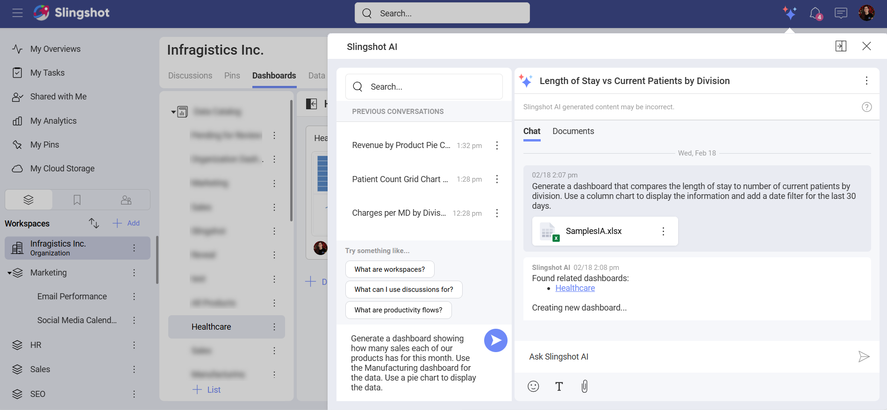

2. When you are ready, click/tap on **Send**.

3. Slingshot AI will go through the gold-certified dashboards to see which dashboards have the required information. Then, it will extract that data and organize it in a dashboard. It will also provide you with a detailed explanation about what the dashboard displays. 

    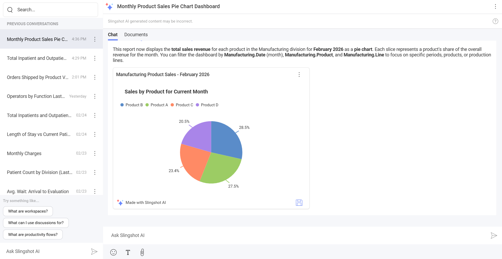

4. You can save a copy of the dashboard in a location or open its overflow menu to choose members to share it with, or attach it to a pin, a chat, a task, or a discussion. You can also click/tap on the dashboard to open it in a maximized view.

### Attached dashboard

Instead of Slingshot AI going through the gold-certified dashboards, it can also go directly through an attached dashboard and use its data to generate a new dashboard.  

**Example:** 

You want to compare the number of units produced to the number of units lost for the last 7 days. To achieve this, you can: 

1. Start a new Slingshot AI conversation by describing in detail the dashboard you want Slingshot AI to generate. In this case, you can ask it to compare the number of units produced to the number of units lost for the last 7 days.  

   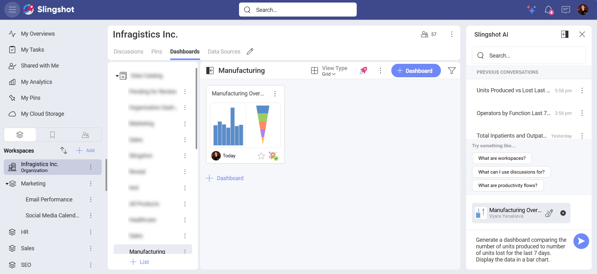

2. Attach the dashboard you have in mind and click/tap on **Send**. 

3. The AI will go through the dashboard and extract the information. Then, it will generate a dashboard, alongside a detailed explanation about what the dashboard displays. 

   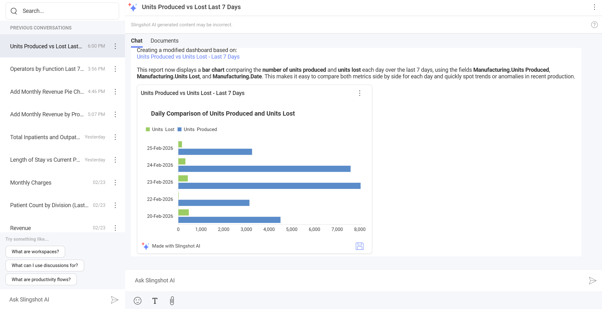

4. You can save a copy of the dashboard in a location or open its overflow menu to choose members to share it with, or attach it to a pin, a chat, a task, or a discussion. You can also click/tap on the dashboard to open it in a maximized view. 

### Attached data source 

If you have a specific data source in mind, you can directly attach it to a conversation and ask Slingshot AI to use it to generate a dashboard. 

>[!Note] When you generate a dashboard from a new data source for the first time, you will need to refresh the AI response in a few minutes for Slingshot AI to fulfil the request. 

**Example:**

You want to compare the number of units produced to the number of units lost for the last 7 days. To achieve this, you can: 

1. Start a new Slingshot AI conversation by describing in detail the dashboard you want Slingshot AI to generate. Specify that you want to compare the number of units produced to the number of units lost for the last 7 days. 

   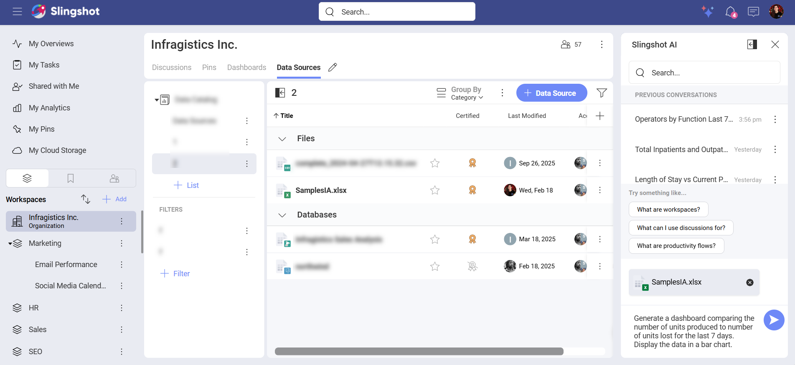

2. Attach your data source by dragging and dropping it in the conversation and click/tap on **Send**.  

3. Slingshot AI will extract the data from the data source and create a new dashboard. It will also provide you with a detailed explanation about what the dashboard displays. 

   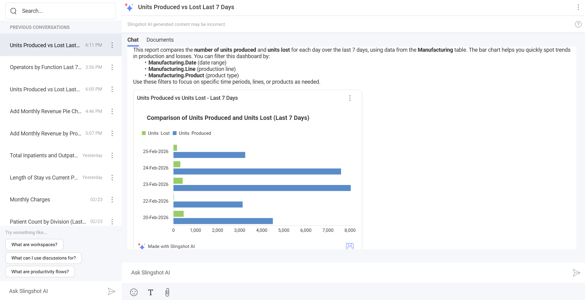

4. You can save a copy of the dashboard in a location or open its overflow menu to choose members to share it with, or attach it to a pin, a chat, a task, or a discussion. You can also click/tap on the dashboard to open it in a maximized view. 

## Edit dashboards with Slingshot AI 

>[!Note] Slingshot AI cannot make any changes to original dashboards. It only creates new modified dashboards based on the information provided. 

Only dashboards that use following types of data sources can be edited while using Slingshot AI: 

-	Amazon Athena

-	CSV files (only as [Web Resources](./analytics/datasources/supported-data-sources/web-resource.md))

-	Excel files (only as [Web Resources](./analytics/datasources/supported-data-sources/web-resource.md))

-	Microsoft Analysis Services

-	Microsoft SQL Server 

-	MySQL

-	Oracle

-	PostgreSQL

-	Snowflake

You can edit dashboards by: 

- Using gold-certified dashboards. 

- Attaching a dashboard to a conversation. 

>[!Note] You can also edit Slingshot AI-generated dashboards.

### Gold-certified dashboards 

You can edit a dashboard the same way you generate a new one. You can search for a [gold-certified](certifications.md) dashboard with the help of Slingshot AI and then explain to the AI how you want to change that specific dashboard. Then, Slingshot AI will make the requested changes.

**Example:** 

You want to add a column chart to a dashboard showing revenue by product for this month. To achieve that, you can: 

1. Start a new Slingshot AI conversation by describing in detail how you want to edit the specific dashboard. In this case, you can specify that you want to add a column chart to a dashboard showing revenue by product for this month. 

   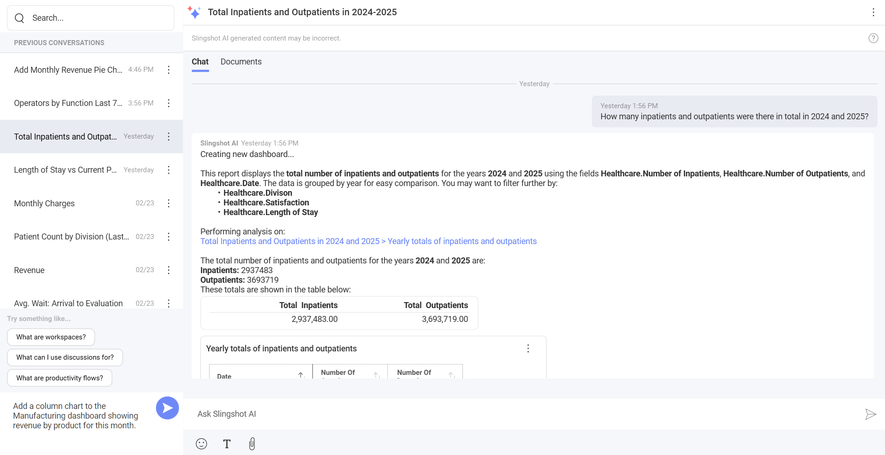

2. When you are ready, click/tap on **Send**. 

3. Slingshot AI will go through the gold-certified dashboards to see which dashboard you want to edit. Then, it will make the requested changes. Afterwards, it will display an updated version of the dashboard as well as provide you with a detailed explanation of the changes it has made. 

    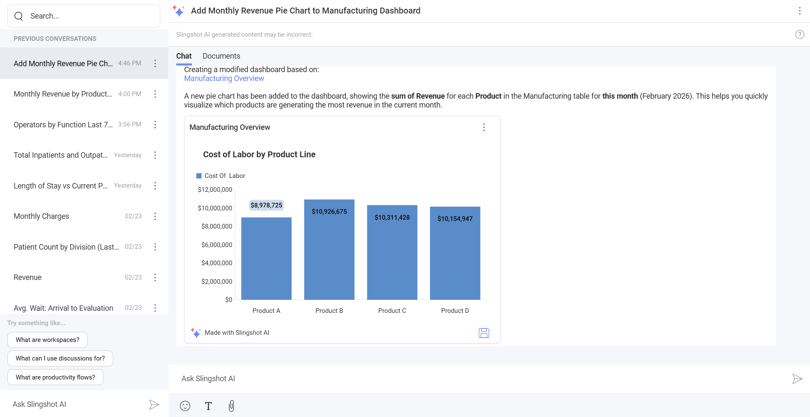

4. You can click/tap on the dashboard to open it in a maximized view to see the changes. You can also save a copy of the dashboard in a location or open its overflow menu to choose members to share it with, or attach it to a pin, a chat, a task, or a discussion. 

### Attached dashboard 

If you have a specific dashboard in mind, you can attach it to a Slingshot AI conversation and ask Slingshot AI to edit it. 

**Example**:  

You want to add a column chart to a dashboard showing revenue by product for this month. To achieve that, you can: 

1. Start a new Slingshot AI conversation by describing in detail how you want to edit the specific dashboard. In this case, you can specify that you want to add a column chart to a dashboard showing revenue by product for this month. 

2. Attach the dashboard to the conversation. 

   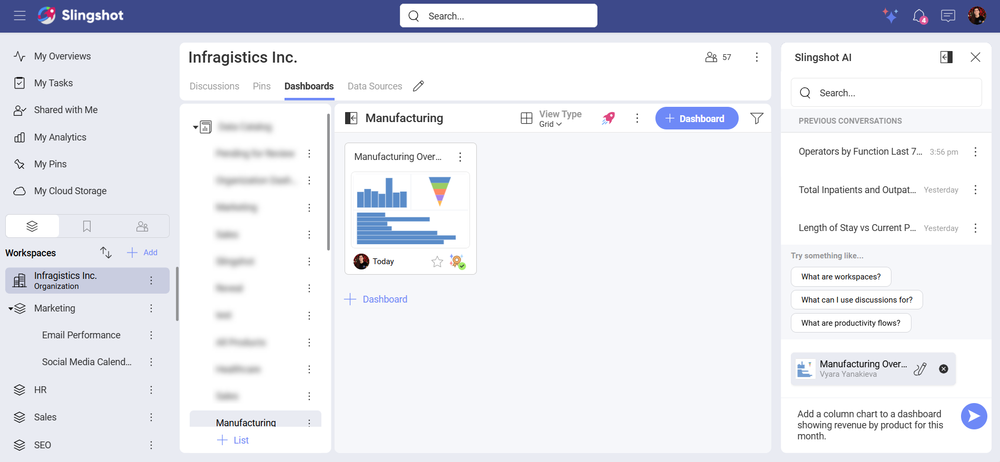

3. When you are ready, click/tap on **Send**. 

4. The Slingshot AI will analyze the dashboard and make the requested changes. Afterwards, it will display an updated version of the dashboard as well as provide you with a detailed explanation of the changes it has made. 

   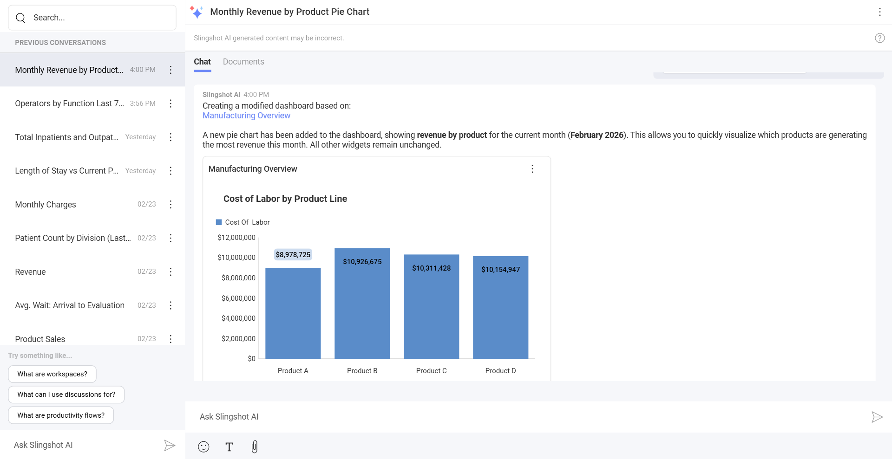

5. You can click/tap on the dashboard to open it in a maximized view to see the changes. You can also save a copy of the dashboard in a location or open its overflow menu to choose members to share it with, or attach it to a pin, a chat, a task, or a discussion. 

## Analyze dashboards and visualizations with Slingshot AI 

You can analyze dashboards or visualizations by: 

- Using gold-certified dashboards. 

- Attaching a dashboard to a conversation. 

>[!Note] All types of data sources are supported.  

### Gold-certified dashboards

With Slingshot AI, you can analyze [gold-certified](certifications.md) dashboards and their visualizations stored in your organization. 

**Example**:  

You want to see how many inpatients and outpatients there were in total in 2024 and 2025. To do that, you can: 

1. Start a new Slingshot AI conversation by asking detailed questions. For example, you can ask: *“How many inpatients and outpatients were there in total in 2024 and 2025?”*.  

2. Click/tap on the **Send** button. 

3. Slingshot AI will search through the gold-certified dashboards and analyze the one that has the required information. Then, it will provide you with detailed analysis as well as the dashboard representing the requested information. 

    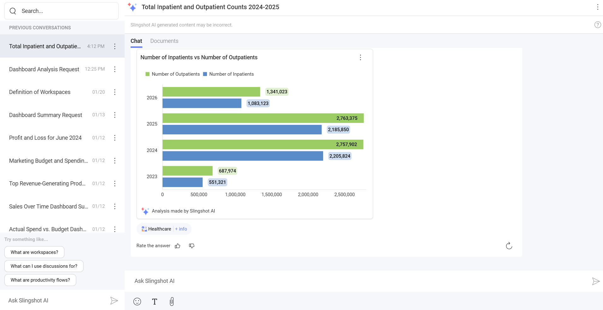
 
### Attached dashboard 

If you have a specific dashboard in mind that Slingshot AI can use for analysis, you can directly attach it to a conversation.  

**Example**:  

You want to see how many inpatients and outpatients there were in total in 2024 and 2025. To do that, instead of Slingshot AI going through the gold-certified dashboards, you can direct it to use the dashboard you have in mind when you: 

1. Start a new Slingshot AI conversation by asking detailed questions. For example, you can ask: “*How many inpatients and outpatients did we have in total in 2024 and 2025?”*. 

   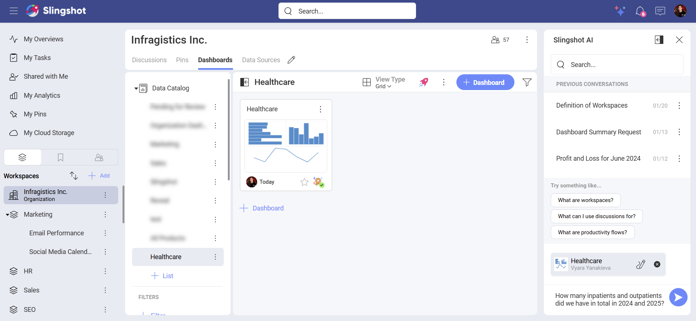

2. Attach the dashboard you have in mind and click/tap on **Send**. 

3. Slingshot AI will extract data from the dashboard, show the existing dashboard (or a modified version when needed) with the requested information, and provide a detailed explanation of the analysis performed.

   

>[!Note] When modifying a dashboard that is using an unsupported data source, Slingshot AI will edit only the dashboard filters.  

## Dashboard descriptions and AI training 

>[!Note] Only users who are authorized by an organization's owner can certify dashboards. 

When you certify a dashboard as Gold, you can use that dashboard to train Slingshot AI, so it can use the dashboard for generating, editing and analyzing data. 

To Gold-certify a dashboard, you need to: 

1. Open a dashboard. 

2. Click/tap on the badge icon and choose the gold badge from the dropdown menu.

   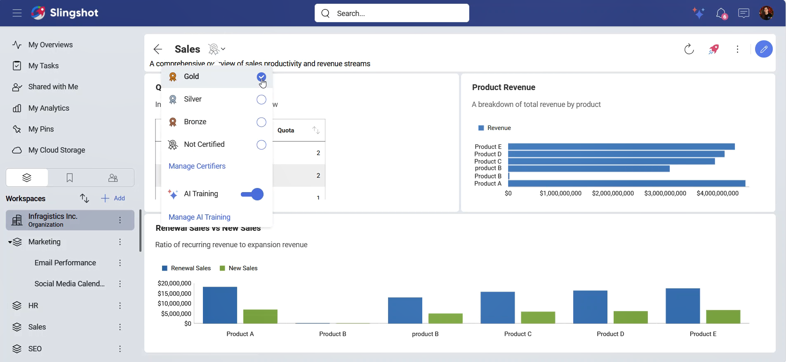
 
3. Once the dashboard has been certified, the **AI Training** option will be enabled. Slingshot AI will generate descriptions for the dashboard and its visualizations. These descriptions help Slingshot AI generate, edit, and analyze dashboards. 

## Managing AI Training

You can always update the AI-generated descriptions, so Slingshot AI can provide you with the most up-to-date information in your future inquiries. 

If you want to go through the AI-generated descriptions of a dashboard and its visualizations, you need to:

1. Open a gold-certified dashboard.

2. Click/tap on the **AI Training Info** button.

3. Choose **Manage AI Training**.

   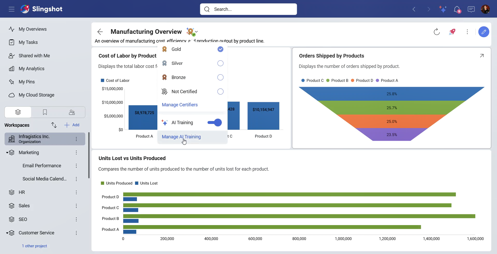
 
4. You will be presented with the *AI Training Info* dialog where you can see each description. Here you can:

-	Clear the training for a specific visualization or the dashboard itself.

-	Clear all training. This will remove every description in the dashboard.

-	Update each description and then save the changes.

    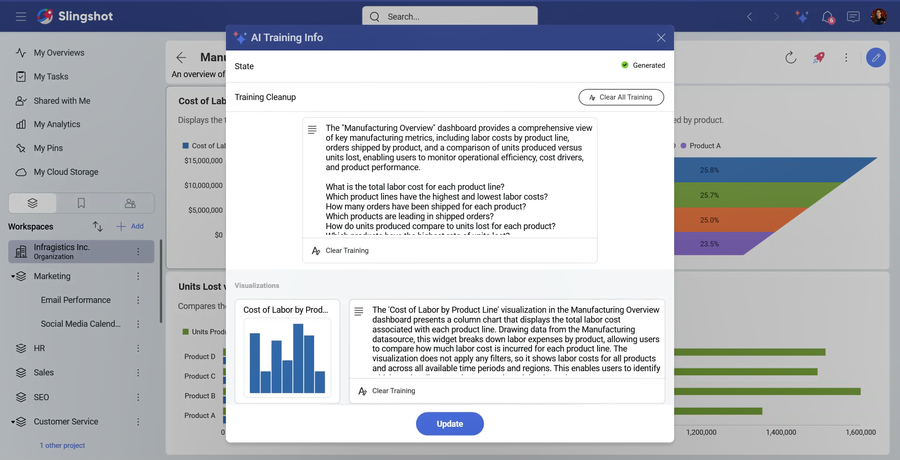

If you want to update only the descriptions of each visualization, you can:

1. Click/tap on the **Edit** button of a gold-certified dashboard.

   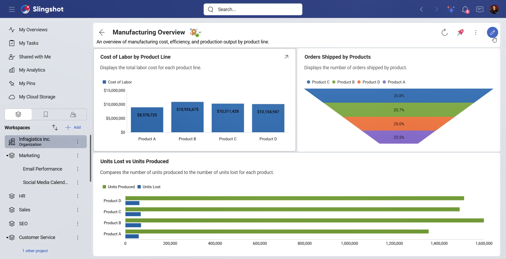
 
2. Click/tap on the **Edit** button of a visualization.

   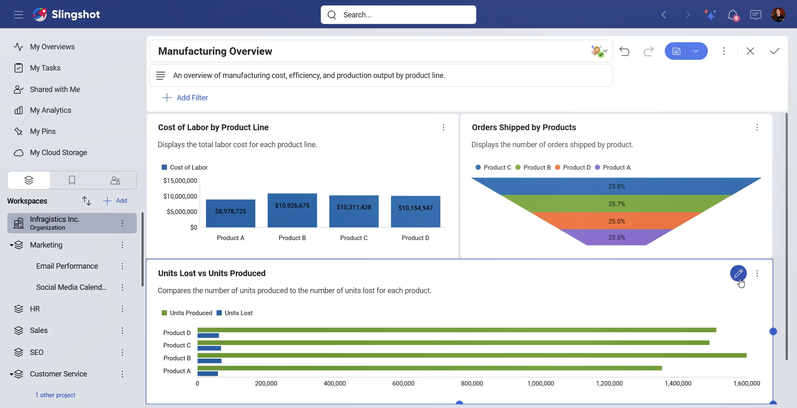
 
3. Open the **Settings** section.

4. Scroll down to the *AI section*.

5. Click/tap on **Edit**.

    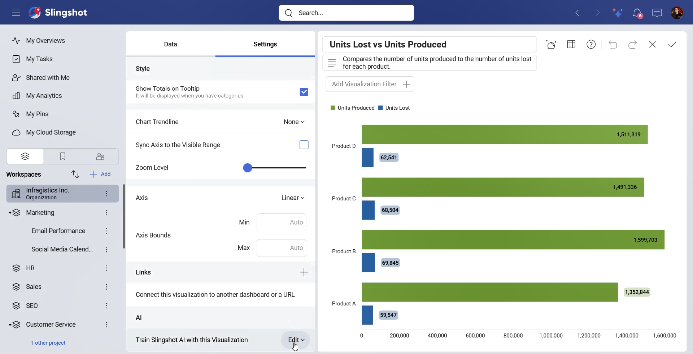
 
6. You will be presented with the *Slingshot AI Training* dialog. Here you can update the information. When you are ready, click/tap on **Update** to save the changes.

    
 
7. Click/tap on the **Save** button in the top right corner to save the changes and then one more time to update the dashboard.

## Disable AI Training

If you don’t want Slingshot AI to use specific dashboards in your organization for its training, you can: 

1. Click/tap on the **AI Training Info** button. 

   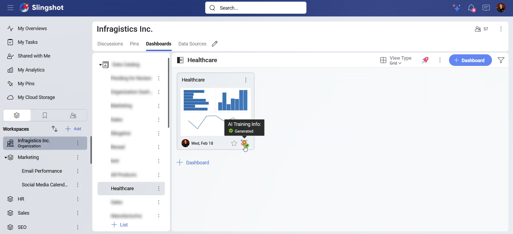

2. Toggle the **AI Training** off. 

    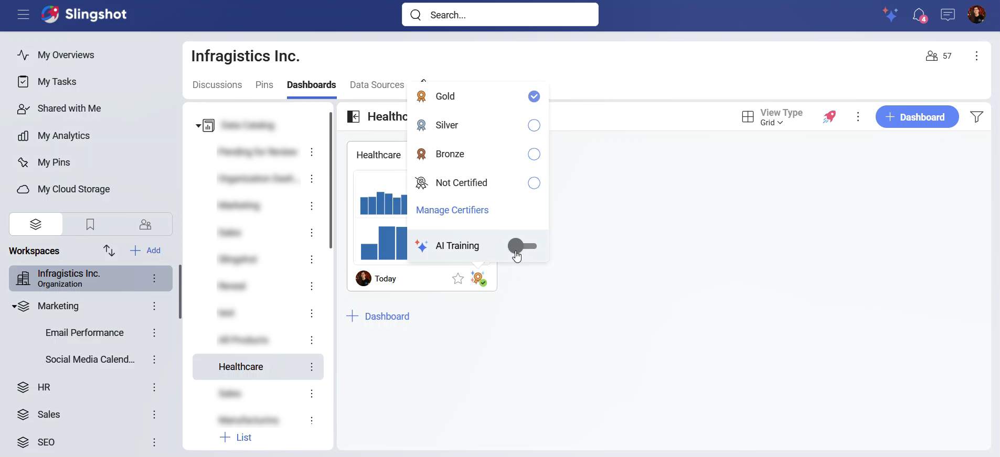

## Commonly asked questions

**Q:** **Can I edit Slingshot AI-generated dashboards?**

**A:** Yes, you can always edit Slingshot AI-generated dashboards.

**Q:** **Can AI-generated dashboards be shared with other team members?**

**A:** Yes, you can open the overflow menu of the dashboard in a Slingshot AI response and use one of the productivity boost features, or directly copy the link to the dashboard.

**Q:** **What are gold-certified dashboards, and why does the Slingshot AI use them?**

**A:** Gold-certified dashboards are dashboards that are reliable and contain only verified information. This is why Slingshot AI goes only through gold-certified dashboards.

**Q:** **Are there limitations to the types of charts THE Slingshot AI can generate?** 

**A:** Slingshot AI can generate dashboards using the following chart types: 

- All Category Charts 

- Bubble Chart 

- KPI vs Target Chart 

- KPI vs Time Chart  

- Pivot Chart 

- Text Chart 

- Text View Chart 

- Tree Map Chart 
