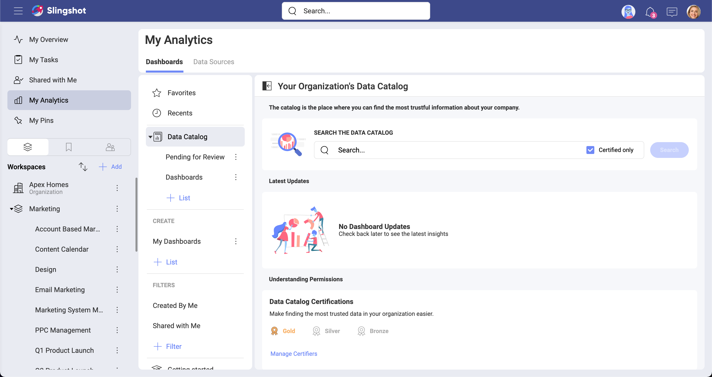
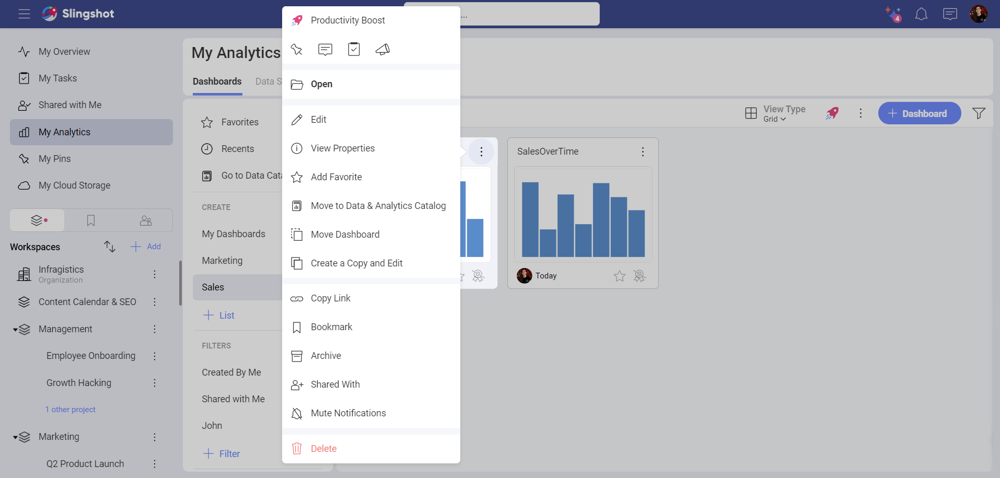
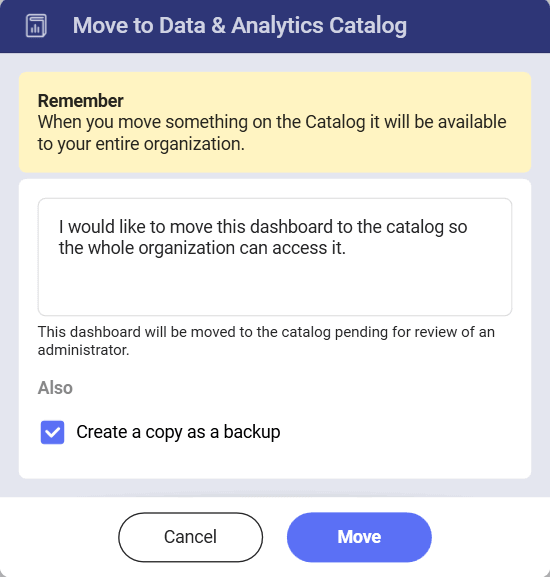
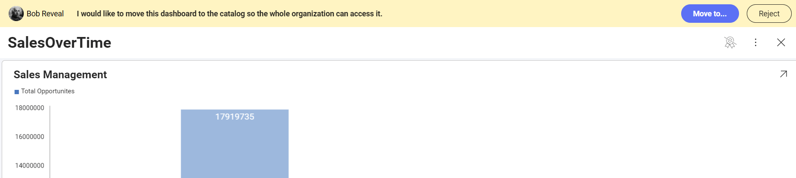

# Data Catalog

A data-driven company is one that always puts data at the center of any decision, taking advantage of gathered data and driving actionable insights from it. Naturally it requires data to be accessible to everyone while also to provide the tools to better process it.
Slingshot makes this possible for Enterprise users by providing an extensive catalog of analytics, data sources & sets, visualizations and dashboards.

## What’s in Slingshot’s Data Catalog

Find the most trustful information about your company, accessing data that is categorized, properly documented, and certified.

Below are the high level features that your Data Catalog brings along:

- **Certifications**: Find trusted data within your organization, dashboards and data sources that are reliable and contain verified information. 

- **Advanced Information (Metadata)**: Add and later make good use of advanced information such as the datasets a data source contains, types of data fields, descriptions, last modified date, and others.

- **Dashboards and Data Sources**: The Data Catalog is really about giving users access to an extensive catalog of dashboards and data sources.

### Certifications
Organization owners can guide their users about which dashboards or data sources can be considered reliable, containing verified information.

Users can easily identify certified dashboards or data sources looking for a gold, silver, or bronze colored badge next to them.
[Learn more about Certifications here](certifications.md).

### Advanced Information (Metadata)
Organization certifiers can use the Advanced Editor and add/modify metadata to certified data sources. Adding this information allows certifiers to provide proper documentation about the data.
Certifiers can also hide data to boost the team productivity, the hiding capability can really help dealing with huge amounts of data.

Organization users will benefit from adding descriptions to data fields, making data easy to understand.
[Learn more about Advanced Editing for Data Sources here](metadata-advanced-editing.md).

### Out-of-the-box Lists
By default you will find "Pending for Review" and another list, most likely called "Dashboards" or "Data Sources", but Organization owners can create more and easily reorganize and move lists, sections and dashboards or data sources just by dragging them.

## Filtering the Data Catalog
Using filters allows you to view a set of dashboards or data sources that meet a certain criteria.

To access the Filters editor just click/tap the filter icon (top right of the screen), next to the overflow.

To stop filtering dashboards or data sources, click/tap the filter icon to open the Filters dialog. Then, select the Clear button at the bottom to remove the current filters, and Apply to save your changes.

## Organizing the Data Catalog

Organization owners can manage the Data Catalog, adding or approving new content, and also organizing the content shared with the rest of the organization.

You can find multiple lists of dashboards and data sources, which are designed to organize, manage and share those resources.
The Dashboards and Data Sources tabs have lists that can be further organized in sections. Sections are useful to add divisions and better layout your content.

Organization users that are not owners cannot delete or add content to the Data Catalog. They can browse lists and sections but not create or edit them. 

## Expanding the Data Catalog 

The Data Catalog includes the most trustful information about your company, all data is categorized, properly documented and certified. Naturally, the process of adding new dashboards or data sources to the Data Catalog has several steps to ensure quality and a trustful process. 

**Process in an nutshell:**

1. User requests to add a data source or dashboard to the Data Catalog.
2. The dashboard or data source is moved to "Pending for Review".
3. An Org owner reviews the request.
4. If approved, the Org owner moves the dashboard or data source to a place in the Data Catalog.
5. The Dashboard or data source is now available for everyone within the Org.

### Process of Adding New Content to the Data Catalog

Below you can find a more detailed explanation of each step of the process:

1. **A user starts a request to add content to the organization's Data Catalog**.  
   The Slingshot user has a dashboard or data source located in My Analytics, a workspace, or a project. Wants to make that content available for the whole organization and starts the process for doing so.
   
   A. Click/tap the dashboard's overflow (top right) and select "Move to Data & Analytics Catalog".  
     
   B. Write a message for the Org owner describing your request. Here you can also choose if you want to keep a copy of your dashboard or data source in the original location.  
     

2. **The data source or dashboard is moved to "Pending for Review"**.  
   The Pending for Review list holds all the data sources or dashboards pending to be reviewed by Org owners.
   
3. **An Org owner reviews the request**.  
   Any Org owner can open the dashboard or data source to review it. A banner will be displayed (top of the screen) allowing the reviewer to reject the request or accept it and move the content inside the Data Catalog.  
     
4. **If approved, the Org owner moves the dashboard or data source to a place in the Data Catalog**.
5. **The Dashboard or data source is now available for everyone within the Org**.