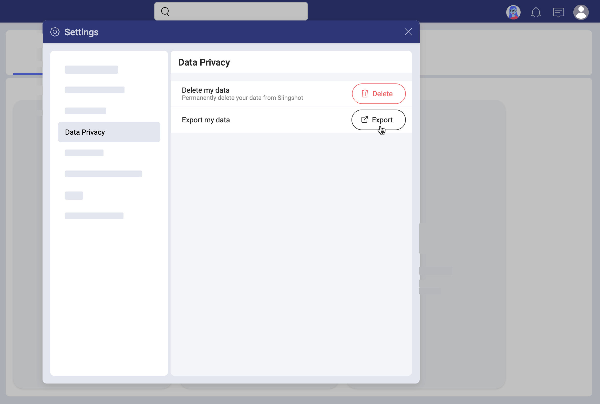

## Learn More about Data Privacy 

Welcome! Read on to get answers to your questions about data privacy.

### Is Slingshot GDPR compliant?

Yes, it is. Slingshot aligns its data privacy practices with global data privacy laws such as the General Data Protection Regulation (GDPR). To protect data rights, Slingshot provides a controlled procedure for deleting and exporting users' data. 

Read on to learn _who_ can delete and export users' data, and _what_ type of information can be deleted or exported.  

### Who can delete profile information?

Technically speaking, the Slingshot support team is the one having rights to delete profile data from Slingshot. But they do this at the request of users, of course. 

Then, who can request profile data deletion directly from the Slingshot support team? The answer is:

- a user with a [personal account](roles-permissions.html#what-about-users-with-no-organization) in Slingshot, or 
- an Organization owner. 

What if you are a member of an Organization in Slingshot? Then the information in your profile is considered ownership of the Organization. In case you want to have your data deleted, you have to contact an administrator of personal data in your organization and request the deletion from them.

### How to delete profile information?

Below you will find two possible scenarios. The deletion procedure steps depend on your relation to an Organization in Slingshot.

#### For Organization Owners 

If you are a user with an [Owner](roles-permissions.html#teams-projects-roles) role in your Organization team and you need to delete one or more users' profile information, then read the steps below to learn how to proceed. 

1. Contact our team at **support@slingshot.io**
2. Note you want to delete an Organization member's profile information.
3. You may be asked to provide more details about yourself. 
4. The Slingshot support team will verify your right to request deletion first. Only then the deletion will start. When profile information is finally deleted, the user's name will be displayed as *@deactivateduser* wherever their content has not disappeared (see [above](#data-not-deleted)).  

#### For Users with Personal Accounts

If you have a [personal account](roles-permissions.html#what-about-users-with-no-organization) in Slingshot, this also means you do not belong to an Organization in Slingshot. However, you can still be part of workspaces belonging to an Organization if invited. In this sense, your profile information does not belong to any organization and you can request data deletion from the Slingshot support team directly. To do this:  

select your profile image > *Settings* > *Data Privacy* > *Delete my Data* (as shown in the screenshot below).

If you are the only owner of any workspace in Slingshot, you will be asked to assign new owners before your profile is deleted. 

The deletion process may take up to 24 hours. You will not be able to sign into your Slingshot profile again until deletion is finished.

>[!NOTE] If you have been invited to be a member of an Organization related workspace in Slingshot, you will not lose the right to delete your profile information. However, Organization related data will not be deleted together with your profile information as it is owned by the Organization.

### How does the deletion of profile information work?

In collaboration software like Slingshot, what you do, affects the people you work with. If, for example, you start a discussion in a workspace, this information will be saved in Slingshot to help others. Everyone in the workspace can benefit from the information in the discussion and will see that you are its initiator. 

The following is considered your profile information by Slingshot and will disappear from the app as a result of the deletion: 

- your name and email address;
- your title, industry, and department if provided (see in _Settings_ > _Profile Information_);
- all content created by you or shared with you in *My Stuff*;
- all task assignments - tasks you were assigned in a team or a project will become unassigned, but will not disappear; 
- access to pinned files and dashboards will be denied - users in Slingshot will not be able to open files and dashboards that deleted users have shared.

Deletion is permanent - once deleted, your information cannot be recovered in Slingshot. 

### Can I reactivate my profile after it was deleted?

If you have a [personal account](roles-permissions.html#what-about-users-with-no-organization) in Slingshot, you can reactivate your profile by simply logging in again after the deletion process is completed. However, the information that was deleted from your profile cannot be recovered. Your history will not be available as well. 

If you are an Organization member, you cannot reactivate your own Slingshot profile. You need to contact the people responsible for managing Slingshot at your organization. Note that, once you return to Slingshot, you will start with clear history. 

### Who can export data from Slingshot? 

You can make an export request to the Slingshot support team if you are: 

- a user with a personal account in Slingshot, or 
- an Organization owner. 

If you are a member of an Organization in Slingshot, then the information in your profile is considered ownership of the Organization. In case you want to receive an export of the data in your profile, you have to contact an administrator of personal data in your organization and request the export from them.

### What is the export format?

Profile information is exported in the JSON format. 

Upon request, you will receive an email from Slingshot. This email contains a link to download a zip file with one or more JSON files with profile data. 

### How to export profile information? 

Below you will find two possible scenarios. The export procedure steps depend on your relation to an Organization in Slingshot.

#### For Organization Owners

If you are a user with [owner](roles-permissions.md) permissions in the Organization workspace and you need to export users' profile data, then read the steps below to learn how to proceed. 

1. Contact our team at **support@slingshot.io**
2. Note you want to export an Organization member's profile information.
3. You may be asked to provide more details about yourself. 
4. The Slingshot support team will verify your right to request export first. Only then you will receive the exported data by email. 

#### For Users with Personal Accounts

If you have a [personal account](roles-permissions.md#what-about-users-with-no-organization) in Slingshot, this also means you do not belong to an Organization in Slingshot. You can be a member of Organization's teams and projects if invited. In this sense, your profile information does not belong to any Organization and you can request data export from the Slingshot support team directly. To do this:  

select your profile image > *Settings* > *Data Privacy* > *Export my Data* (as shown in the screenshot below).

>[!NOTE] If you are an Organization member *Data Privacy* is not available in your *Settings* menu. 

Export may take up to 24 hours. 

### What type of data does the export contain? 

The export contains:

- the email, name, id, and locale associated with the user profile; 
- industry, department, title - if provided by the user;
- information about tasks (incl. task groups and task filters);
- information about *Content* boards;
- information about pinned or shared files, but not the files themselves;
- discussions, topics, and the actual text of the messages of the user, but not the text of other users' messages;
- information about private chats, and the actual text of the messages of the user, but not the messages of other participants in the chat;
- analytics - information about personal dashboards, but not the actual dashboards; information about dashboards shared by other users is not exported.