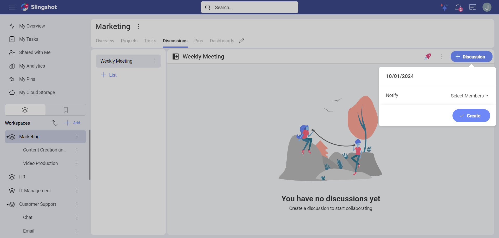
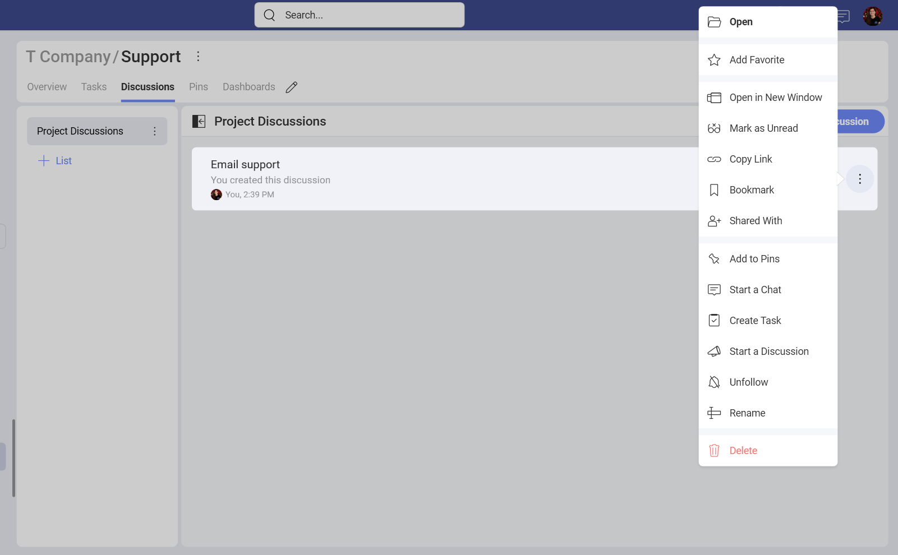
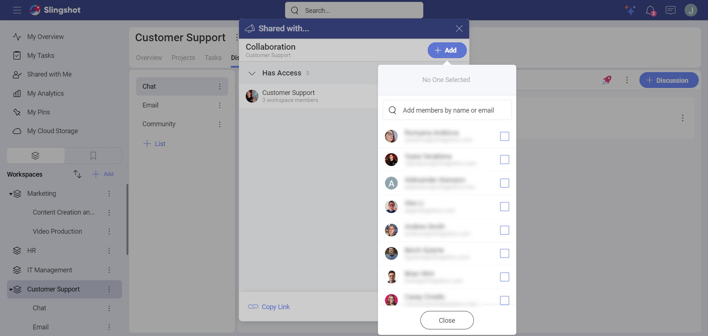
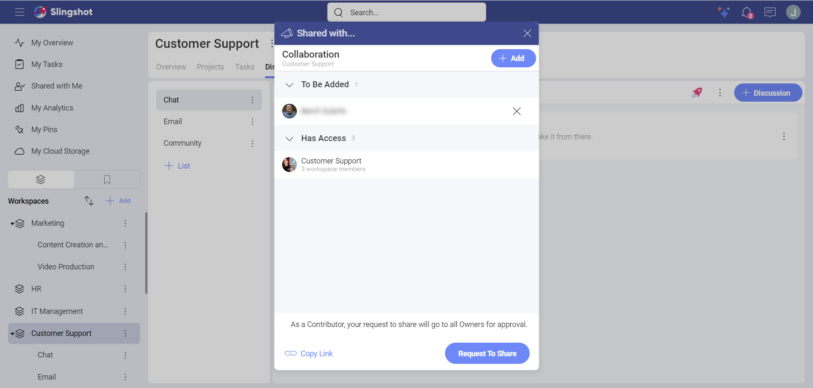
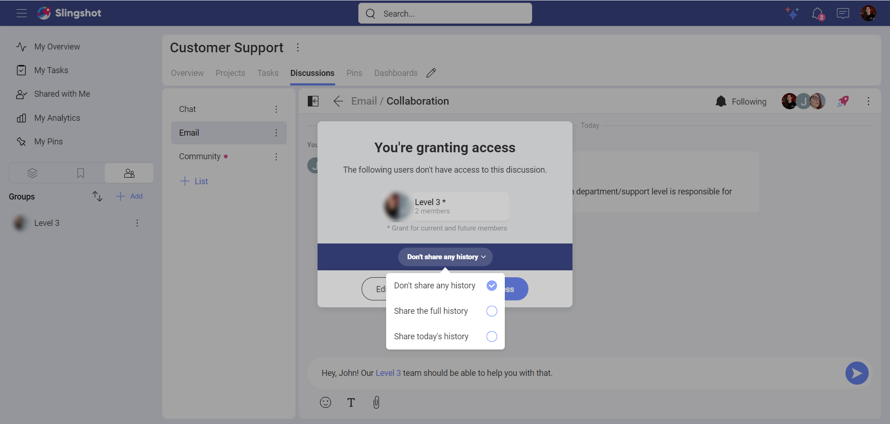
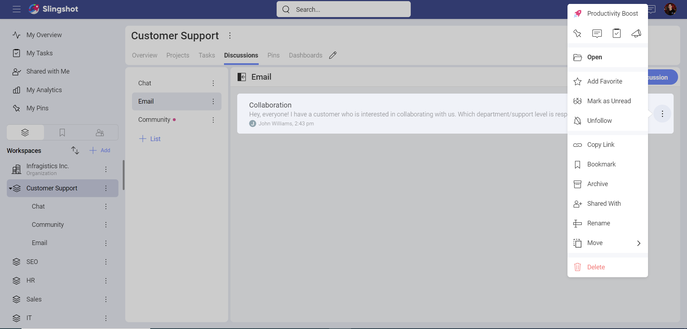
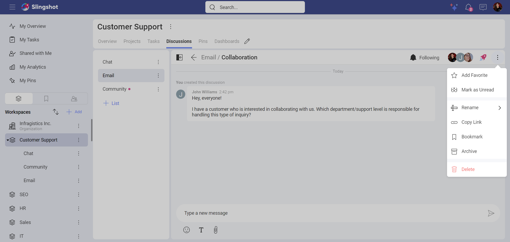
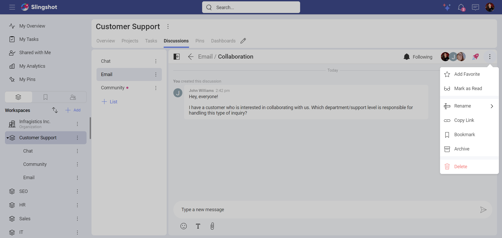

# Discussions

Welcome! Read on to learn more about discussions.

## Discussions vs Chat

In Slingshot, communication happens in discussions and private chats.

Each workspace has its own dedicated *Discussions* tab, which include lists of discussions. Discussions are specific to workspaces and projects. Because of this, you will not be able to see and take part in all discussions in Slingshot. Read more about [who can access discussions](discussions-faq.html#who-can-access-discussions) by following the link.

Unlike discussions, private chat is workspace and project independent. For more details go to [Chat](chat-faq.md).

## How can I access my discussions?

To access your discussions, go to a workspace or project and select the **Discussions** navigation tab on top (see the screenshot below).

You can bookmark a discussion, list, or even a specific message to keep it at hand. They will appear in your bookmarks list and in **My Overview**.
Follow the link for further details about [overviews](overviews.md).

## Who can access discussions?

Depending on where you stand, you will find different discussions. To guarantee the privacy of workspaces and projects, Slingshot does not allow you to access all discussions. So read on to find out who can access what! 

Within a workspace or project, you can have discussions that only their members can access.

Within a project, you can have discussions that are specific for this project. Every collaborator of it, incl. personal account users, can join these discussions. The members of the [workspace](workspaces.html#using-workspaces-within-the-workspace) can also access projects' discussions. 

Within the *Organization*, you will find *Discussions* too. Organization discussions cannot be accessed by users with a personal account. This is the perfect place for announcements and other important organization related discussions. 

## How can I discover and join discussions?

Use the *Discussions* tab in workspaces or projects to discover interesting discussions.

A list of discussions is basically a section dedicated to a specific subject and organized by a limitless list of discussions. Discussions are where conversations happen.

>[!NOTE] Only Owners and Contributors of the workspace or project can reply to a discussion and create a new one. Viewers can only read discussions.

## How can I create a new discussion?

Every *Owner* or *Contributor* of a workspace or project can create a new discussion. The same goes for the discussions inside the *Organization*. 

In general, discussions are *read only* for *Viewers*.

>[!NOTE] Always take into consideration your role only in the workspace or project where you want to create or answer a discussion. 

To **create a discussion**: 

1. Go to the **Discussions** tab. 

2. Select or create a list.

3. Select **+ Discussion**.

4. Name the discussion. Optionally, choose which members to be notified for its creation by adding their emails in *Notify*. 

5. Click/tap on **Create**.

Now your discussion is created. You can start typing your first message to give more details on the subject. It will also serve as a conversation starter.

If you want to reply to your own messages or messages from other people, you can also do that by clicking/tapping on the reply arrow. It will show up when you hover over a message.

>[!NOTE] Reply threading is not supported.

## How can I share a discussion with another user?

You can follow the steps below in order to share a discussion with another user:

1. Open the overflow menu of the discussion and click/tap on **Shared With**.

2. You will see a dialog where you can add people.

3. In case you are the owner of the discussion, you can add other users while choosing their role permissions and then click/tap on **Update**. If you are not the owner of the discussion, you can add users and click on **Request To Share**. The owner of the discussion will get notified and can accept or decline the request. 

Another way of sharing a discussion with someone or with a group of people is by mentioning them (you can do that by using the *@ sign* and then typing the username or the email address of the user, or the name of the group). 

If they are not part of the workspace or the project, they won't be able to see the discussion until the owner(of the workspace or the project) grants them access. 

When an owner of a workspace (or a project) opens a discussion and mentions a group, they will be provided with the following options for the discussion history: 

- Don't share any history

- Share the full history 

- Share today's history

After choosing how much of the history to provide the group with, they can click/tap on **Grant Access**.

In case a member of a group (who is not an owner of the workspace or the project) wants to mention the group, they need to first request access from the owner. When the owner grants permission to the group, the members will be able to see the discussion with its full history. 

## How can I make sure someone is notified of new answers?

There are subjects where you need the attention of particular people. To make sure they receive notifications for each new message in a discussion, you can use the *Notify* option upon creating a new discussion. 

>[!NOTE] **Notifying limitations.** You can only notify users who are part of the workspace or project. 

If you have missed the opportunity to use the *Notify* function when creating the discussion, you can later use the @mention in a message. The mentioned users will be notified about your message, but will not receive any further notifications for new messages unless they opt to *follow* the discussion.

## How can I make sure I am notified of new answers? 

When you want to make sure *you* are notified of new messages, you need to navigate to a discussion, open it and change the button on top to *Following*. You will start receiving notifications in the *Notifications* center.

>[!NOTE] **Auto following.** Each time you answer a discussion, you will start automatically following it. This means you will receive notifications for all new answers until you explicitly unfollow the topic. 

## How can I mark a discussion as *unread*?

In order to remind yourself that you need to respond in a discussion, you can mark that discussion as *unread*. You can do this by opening the overflow menu and choosing **Mark as unread**.

Alternatively, you can open the discussion and then mark it as *unread*.

 If you want to mark a discussion as read, you can open the overflow menu next to that discussion and choose **Mark as Read**. When you open a discussion, it gets also marked as *read*.

## Deleting vs unfollowing a discussion

Not all discussions would be interesting to you or need your participation. To prevent your Slingshot discussions become overwhelming, you can unfollow or delete discussions. 

When you no longer care for a discussion, you can **unfollow** it. You will stop receiving notifications for new answers in the *Notifications* center. This will make it easier for you to focus on more important stuff. Just select the bell on top to switch to *Not Following*. 

When a discussion is no longer relevant to anyone, you can **delete** it. Be careful, because deleting a discussion will make it disappear for all users. If it still contains valuable information, think twice before deleting it.

To delete a discussion, navigate to it and select **Delete** in its overflow menu.

## Rearranging lists of discussions

Whenever you create a new list it will be added at the end of the discussions list. There will be times when you won't be satisfied by the chronological order, for example when you accumulate several lists. Don't worry about this, because there is an easy and quick way to rearrange them. Just drag them up and down!

