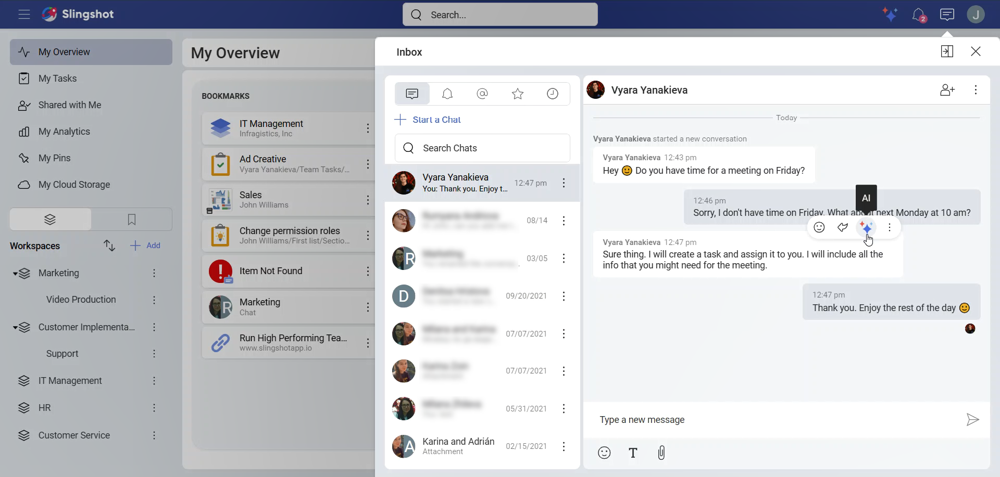
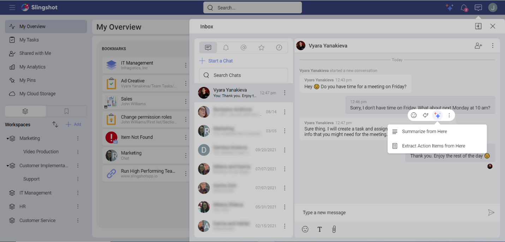
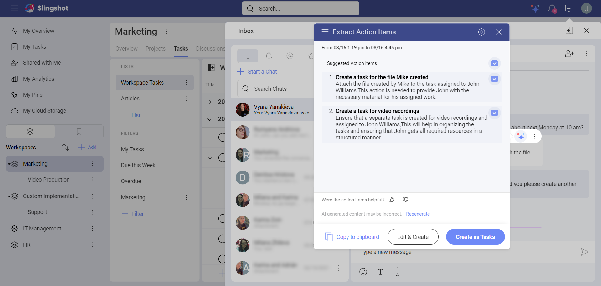
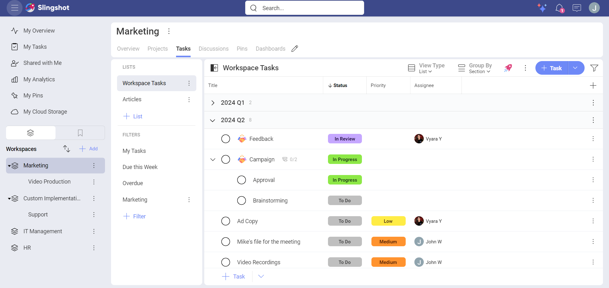
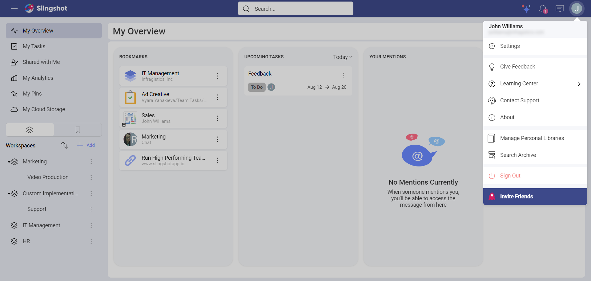

# Extract Action Items

With the Extract Action Items AI feature, you can create tasks from messages in chats, discussions or even tasks, while using AI generated titles and descriptions. This way you can save time while creating tasks and can efficiently distribute responsibilities between different teams.

>[!Note] Extract Action Items from Here is a [Slingshot](slingshot-subscription.md) and [Slingshot Enterprise](slingshot-enterprise-subscription.md) feature.

## Where can I find the option to Extract Action Items?

You can find it when you:

1. Hover over or long press (for mobile devices) on a message in a chat, discussion or a task.

2. You will see different options, such as reacting to the message with emojis, or directly replying to it. To see a list of the AI features that are available to messages, click/tap on the three-star button. 

 

3. You will be presented with the following options:

- [Summarize from Here](summarization.md)

- Extract Action Items from Here

 

## How can I create a task from an Extracted Action Item?

Once you have chosen the option to extract action items, you will see the following dialog:

 

Here you can:

- Choose which items you want to use for the creation of your tasks. Each item has a title and a description. If you decide to use them while creating the new tasks, they will automatically be added to them. This way you can save time and be more efficient with the distribution of tasks. You can always edit the items, if needed.

- Generate new versions of the extracted action items from the **Generate** button. This way you can have different options for titles and descriptions. You can choose the ones that best fit your goals.

- **Copy to clipboard** if you want to reuse the titles and descriptions of the items  for creating notes or messages. 

- Give us feedback. The feedback from our users helps us improve Slingshot and the experience with it.

- **Edit** and then **Create** the tasks or directly create them. 
   - When you **Edit** the tasks, you can change the tasks’ default values and fields. For example, you can set the *Status* to be **In Progress** instead of **To Do**. You can also change the title and the description.
   
   - When you directly create tasks, you can’t make any changes to them. This means that you cannot edit the title and the description that are used from the extracted action items. There is also no option to edit the default values and [fields](custom-fields.md). Once you have created the tasks, you can make changes.

If you don’t want to make any changes to the tasks, you can:

1. Click/tap on **Create as Tasks**. 

 

2. Choose a location where you want to save them and then click/tap on **Next**. As you extract action items from a message, the default location for the tasks is the location of the message. 
For example, we wanted to create tasks from a private chat message. This is why the default location was *My Tasks*. You can always change the location based on your goals. In the process of creating the tasks, you can also add new *Task Lists* and *Task Sections* to the location.

 

>[!Note] You can extract actions items only from non-generated messages. [link to the Summarization article ] This means that you can create tasks from messages that are not created with the help of AI (Artificial Intelligence). 

If you want to first make some changes, for example, set up the **Priority** of a task or a set of tasks, you can:

1. Click/tap on **Edit&Create**. 

 

2. Choose a location where you want to save them and click/tap on **Next**. Note that the default location for the tasks is the location of the message you used for extracting action items. You can always change the location. You can also add additional *Task Lists* and *Task Sections* while creating the tasks.

 

3. When you are ready with the modifications of each task, click/tap on **Create** in each of them. If you have multiple action items, you will see a number of Action Items remaining to be created as tasks next to the **Create** button.

 

4. The tasks will appear in the location where you have saved them.

 

## How can I turn off the option to Extract Action Items?

If you are in the process of creating tasks from extracted action items, you can:

1. Click/tap on the **Settings** button in the upper right corner of the summarization dialog box.

 

2. The *AI* settings will open up. Toggle **General AI Features** off. This will disable all AI features.

 

Alternatively, you can:

1. Go to the upper right corner and select your profile image.

2. Click/tap on **Settings**.

 

3. Open the *AI* section.

 

4. Toggle **General AI Features** off.

