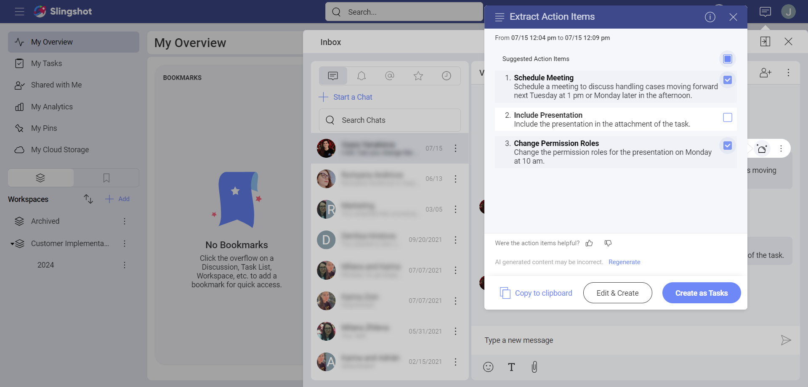
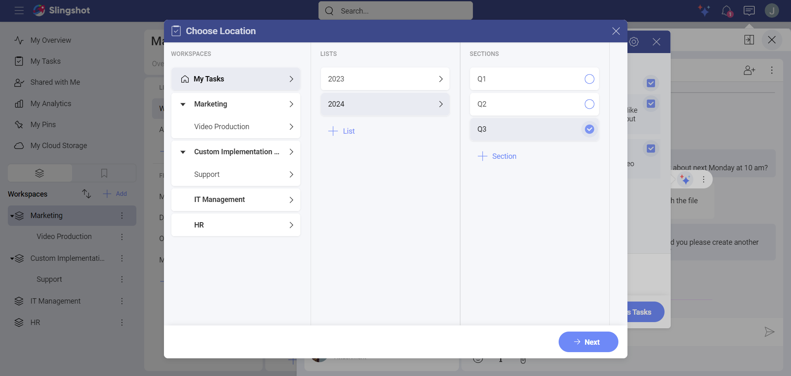
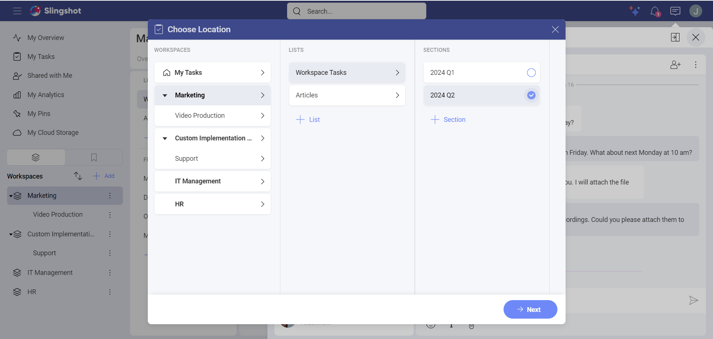
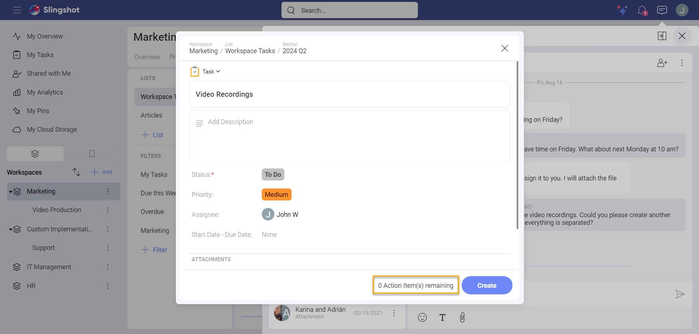
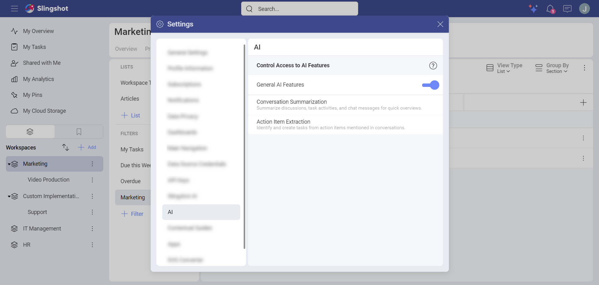

# Extract Action Items

"Extract Action Items" is a Slingshot AI-powered feature that enables you to generate tasks directly from messages in chats, discussions, or even other tasks. With AI-generated titles and descriptions, this feature streamlines the task creation process, saving you time and helping you efficiently distribute responsibilities across teams. 

As with all Slingshot AI features, it is a paid feature, available under the *Slingshot* and *Slingshot Enterprise* subscriptions. For more information on upgrading your license, please visit [here](https://www.slingshotapp.io/pricing).  

## How can I use the Slingshot AI Extract Action Items feature? 

Using the Slingshot AI Extract Action feature is simple to use and helps you create tasks easily and effortlessly from chats and discussions. This feature streamlines task creation by extracting text from a discussion or chat and generating a task, eliminating the need to follow the usual steps.  

Navigate to the discussion or chat message that you want to create a task from. 

1. Hover over or long press (for mobile devices) on a message in a chat or discussion. 

2. You will see different options, such as reacting to the message with emojis, or directly replying to it. To see a list of the Slingshot AI features that are available to messages, click/tap on the three-star AI button.  

3. You will see a list of Slingshot AI features. For this walkthrough, chose **Extract Action Items**. 

4. From here a dialog box will appear. This will display a list of Suggested Action Items. 

From here, there are many more options you can do: 

- Choose which items you want to use for the creation of your tasks. Each item has a title and a description. If you decide to use them while creating the new tasks, they will automatically be added to them. This way you can save time and be more efficient with the distribution of tasks. You can always edit the items, if needed. 

- Regenerate new versions of the extracted action items from the **Generate** button. This way you can have different options for titles and descriptions. You can choose the ones that best fit your goals. 

- **Copy to clipboard** if you want to reuse the titles and descriptions of the items for creating notes or messages.  

- Give us feedback. The feedback from our users helps us improve Slingshot and the experience with it. 

- **Edit & Create** button allows you to Edit the tasks’ default values and fields. For example, you can set the Status to be *In Progress* instead of *To Do*. You can also change the AI generated title and the description. It then creates the tasks. 

- **Create** button creates tasks immediately without the option to edit them. This means that you cannot edit the title and the description that are used from the extracted action items. There is also no option to edit the default values and fields. Once you have created the tasks, you can make changes. 

## How do I create tasks? 

1. Click/tap on **Create as Tasks**.  

2. Choose a location where you want to save the tasks and then click/tap on **Next**. The default location for the tasks is the location of the message. For example, if you extract action items from a private chat message, the default location will be *My Tasks*. However, you can change the default location to suit your needs. In the process of creating the tasks, you can also add new *Task Lists* and *Task Sections* to the location, as shown in the screenshot below. 

 

>[!Note] You can only use the Slingshot AI extract action items feature on non-generated messages. This means that you cannot summarize messages that have already been summarized using the Slingshot [AI Summarization](summarization.md) feature.   

## How do I edit tasks before creating them? 

If you want to first make some changes, for example, set up the *Priority* of a task or a set of tasks, you can: 

1. Click/tap on **Edit&Create**.  

2. Choose a location where you want to save the tasks and then click/tap on **Next**. The default location for the tasks is the location of the message. For example, if you extract action items from a private chat message, the default location will be *My Tasks*. However, you can change the default location to suit your needs. In the process of creating the tasks, you can also add new *Task Lists* and *Task Sections* to the location, as shown in the screenshot below. 

3. When you are ready with the modifications of each task, click/tap on **Create** in each of them. If you have multiple action items, you will see a number of Action Items remaining to be created as tasks next to the **Create** button. 

 

## How do I disable the Slingshot AI Extract Action Items Feature:  

Slingshot AI is turned on by default, unless you are part of an Organization and your Org Admin has disabled it for the entire organization.   

If you want to turn Slingshot AI off:  

1. You can access the settings panel in two separate scenarios:  

    a. Navigate to your Avatar in the top right corner.   

    b. Directly from the summarized text window navigate to the settings icon in the top right corner. 

2. From the Settings Panel, select *AI*.  

3. Toggle the **General AI Features** off. 

 
