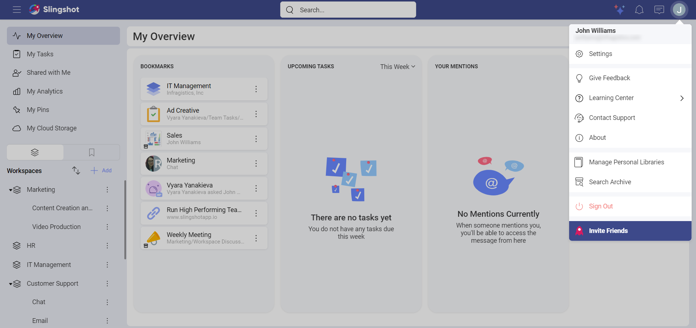
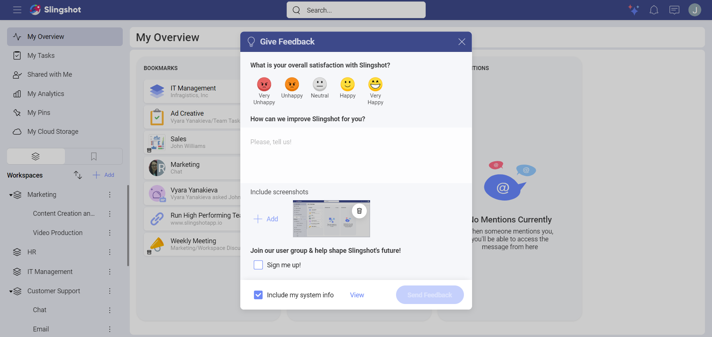

# Feedback

We are constantly working on improving Slingshot as our goal is to reach simplicity in our data-driven world while making remote work easy and fast. As we share our users’ passion for a digital workplace, we would like to hear more from you through our feedback form.

## How can I provide you with My Feedback?

You can follow these quick steps in order to share your feedback with us:

1. Tap/click on your profile picture in the upper right corner.

2. Tap/click on **Give Feedback**.

 

3. A window will pop up, where you can:

- Write about your experience with Slingshots and tell us more about the features or options that you would like us to include/improve.

- Include screenshots of the app. You can also edit them with the help of different tools such as adding text or using an arrow to point to a specific area.

- Sign up for our newsletters.

- Include your system info. We would recommend that you always include this info in your feedback as that will help us get a better overview on the matter.

 

If you want to find out more about the other options under your user account and settings, click [here](https://www.slingshotapp.io/en/help/docs/user-account).