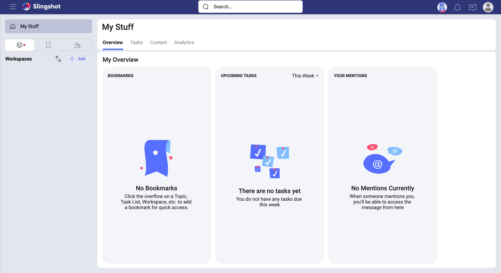
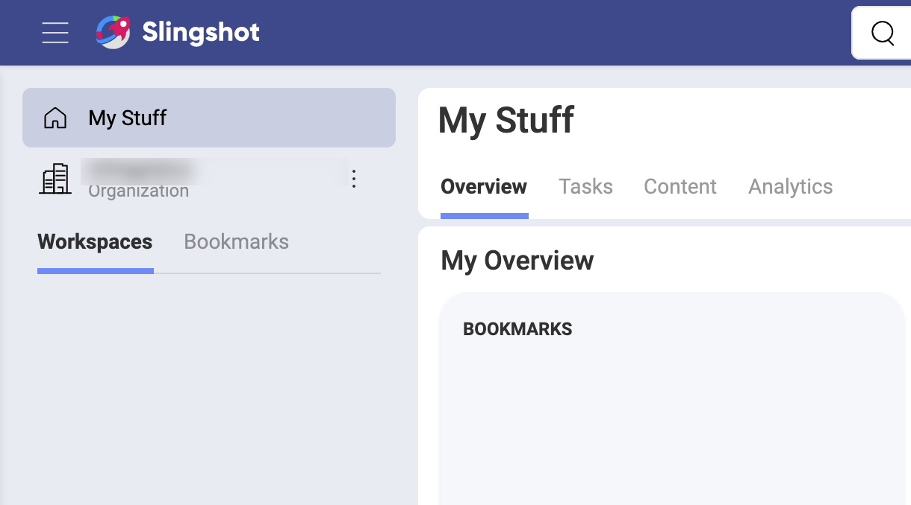
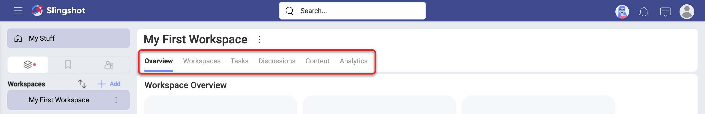
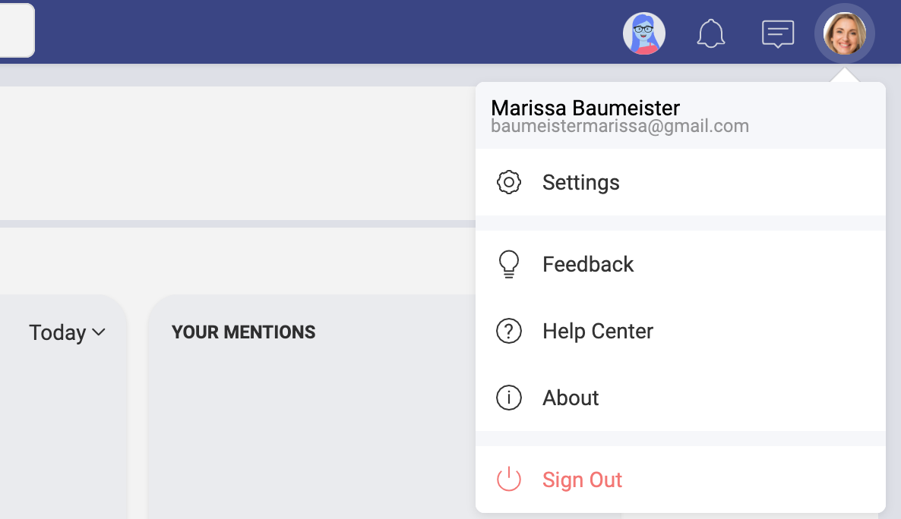
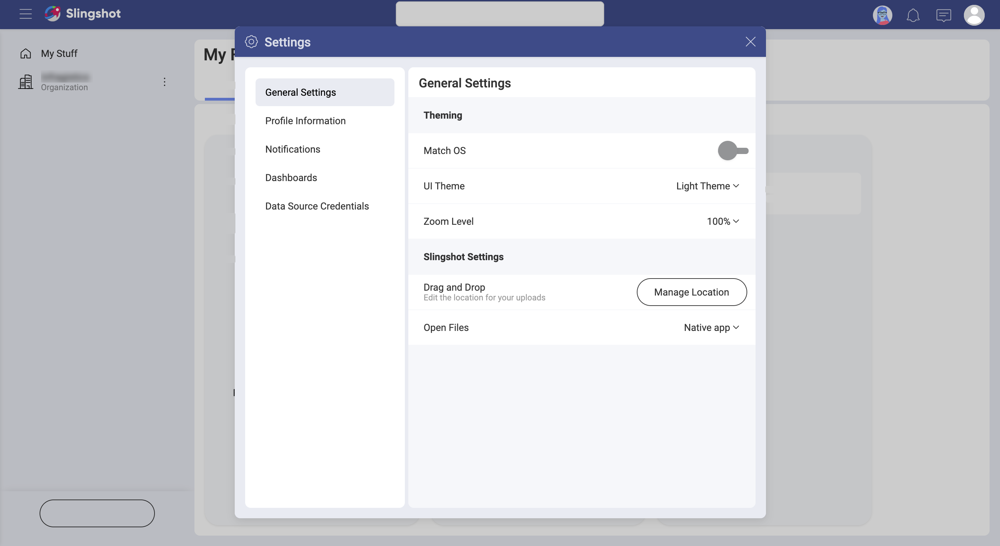
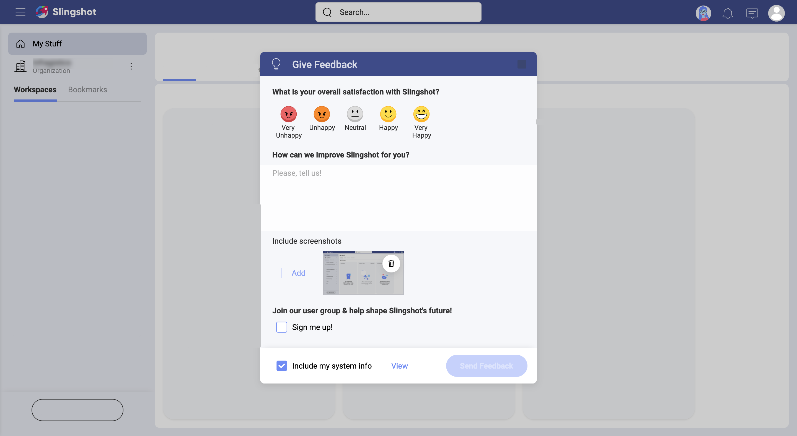

## First Time Signing In

Welcome to Slingshot!  
When opening the app you'll be met with different sign in options:

Before jumping in, take into account that in Slingshot you can join an **Organization**. If you are a member of an organization, you have to log in with your organization’s email. Choose Google or Microsoft as needed, and you'll be associated with the main Organization.

> [!NOTE]
> The Organization workspace is useful for managers and leaders to communicate key goals, metrics, strategies, and important announcements throughout their organization. The Organization workspace is named after your organization (e.g. your company's name).  

When you log in with Google or Microsoft, you get a cloud storage automatically configured based on your credentials, Google Drive or OneDrive respectively. This means you get access to your files on the cloud storage and can share them with other users in Slingshot.

### Your first screen

Once you get in, you are greeted with your first screen:

You always start in your personal space, **My Stuff**. Specifically, in _My Overview_. This is the place where you can have a quick glance at your most important information, organize yourself, and visualize your work.

As you can see above, _My Overview_ can get very busy. Let's focus on getting you familiar with Slingshot first...

### My Stuff, Organization, Workspaces

Your personal space, **My Stuff**, is great and useful, but Slingshot is about effective collaboration in *Workspaces* where you run teams and projects. So, you're probably wondering how to switch between your personal space, the Organization, and the workspaces... 

Check out the image below:

The navigation panel on the left includes: 

- the **My Stuff** tab; 
- the **Organization** tab (if you have one), and 
- the **Workspaces** and **Bookmarks** tabs. 

You can switch between the content in My Stuff, Organization and Workspaces. 

When the *Workspaces* tab is selected, you will see a list of workspaces and [sub-workspaces](workspaces#using-workspaces-within-the-workspace). If you bookmarked any workspace to keep it at hand, you can select the *Bookmarks* tab to find it faster. To navigate to any workspace, just click/tap over it.

Keep in mind that in Slingshot, people can be part of an organization and limitless workspaces. Inside a parent workspace you can create more workspaces for your projects, and you'll have overviews, tasks, discussions, content, and analytics at both levels. For example, there are tasks in the parent workspace and tasks in each of the sub-workspaces as well.  
Follow the link for further details about [Workspaces](workspaces.md).

### Overviews, Workspaces, Tasks, Discussions, Content, and Analytics

Inside Slingshot workspaces, you will find the six main navigation bars on top: **Overview**, **Workspaces**, **Tasks**, **Discussions**, **Content**, **Analytics**.

As already mentioned, the Organization workspace is not like other workspaces. So, inside it, there is a different number of navigation bars. That goes for _My Stuff_ and sub-workspaces, which also have the navigation bars. 
But why is that? Let's answer this question quickly by explaining the idea behind each navigation bar.

- *Overview* gives you a quick status of your workspaces or your personal work.
- **Workspaces** shows the list of workspaces and allow you to create another level of workspaces inside the parent workspace. However, you can have only two levels of workspaces - i.e. one parent workspace containing limitless sub-workspaces.
- **Tasks** represent work to be done by the members in a workspace.
- **Discussions** used to communicate among members of an organization or a workspace. 
- **Content** is about cloud storages and boards - basically you connect to cloud storages and then use boards to organize and share that content with others. 
- **Analytics** allow you to quickly create and share data visualizations so you can turn your data into insights.

The image above shows the navigation bars of a Slingshot workspace, the Organization, a sub-workspace, and *My Stuff*. But only workspaces include all the main navigation bars. 
Follow the links for further details about [overviews](overviews.md), [workspaces](workspaces.md), [tasks](tasks.md), [discussions](communication.md), [content](content-boards.md), or [analytics](analytics/index.md).

### Notifications and User Settings

**Notifications** are designed to keep you updated on any changes to workspaces, tasks, messages, and analytics. You can learn, among others, that a task was assigned to you, that you are removed from a workspace, or that someone sent a message in a discussion thread you're following.

There are three different types of notifications, in-app, push, and email. This means that you can get a message that pops up while using Slingshot (in-app notification), a message that pops up on a mobile device (push notification), or even an email notification.  
Follow the link for further details about [notifications](notifications.md).

Get to **User Settings** by selecting your *profile image*, there you can find _General Settings_, _Feedback_, and you can also _Sign Out_ of the application.

Then, in _Settings_ you can find five categories, including general and profile settings, notifications, data privacy and settings related to your dashboards. In _General Settings_ you can configure your app appearance and also how you work with content, whereas _Profile Information_ includes information about you and your organization. 

In _General Settings_ you will notice the **Drag and Drop** button. This setting allows you to manage the location of your uploads. But what does this mean?

All files you reference or share within Slingshot, are located in a cloud storage. When you drag and drop a file, which comes from outside Slingshot,  it's uploaded to the cloud storage configured here.

Use in-app **Feedback** to send us suggestions, comments, or requests about Slingshot. Here you can rate the app, add screenshots to the feedback you send, and also annotate the screenshots to provide even more detailed information.

