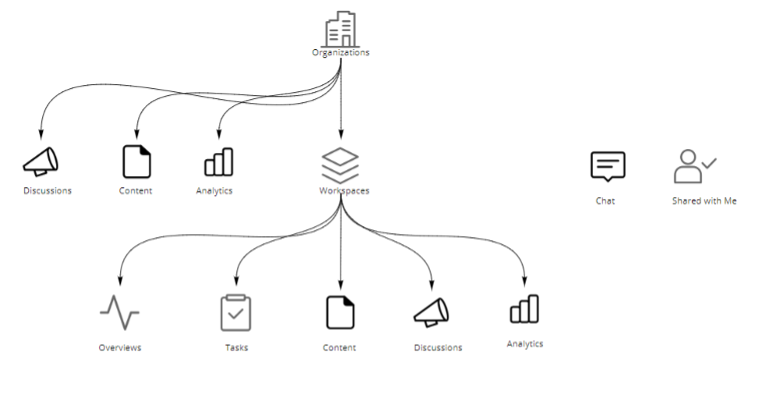
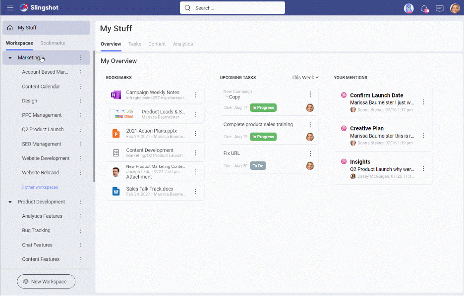

# Getting Started with Slingshot

Slingshot is the only digital workplace that brings together all the tool you need to run high performing teams such as – project management, data analytics, content management and team collaboration.

For a seamless onboarding experience, you should first become familiar with the basic structure and features. In the top left of your main navigation panel, you have the following>  

- **Overview**: Serve as a high-level area where you can quickly access bookmarks, see priorities and messages you need to catch up on.
- **Assigned Tasks**: Pulls together all of the tasks that are assigned to you in Slingshot, from any workspace or project. You can create custom filters that will allow you to prioritize and manage your work across different teams, departments, and projects.
- **Shared with Me**: Quick access to anything in Slingshot that has been shared with you. You can share, dashboards, lists, discussions, and more.
- **Analytics**: Gain deeper insights than ever before with self-service business intelligence. Build dashboards right from the data sources you use every day, access your organizations data catalog and much more. 
    - *Data Catalogs*: Find the most trustful information about your company, accesssing data that is categorized and certified.

- **Organizations**: Organizations are a way for your entire company to have transparent discussions, access to content and data through your company data catalog.

>[!NOTE] Organizations & Data Catalogs are Enterprise level features.

After your quick access features Slingshot has three tabs for your workspaces, bookmarks & groups:  

- **Workspaces**: This is a place for your teams and groups of people to come together to work on projects and initiatives. Workspaces contain:  

    - *Projects*: Live underneath the workspace to organize your tasks, content, dashboards and conversations further. Projects will also have their own overviews.  
    - *Tasks*: Create and organize tasks for your teams and projects.  
    - *Discussions*: Have conversions where members or your workspaces and organizations can participate and stay in the know. 
    - *Pins*: Bring URLs, files and documents together in context of your workspaces or organization from any cloud provider (Google Drive, OneDrive, SharePoint, Box, DropBox).
    - *Dashboards*: Add dashboards to workspaces and projects to ensure data-driven decisions.  
    - *Data sources*: Add data sources that members of workspaces or projects need to have access too.

- **Bookmarks**: Keep your most important documents, dashboards, conversations and more, one click away by bookmarking anything in Slingshot.  

- **Groups**: Create groups so you can mention, invite and share information faster with a set of people.  

>[!NOTE] Groups are an Enterprise only feature.

On the top right area of Slingshot you will find the following features:  

- **Emily**: Slingshot’s personal AI assistant is filled with onboarding and will be there to help you along your Slingshot journey.  

- **Notifications**: Never miss a beat with real time notifications  

- **Chat**: Privately chat 1 on 1 or with a group of other users of Slingshot – within or outside of your organization.   

- **Your Avatar**: Update your profile, access settings, and much more from behind your avatar icon.  

Get a high-level overview of Slingshot and a glimpse into all of the different features in our Slingshot Product Tour video.  

> [!Video https://www.youtube.com/watch?v=s5HRJE_iFPI]

## Logging into Slingshot  
When first launch the Slingshot application you are welcomed with 4 sign in options:
 - Apple
 - Google
 - Microsoft
 - Infragistics

 Using your business Google or Microsoft log ins will give you additional benefits such as contact syncing.

Before jumping in, let’s first run through the advantages to the different log ins.  

Slingshot was built on top of Microsoft and Google making it the perfect too to integrate into your teach stack. Using your business email with one of these providers comes with 3 main advantages:  

1.	All your contacts will be synced and brought into Slingshot making it easier to start inviting users to your workspaces, chat with them and assign them tasks.  
2.	Your respective cloud storage provider will automatically be added so you can start pinning and attaching files or create dashboards from any excel file.  
3.	You will automatically be added to your associated organization  

>[!NOTE] The Organization workspace is useful for managers and leaders to communicate key goals, metrics, strategies, and important announcements and resources throughout their organization. The Organization workspace is named after your organization (your company's name).

## Your First Screen  
Now that you are logged in you can start using Slingshot! Upon your first log in you will see the following screen:  

My Stuff in Slingshot serves as both a lens to your workload and a place to create and store personal items.

## Main Navigation

Slingshot main navigation panel on the left-hand side allows you to quickly switch between My Stuff, you Organization, Workspaces and Bookmarks.  

-	**My Stuff** allows you to create personal tasks, content, and dashboards. In addition, within the task tab you can see any tasks that is assigned to you – no matter where it is in Slingshot – for a full view into your workload
- **Organizations** will automatically add anyone who logs in with their business email to gain access to org level discussions, content and data  
- **Workspaces** are places for you to gather with your different teams to work on projects and initiatives. Each workspace has an overview, tasks, content, discussions and analytics.  
-	**Bookmarks** give you quick access You can bookmark essentially anything in Slingshot that you want quick access too.  

## Notifications

[Notifications](notifications.md) are designed to keep you updated on any changes to workspaces, tasks, messages, and analytics. You can adjust your notification settings to select what and where you get notified for. There are three different types of notifications, in-app, push, and email.

  

## Settings  

Behind your avatar in the top right corner of Slingshot you will find your user settings, a place to provide feedback right from in the app and additional resources.  

