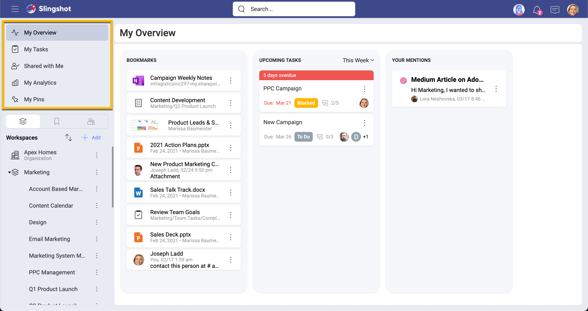
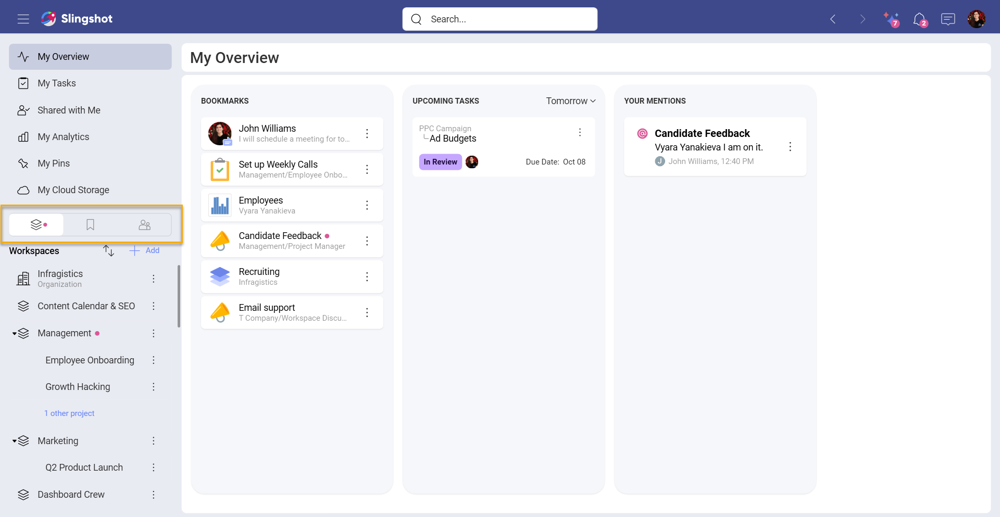
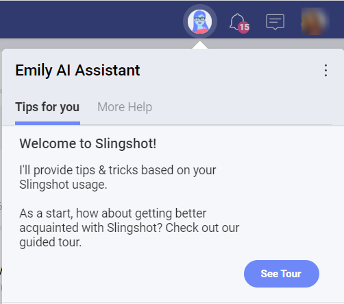
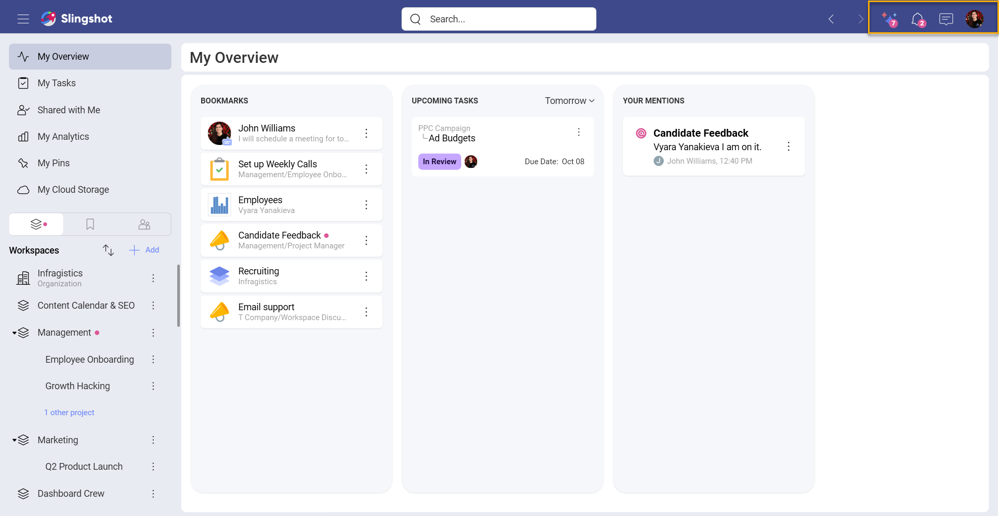

# Getting Started with Slingshot

Slingshot is the only digital workplace that brings together all the tool you need to run high performing teams such as – project management, data analytics, content management and team collaboration.

For a seamless onboarding experience, you should first become familiar with the basic structure and features. In the top left of your main navigation panel, you have the following:  

- **My Overview**: Serve as a high-level area where you can quickly access bookmarks, see priorities and messages you need to catch up on.
- **My Tasks**: Pulls together all of the tasks that are assigned to you in Slingshot, from any workspace or project. You can create custom filters that will allow you to prioritize and manage your work across different teams, departments, and projects.
- **Shared with Me**: Quick access to anything in Slingshot that has been shared with you. You can share, dashboards, lists, discussions, and more.
- **My Analytics**: Gain deeper insights than ever before with self-service business intelligence. Build dashboards right from the data sources you use every day, access your organizations data catalog and much more. 
    - *Data Catalogs*: Find the most trustful information about your company, accesssing data that is categorized and certified.
- **My Pins**: Contains all your links to different resources, including files from cloud storages, URLs, and analytics dashboards.

>[!NOTE] Data Catalogs is an Enterprise level feature.

After your quick access features Slingshot has three tabs for your workspaces, bookmarks & groups:  

- **[Workspaces](https://www.slingshotapp.io/en/help/docs/workspaces)**: This is a place for your teams and groups of people to come together to work on projects and initiatives. Workspaces contain:  

    - *[Projects](https://www.slingshotapp.io/en/help/docs/overviews)*: Live underneath the workspace to organize your tasks, content, dashboards and conversations further. Projects will also have their own overviews.  
    - *[Tasks](https://www.slingshotapp.io/en/help/docs/tasks)*: Create and organize tasks for your teams and projects.  
    - *[Discussions](https://www.slingshotapp.io/en/help/docs/discussions-faq)*: Have conversions where members or your workspaces and organizations can participate and stay in the know. 
    - *[Pins](https://www.slingshotapp.io/en/help/docs/pins)*: Bring URLs, files and documents together in context of your workspaces or organization from any cloud provider (Google Drive, OneDrive, SharePoint, Box, DropBox).
    - *[Dashboards](https://www.slingshotapp.io/en/help/docs/analytics/dashboards/overview)*: Add dashboards to workspaces and projects to ensure data-driven decisions.  
    - *[Data sources](https://www.slingshotapp.io/en/help/docs/analytics/datasources/overview)*: Add data sources that members of workspaces or projects need to have access too.

- **Bookmarks**: Keep your most important documents, dashboards, conversations and more, one click away by bookmarking anything in Slingshot.  

- **[Groups](https://www.slingshotapp.io/en/help/docs/groups)**: Create groups so you can mention, invite and share information faster with a set of people.  

>[!NOTE] Groups are an Enterprise only feature.

If you are part of an Organization, it is listed as the first item under Workspaces. Organizations are a way for your entire company to have transparent discussions, access to content and data through your company data catalog. It is also useful for managers and leaders to communicate key goals, metrics, strategies, and important announcements and resources throughout their organization. The Organization workspace is named after your organization (your company's name).

>[!NOTE] Organizations are an Enterprise only feature.

On the top right area of Slingshot you will find the following features:  

- **Emily**: Slingshot’s personal AI assistant is filled with onboarding tips and tricks, guides and tours, and will be there to help you along your Slingshot journey. When you open the personal AI assistant, you will see two sections: **Tips for you** and **More Help**:
   - *Tips for you*: When you click/tap on **See Tour** you will be pointed to different features with a short summary of what they do in order to get a better overview on Slingshot.

   - *More Help*: Here you can find more information about the features with the help of visuals. If you want to find additional information about the app, you can go through the different sections of the **Learning Center Docs**. 
   
   

- **[Notifications](https://www.slingshotapp.io/en/help/docs/notifications)**: Never miss a beat with real time notifications.  

- **[Chat](https://www.slingshotapp.io/en/help/docs/chat-faq)**: Privately chat 1 on 1 or with a group of other users of Slingshot – within or outside of your organization.   

- **[Your Avatar](https://www.slingshotapp.io/en/help/docs/user-account)**: Update your profile, access settings, and much more from behind your avatar icon.  

Get a high-level overview of Slingshot and a glimpse into all of the different features in our Slingshot Product Tour video.  

> [!Video https://www.youtube.com/embed/s5HRJE_iFPI]

## Logging into Slingshot  
When you first launch the Slingshot application you are welcomed with the following sign in options:
 - Apple
 - Google
 - Microsoft
 - Infragistics

Using your business Google or Microsoft log ins will give you additional benefits such as contact syncing.

Before jumping in, let’s first run through the advantages to the different log ins.  
Slingshot was built on top of Microsoft and Google making it the perfect tool to integrate into your tech stack. Using your business email with one of these providers comes with 3 main advantages:  

1.	All your contacts will be synced and brought into Slingshot making it easier to start inviting users to your workspaces, chat with them and assign them tasks.  
2.	Your respective cloud storage provider will automatically be added so you can start pinning and attaching files or create dashboards from any excel file.  
3.	You will automatically be added to your associated organization.  

