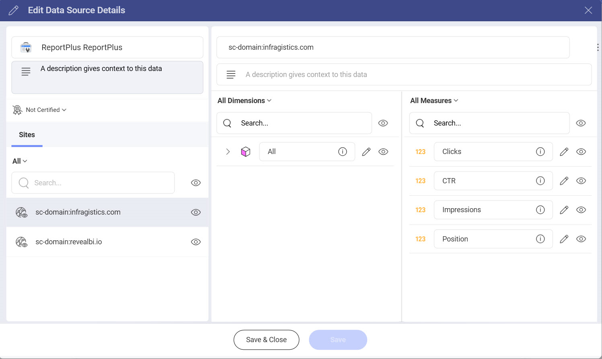

# Google Seach Console

With Google Search Console you can keep an eye on your site’s search traffic and check how your site performs on Google Search.

## Connecting to Google Search Console

1.	Select **Google Search Console** that is under **Marketing**, **Sales and CRMs section** in the data source list. 
2.	In case there are multiple accounts listed, choose the one that stores the data you want to access. You can also add a new Google account if the one that you need is not listed. You can also head [here](https://support.google.com/webmasters/answer/10267942) for more information about how to sign up for Google Search Console. 
3.	If you haven’t signed in yet, you will be prompt to enter your credentials.
4.	Before adding the account to your data sources, you can choose to edit the name, give a description or edit the details.
5.	If you click on **Edit Details**, you will be able to hide the data that you don’t want to use. 

6.	Once you’ve saved the changes, you’ll see the file in your **Data Sources** list.

## Working in the Visualizations Editor

When you use Google Search Console as a data source, you will see that the fields in the visualization Editor appear differently.

Instead of “Fields” heading on the left, you’ll see two sections in their own query field.

1.	Dimensions: They are the attributes of your data.  
2.	Measures (depicted by123 icon): They consist of numeric data. For example, you can see the number of clicks by countries.

## The Date Range Data Filter

This filter can’t be removed but you can change the default date range. The date filter is set to *Last 30 days* by default. 

If you want to change it, you can click on the arrow in the upper right corner (see the screenshot below) and pick a date range from the dropdown menu or create a custom one when you click on the first option.

## Settings

You can do the following changes from the **Settings**:
- Show or hide the title
- Align the text fields, number fields and the date fields
- Choose the font size (small, medium, large)
- Activate **Show Grand totals**
- Connect this visualization to another dashboard or a URL. You can check [this](https://www.slingshotapp.io/en/help/docs/analytics/dashboards/dashboard-linking) article for more information about how to link dashboards. 

