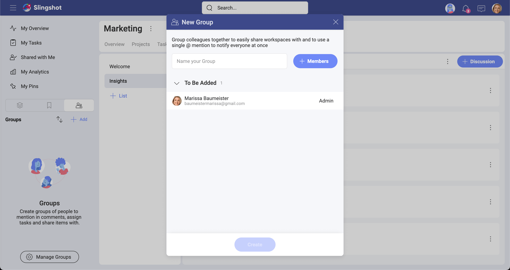
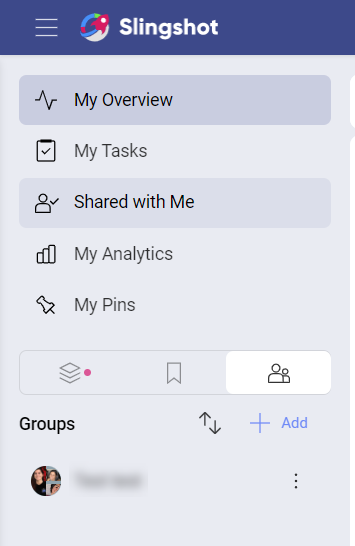

# Groups

Groups in Slingshot enable you to work faster with a set of people that share a common purpose. Typical examples include Product leads, Designers in your Marketing team, the Executive Team, etc. With groups, you can @mention in discussions, invite to workspaces, assign tasks and share dashboards faster with a set of people.

## What can you do with a Group?
Groups can make your life easy in many ways, including:
- Invite a group of people to a workspace or project, instead of individuals only.
- Assign a group of people to a task.
- Start a chat or a discussion with a group.
- Share a file, pin or other resource with the group.

## How to Create a Group
Creating a new group in Slingshot can be done is just a few easy steps!

1. Go to the left navigation and move the toggle from Workspaces to Groups
2. Select the “+ Add” button.
3. Then enter a name for your group and start adding members.
4. Select “create” and that’s it!

## Group Members and Permissions
Within Groups, there are two types of permissions:
- **Admin** – By default the person who created the group is set as the admin. Only the admin can change permissions of members and remove them.
- **Member** – Has access to everything related to the group, but can’t add new members or delete the group.

