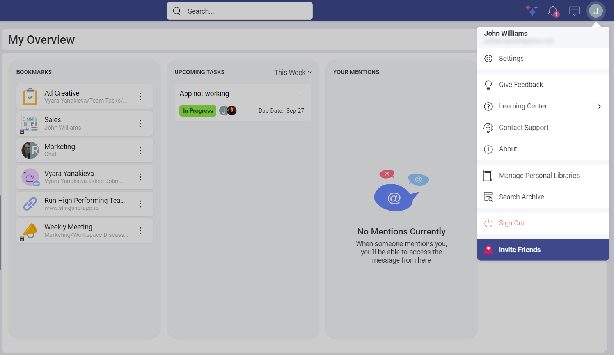
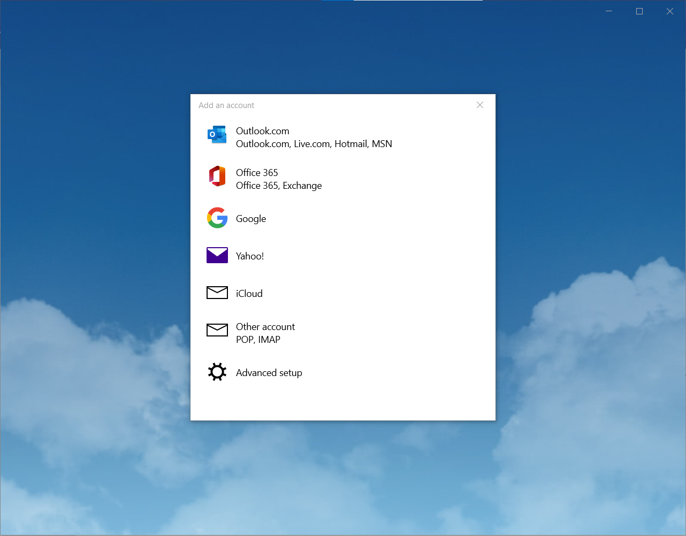

# Invite Friends

Slingshot is a digital workplace that connects everyone you work with to data, helps with organization of projects and content and provides you with the option to communicate with others in order to boost team results.

You can not only reach out to your team members via the app, but you can also message your friends who are not part of a specific organization.

With the Invite Friends feature, you can introduce your friends to Slingshot so you can start collaborating with them in no time.

 

## How can I Invite Friends?

*Mobile*

1.	Click/tap on your profile picture in the upper right corner.

2.	Click on **Invite Friends**.

3.	A share dialog will open up, where you can choose how to send the link (e.g. via text, email or an app)

*Web/Desktop app*

1.	Click/tap on your profile picture in the upper right corner.

2.	Click on **Invite Friends**.

3.	A dialog with a list of different email clients will open. You can choose a client and log in to your account or add a new account. 

 

4.	Once you’ve logged in, you’ll be able to send the link to Slingshot to your friend. After that you friend can log in to their account and check out the page.

5.	They can also click on the **Try it Now** or **Sign in** buttons in the upper right corner of the page and follow the steps in order to create a new account.

To learn more about how you can start a private chat, click [here](https://www.slingshotapp.io/en/help/docs/chat-faq).