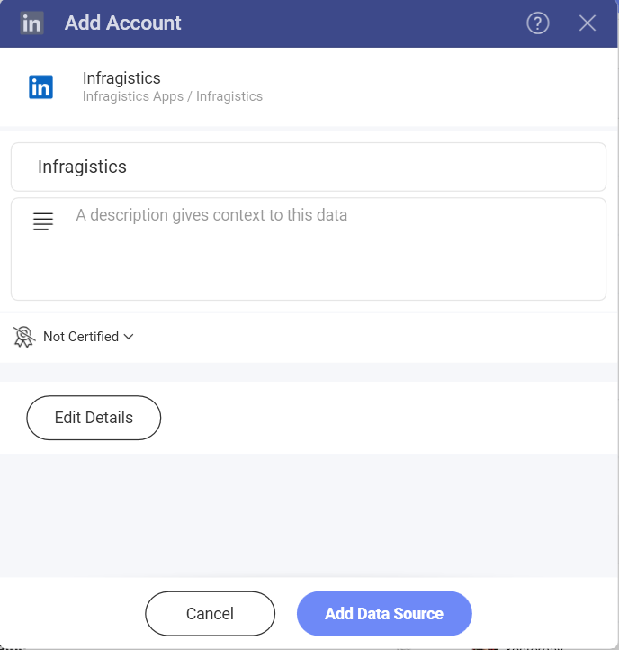
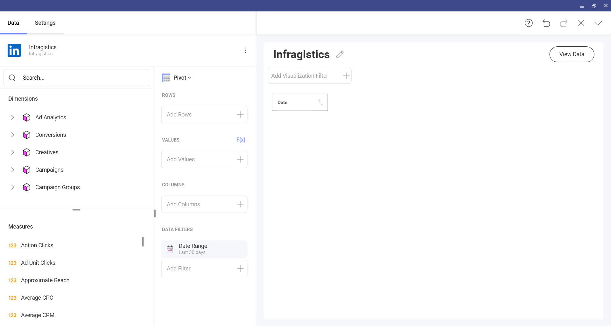
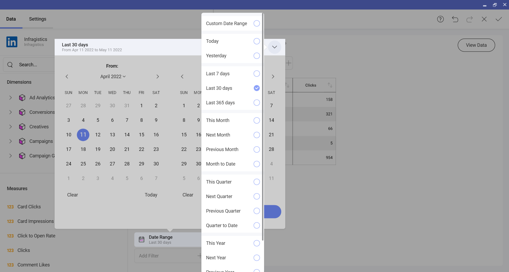

# LinkedIn

With the help of different types of dashboards in Slingshot, you can see how your advertising campaings perform on LinkedIn. 

## How to connect to LinkedIn?

1. Click on the **+Dashboard** button under the **My Analytics** section. 
2. Click on the **+Data Source** button.

3. Select **LinkedIn** that is under **Social Media** in the **Data Sources**.

4. Log in to your LinkedIn Ads account. In case you don't have one, you can check [this](https://www.linkedin.com/help/lms/answer/a426102) article about how to create an Ads account.
5. If you have more than one LinkedIn Ads accounts, you can choose **+Add** in order to include another account.

6. In the dialog that opens, you can change the Ad Account name, add a description or choose which details you want to see included in the dasboard.

 

 7. Click on **Add Data Source** to connect the account.

 ## Working in the Visualizations editor

 When you create a dashboard with information coming from a LinkedIn Ads account, you will see that there are two sections in their own fields. 

 

 
1.	Dimensions: They are the attributes of your data.  
2.	Measures (depicted by123 icon): They consist of numeric data. For example, you can see the number of clicks by regions.

## The Date Range Data Filter

 This filter can’t be removed but you can change the default date range. The date filter is set to Last 30 days by default.

If you want to change it, you can click on the arrow in the upper right corner (see the screenshot below) and pick a date range from the dropdown menu or create a custom one when you click on the first option.

## Settings

You can do the following changes from the Settings:
- Show or hide the title
- Align the text fields, number fields and the date fields
- Choose the font size (small, medium, large)
- Activate Show Grand totals
- Connect this visualization to another dashboard or a URL. You can check [this](https://www.slingshotapp.io/en/help/docs/analytics/dashboards/dashboard-linking) article for more information about how to link dashboards. 

