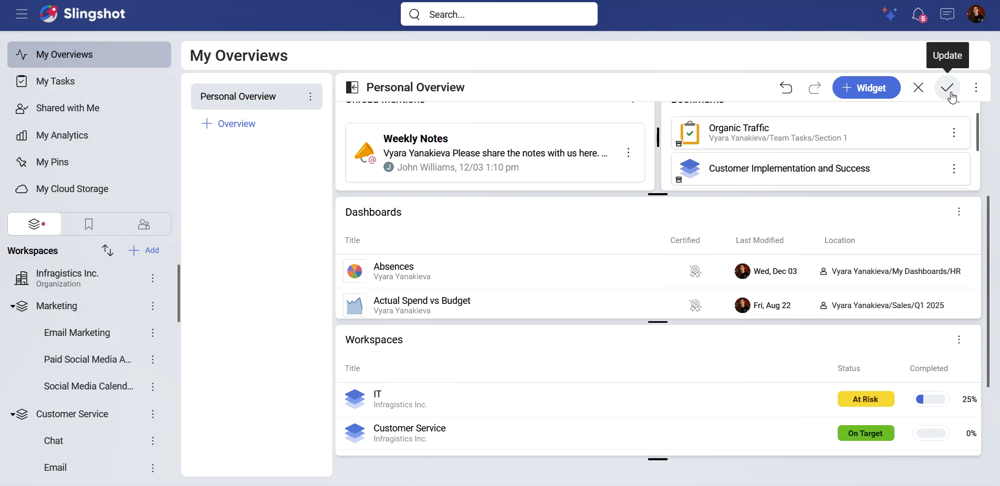
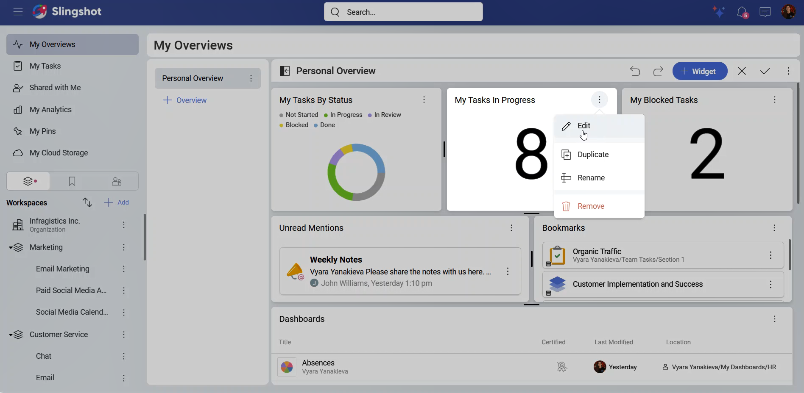
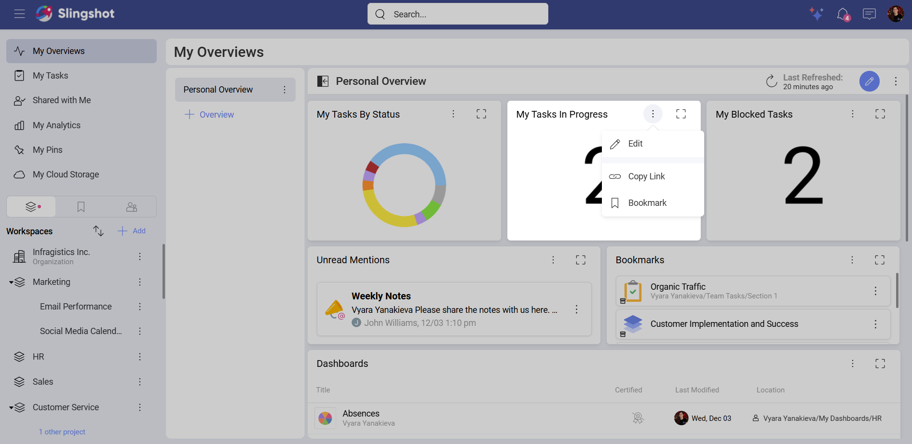
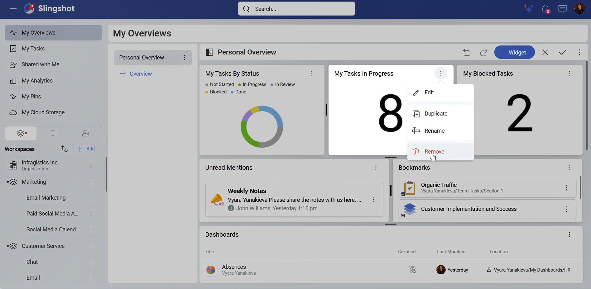
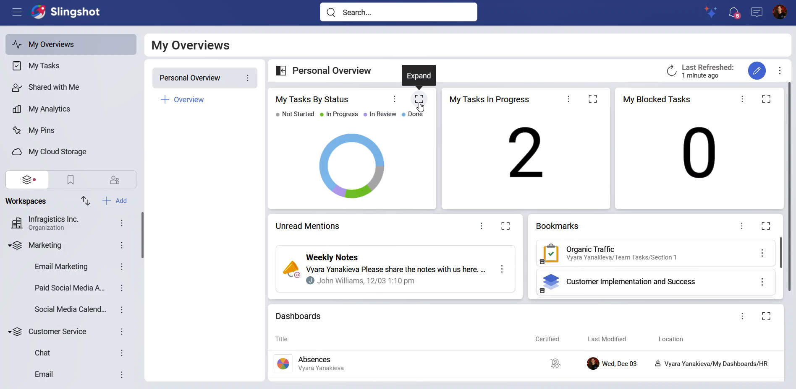
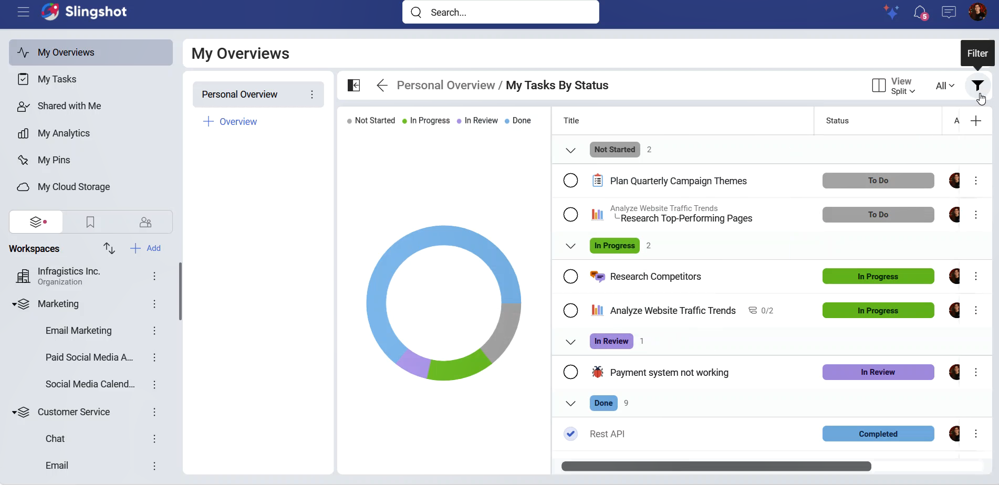
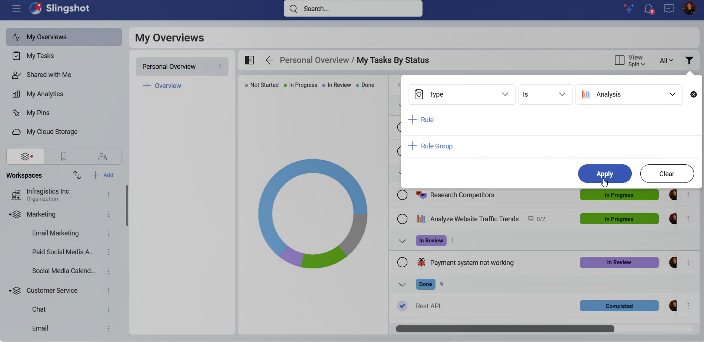
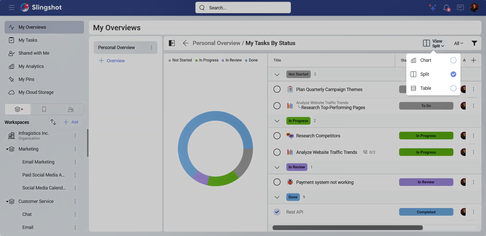
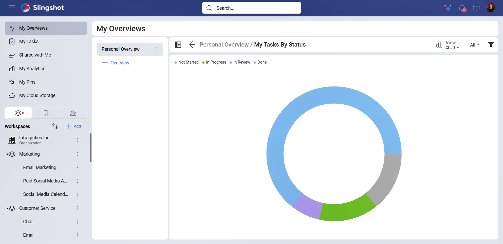

# Managing Overviews

As different teams have different goals and responsibilities, they need a way to browse thorough essential information quickly and efficiently. This is where overviews come in handy. 

Each workspace and project comes with a default Slingshot overview that can be changed. 

Your personal overviews in *My Overviews* can also be customized to best fit your goals.

>[!Note] Overviews cannot be shared via link.

There are two types of widgets that you can use to organize an overview: 

-	[Custom widgets](custom-fields.md): You can create a task, workspace or a project widget from scratch.

-	[Out-of-the-box widgets](out-of-the-box-widgets.md): You can use Slingshot’s predefined widgets that are divided into 6 categories for easy access. 

## Managing an Overview

>[!Note] 
>Only users with *Owner* permissions can make changes to workspace and project overviews.

Depending on what your teams need a quick access to, you can add, edit, duplicate or remove a widget from an overview. 

>[!Note] 
>Overviews update automatically every 30 minutes. You can click/tap on the **Refresh** button to manually update them.

## Adding a widget

To add a widget to an overview, you can:

1.	Choose an overview from the *Overviews* list in **My Overviews**, a workspace, or a project.

2.	Click/tap on the pencil icon in the top right corner.

3.	Click/tap on **+ Widget**.

4.	You will be presented with the option to create a custom widget, use one of the five most popular widgets, or open the *Widget Library*. If you want to see all the widgets organized in categories, you can click/tap on **Widget Library**. 

5.	Select the widget you want to add to the overview or create a custom one. 

6.	Click/tap on the checkmark to update the overview to include the new widget.

>[!Note] You can organize the layout of an overview by dragging the widgets or resizing them.

## Editing a widget

>[!Note] Depending on the type of a widget you want to edit, you will be presented with different settings.

To edit a widget, you need to:

1.	Open an overview from the *Overviews* list in **My Overviews**, a workspace, or a project.

2.	Click/tap on the overflow menu of a widget.

3.	Choose **Edit**.

4.	You will see the elements that you can configure on the left side of the widget.

5.	Once you have made the necessary changes, you can click/tap on the checkmark to save the changes.

6.	Click/tap on the checkmark in the upper right corner to update the overview.

Alternatively, you can:

1.	Open an overview from the *Overviews* list in **My Overviews**, a workspace, or a project.

2.	Open the overflow menu of a widget.

3.	Click/tap on **Edit**.

4.	Make the necessary changes.

5.	Click/tap on the checkmark icon in order to save the changes.

>[!Note] *Pins, Pin from Dashboards, Bookmarks*, and *Unread Mentions* cannot be edited.

## Duplicating a widget

To duplicate a widget, you can follow the steps mentioned above and choose **Duplicate** instead of **Edit**:

1.	Open an overview from the *Overviews* list in **My Overviews**, a workspace, or a project.

2.	Click/tap on the overflow menu of a widget.

3.	Choose **Duplicate**.

4.	Once you have duplicated a widget, you can edit it (if needed).

5.	Click/tap on the checkmark in the upper right corner to update the overview.

>[!Note] Pins, Pin from Dashboards, Bookmarks, Unread Mentions, and My Favorite Dashboards cannot be duplicated.

## Removing a widget

The steps for removing a widget are the same as the ones mentioned above. Here,instead of selecting **Duplicate**, you need to select **Remove**. 

## Filtering tasks

To filter the data in a task widget, you need to:

1.	Click/tap on the zoom in button of a task widget to view it in a maximized mode.

2.	Click/tap on the filter button next to **View**. 

3.	Select a filter value. 

4.	Choose **Apply** to save the changes.

>[!Note]
> There is no option to filter tasks that use the *Timeline* or *Calendar* visualizations.

## Task Widget Views

For better organization of the tasks in an overview, you can choose between three task views: *Chart*, *Split*, and *Table*. 

You can always change the task view when you:

1.	Click/tap on the zoom in button of a task widget to view it in a maximized mode.

2.	Open the dropdown menu of **View**. 

3.	Choose another view.

4.	The new task view will be automatically saved. When someone opens the widget again in a maximized mode, they will see the new task view.

>[!Note] 
>The *List*, *Timeline*, and *Calendar* visualization types don’t have an option to change task views.
