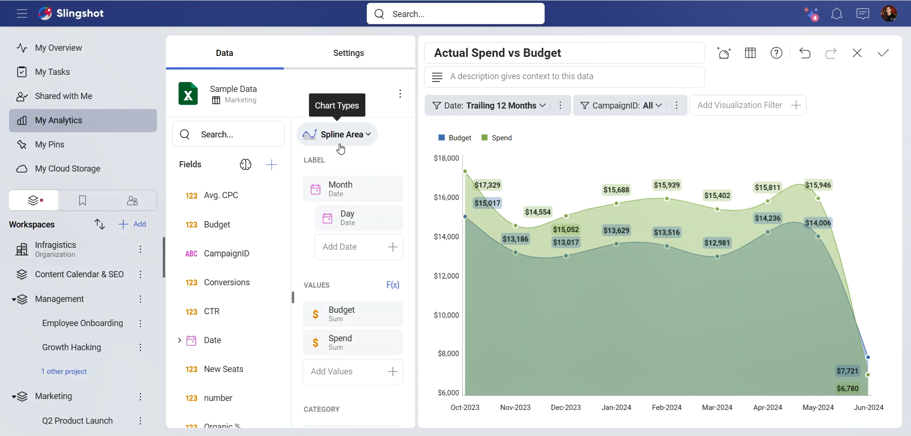
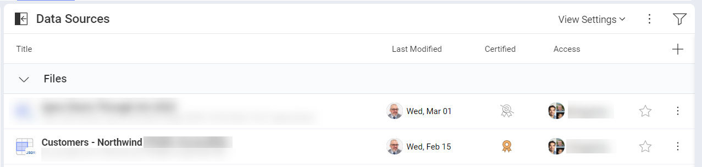
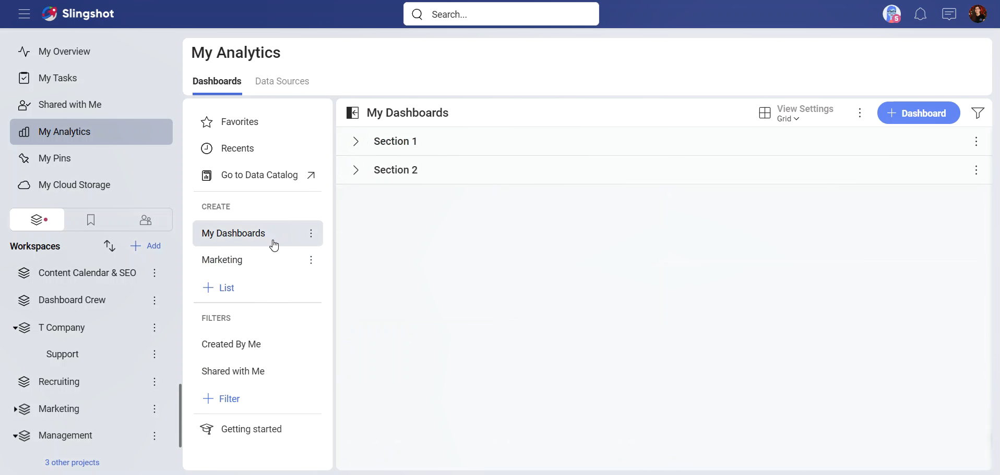
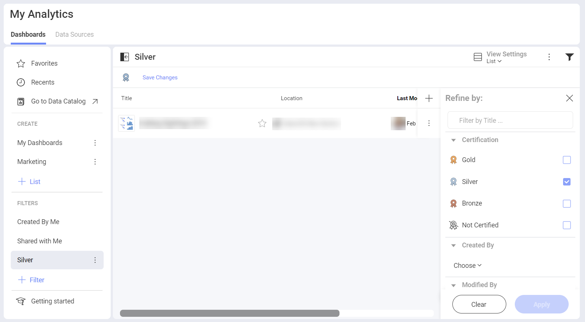

# My Analytics

With the *My Analytics* section of Slingshot, you can bring the power of BI (business intelligence) into your daily workflow while helping your team make faster data-driven decisions.

## What's in My Analytics

In order to make data-driven decisions, Slingshot is on your side with the following features:

- **Dashboards** – Create or share dashboards so your team can utilize data and improve productivity. Bring multiple data sources into one dashboard to ensure that you have all the information in one place.
- **Data Sources** - Connect directly to wherever your data comes from, including content managers, cloud services, CRMs, databases, spreadsheets, and more.
- **Data Catalog** - Find the most trustful information about your company in the list of data catalogs. The data is categorized and certified. 

>[!Note] Data Catalogs are available only to *[Enterprise](https://www.slingshotapp.io/en/help/docs/slingshot-enterprise-subscription)* users.

Data Sources make up visualizations and visualizations make up dashboards. In other words, your data comes from a data source, a visualization connects to that data source and displays the information. In order to increase productivity, dashboards include a collection of visualizations that have different pieces of related information.

## Dashboards

With an intuitive drag and drop interface, Slingshot makes it simple to create dashboards within minutes. Choose from more than 40 different visualizations to present your data and tell your story the best way.

### Customize

You can sort, filter and aggregate your data as you wish. Each chart type provides you with different settings to design your visualizations the way you want them to appear.

[Read more about the different chart types here!](https://www.slingshotapp.io/en/help/docs/analytics/data-visualizations/overview)

### Interact

Once your dashboard is created, interact with your visualizations with the drill-up/down support. 

### Share

Share your dashboards with others and collaborate over them. Different levels of permission types allow you to choose how to share the dashboards and what the access to them can be.

[Read more about dashboards here!](https://www.slingshotapp.io/en/help/docs/analytics/dashboards/overview)

## Data Sources

Connect to the most popular data sources without setting anything up on the server. Get real-time insights by connecting directly to *SharePoint Online*, *Google Drive*, *OneDrive*, *Microsoft Analysis Services*, *Microsoft SQL Server*, *CRM*, and many more. 

[Click here for a full list of connectors!](https://www.slingshotapp.io/en/help/docs/analytics/datasources/overview)

### Connect

To connect right to your data source and build your visualizations, you can follow these steps:

1. Click/tap on the **+ Dashboard** or **Create Dashboard** (Getting started section) blue button.
2. Select the data source you want to connect.
3. Configure the connection. This might include selecting the file’s location (spreadsheet or JSON file) or enter credentials (data storages, web resources, social media connectors, databases).

## Data Catalog

Your organization’s data catalog makes it easier for users to quickly find the insights they are searching for. With this feature, *Enterprise* users can access an extensive catalog of dashboards and data sources. 

Certifications are an important part of the data catalog, as they assist you to find the most trusted data within the organization. This is an excellent way to know which dashboards or data sources are reliable and contain verified information. When a dashboard or data source is certified, you will see a gold, silver or bronze colored badge next to it.

[Read more about data catalog here!](https://www.slingshotapp.io/en/help/docs/data-catalog)

## Lists

You can manage multiple lists of dashboards and data sources, which are designed to organize, manage and share those resources.
The Dashboards and Data Sources tabs have lists that can be further organized in sections. Sections are useful to add divisions and to better layout your content.

### Out-of-the-box Lists

By default, you start with the following lists - *My Dashboards* and *My Data Sources*, but you can create more lists and easily reorganize and move them just by dragging them. 

## Filters

Using filters allows you to view a set of dashboards or data sources that meet certain criteria. There are also filters out-of-the-box that you can save for future re-use.

### Out-of-the-box Filters

Slingshot includes several pre-defined filters which are very useful to quickly find specific dashboards or data sources.

These filters, which can’t be edited or deleted, are:
- **Created by Me** – Each dashboard or data source created by you within Slingshot.

- **Shared with Me** – Each dashboard or data source that has been shared with you by another Slingshot user.

### Creating Filters

To access the Filters editor, just click/tap the **+ Filter** icon in the *FILTERS* section.

To stop filtering dashboards or data sources, you can:

1. Click/tap on the filter icon to open the *Filters* dialog. 
2. Select the **Clear** button at the bottom to remove the current filters.
3. Click/tap on **Apply** to save your changes.

### Saving Filters

Sometimes you might want to save a filter in order to use it again in the future. With Slingshot, you can save specific filters and later edit them, if needed. These filters can help keep at hand a list of dashboards or data sources that are relevant to you.