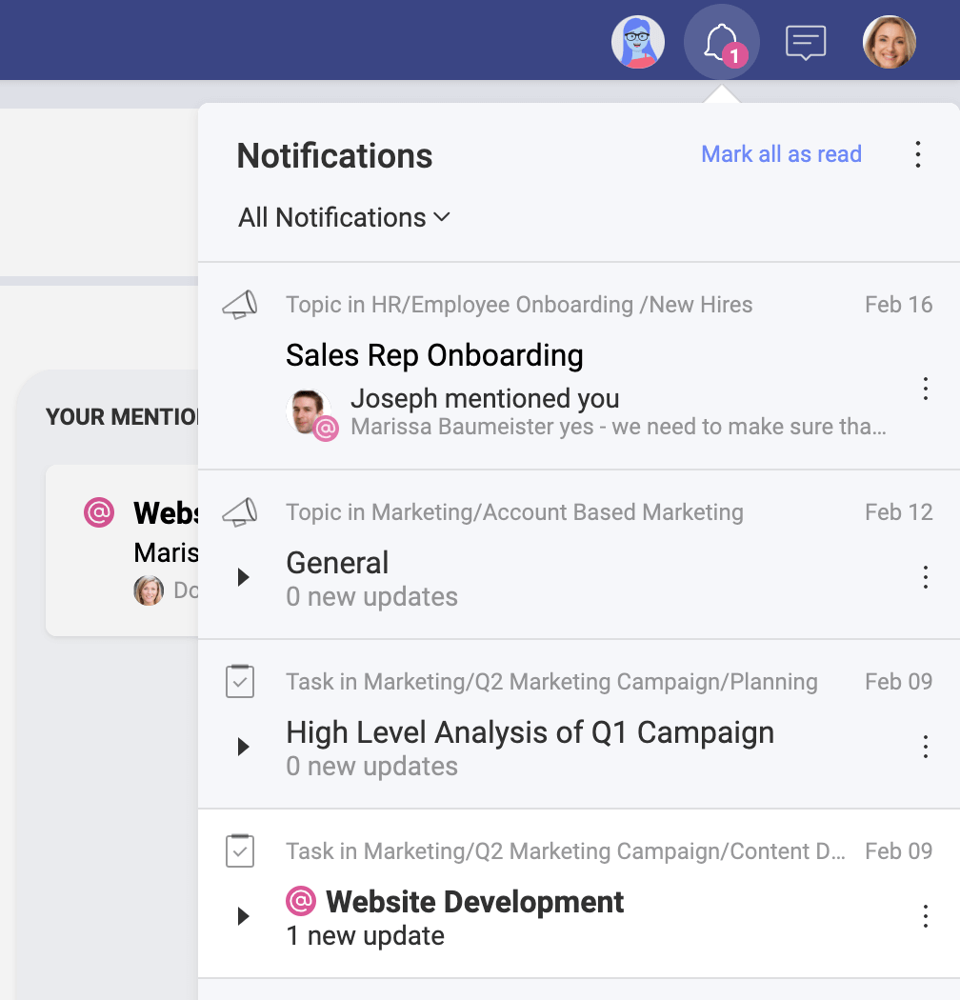
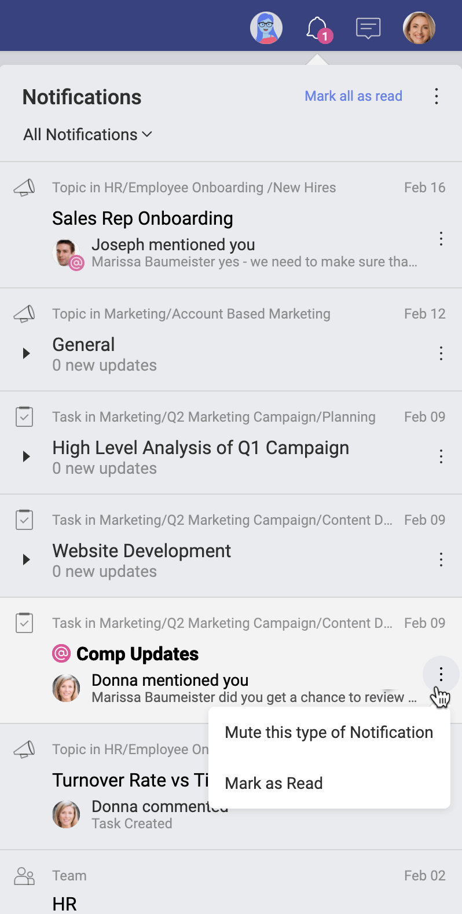
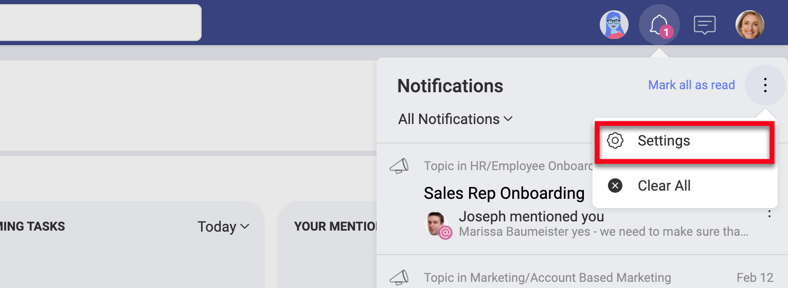
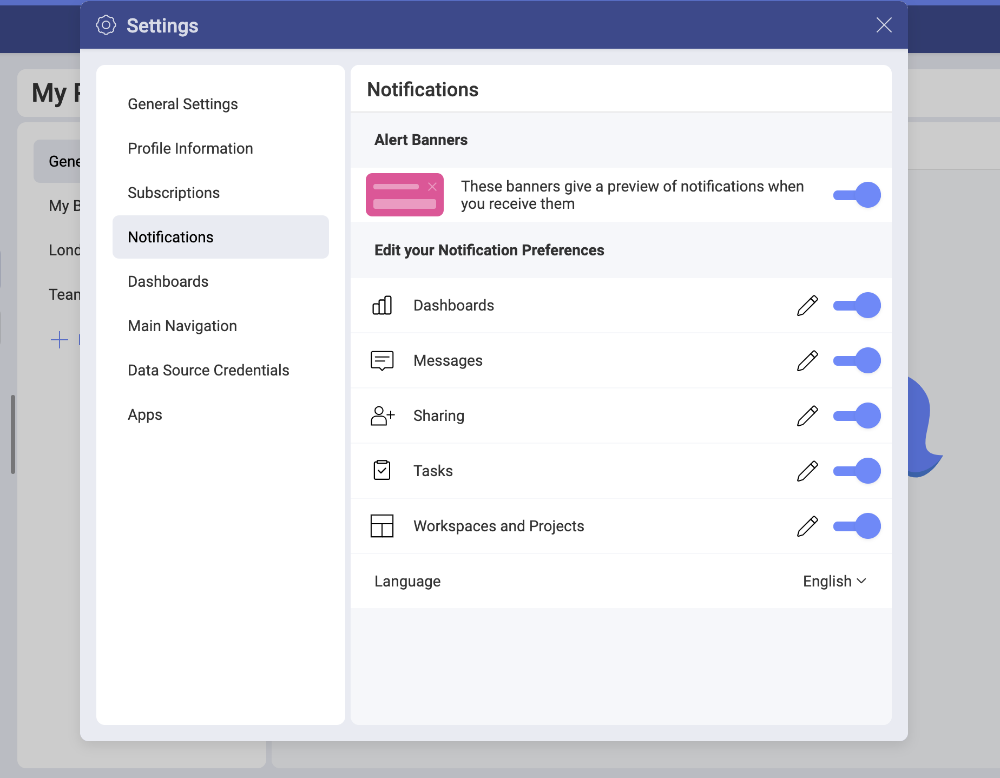
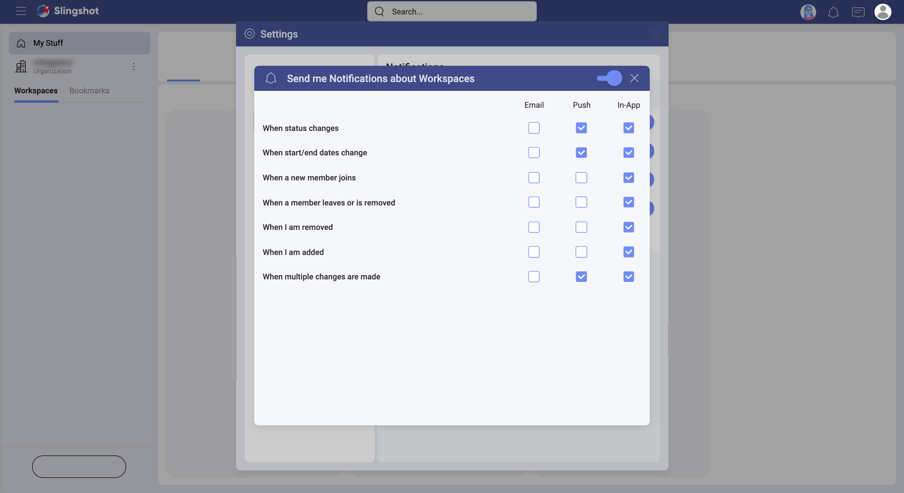

## Notifications

A notification can be defined as an indicator that a certain event has happened. This is a fairly common feature in smartphones, applications, and websites, providing new information to the user.

Sometimes notifications can become overwhelming, as an application can consistently send you  notifications that are not worthy of your attention. In Slingshot, we definitely want to avoid that feeling, so you start with cautious notifications settings. In any case, you can always modify the settings according to your preferences.

### So, what's a Slingshot notification?

It's an auto-generated indicator that is sent to you to let you know a certain event has happened. There are three different types of notifications, in-app, push, and email. This means that you can get a message that pops up while using Slingshot (in-app notification), a message that pops up on a mobile device (push notification), or even an email. As you can get Slingshot on any platform, tweaking those settings is important to customize your experience.

### Stay informed with notifications

Notifications are designed to keep you updated of any changes in workspaces, tasks, messages, mentions, and dashboards. You can learn, among others, that a task was assigned to you, that you are removed from a workspace, or even that someone sent a message in a discussion thread you're following.

You can access *Notifications* on the top right of the screen as shown below.

Within the *Notifications* panel, you can use the *Mark all as read* option at the top. You can also use the overflow menu next to each notification to *Mute* it or *Mark as Read/Unread* (see the screenshot below).

### How can I change my notifications settings?

There are three different types of notifications, in-app, push, and email. In-app notifications are displayed within the app in a Notifications panel. Push notifications are displayed as texts near the notification icon. And emails are delivered to the e-mail address associated with your account.

You can change your notification settings by going to your account settings and selecting the *Notifications* tab. 
Alternatively, you can open the Notifications panel and select *Settings* from the overflow menu in the upper right corner (see in the screenshot below): 

 You will be navigated to the *Notifications* tab in your account settings:

Finally, for each category you can edit the settings as shown below or use the switch to turn them off entirely.

The *language* option at the bottom of the categories list allows you to choose between 13 languages for your notifications. 