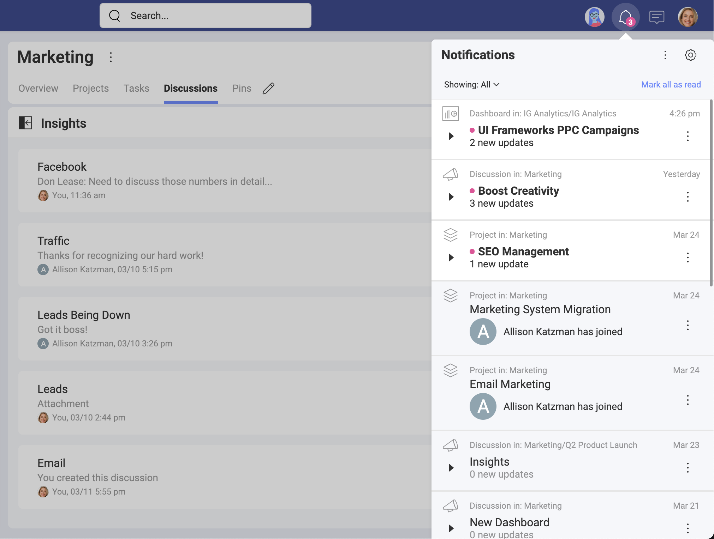
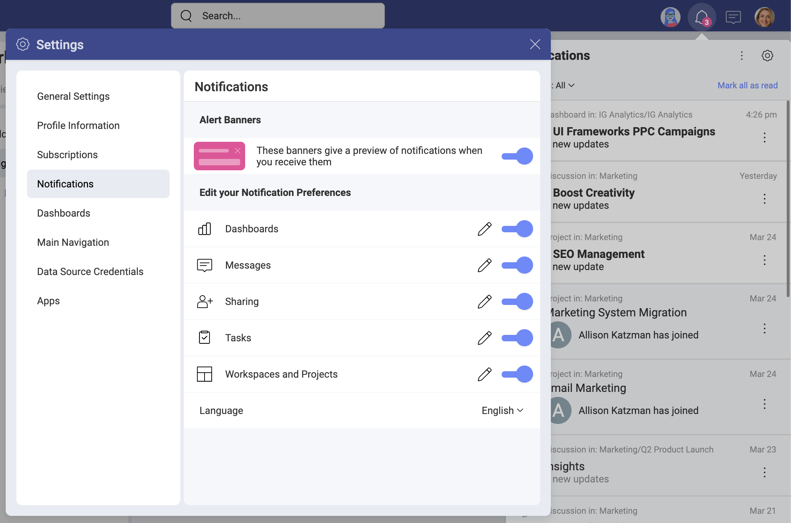
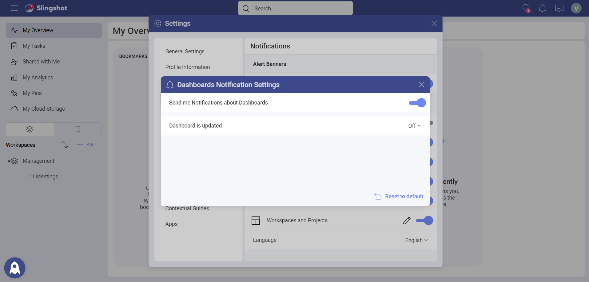
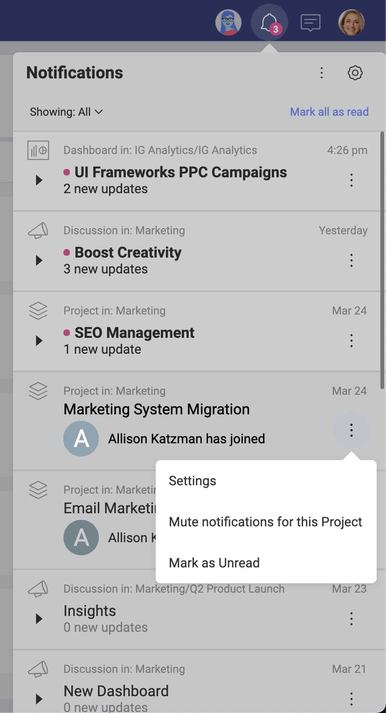

# Notifications

Notifications make sure that nothing goes missed in Slingshot and keep you on top of things that need your attention.

## Types of Notifications

Notifications come in the following three forms: 

- **In-App** – Notifications displayed within the app in the Notifications panel, located in the top right (bell icon).

- **Push** - These notifications are clickable pop-up messages displayed when you are not using the app. They will be shown on your mobile device or on your desktop screen (also called "banner" notifications).

- **Email** - Notifications delivered to the e-mail address associated with your account.

## Customizing your Notifications

You can easily change what you are getting notifications for in Slingshot so you only get alerted for what is most important to you. By going into your settings and then the notification tab you can edit the notification you receive. Alternatively, you can use the overflow menu in the Notifications panel.

In the Notifications panel, select the pencil icon to see the details of each category or toggle on/off an entire category.

Additionally, you can restore the default settings with the *Reset to default* option at the very bottom.

## Using the Notifications Panel

Here you will find updates about workspaces, tasks, messages, mentions, and analytics dashboards. This will keep you up to date with on tasks that have been assigned to you, if you were removed from a workspace, or even if someone sent a message in a discussion thread you're following.
You can access the Notifications panel by clicking the bell icon in the top right corner.

Within the Notifications panel, notifications are shown in groups that you can mute/unmute or mark as read/unread each group separately by using the overflow menu on the right.

The Notifications panel shows all notifications by default, but you can choose to see only Unread notifications or @mentions. To do this, go to the top of the panel and select Showing: All to open the drop-down and then select another value.