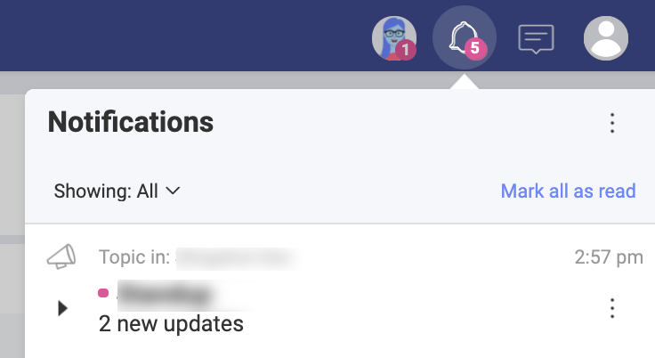
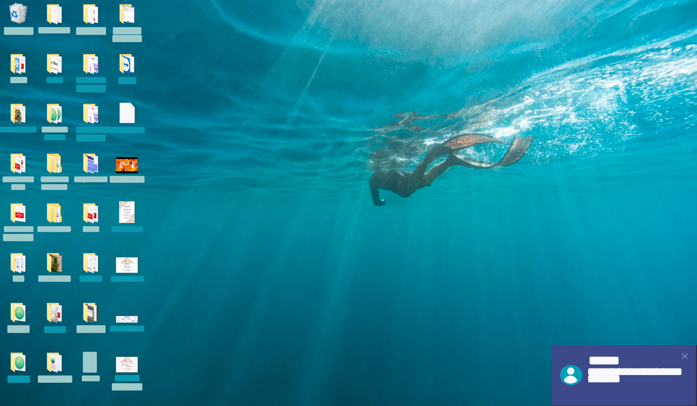
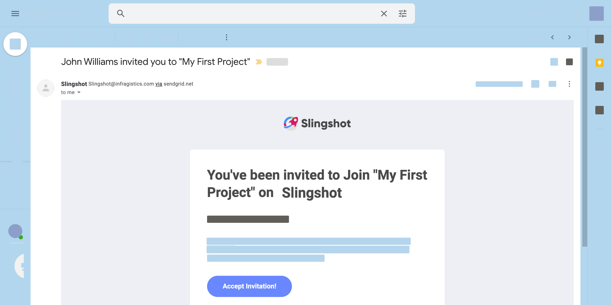
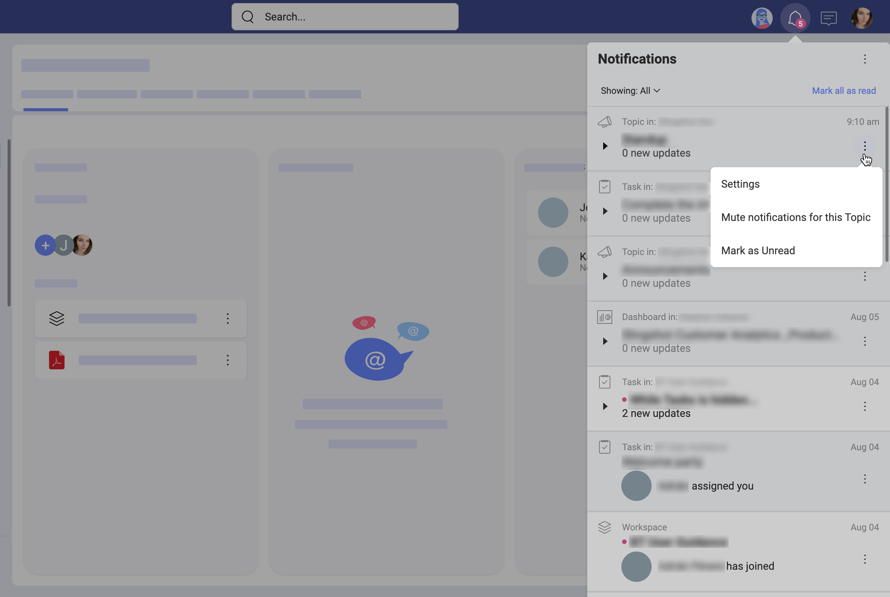
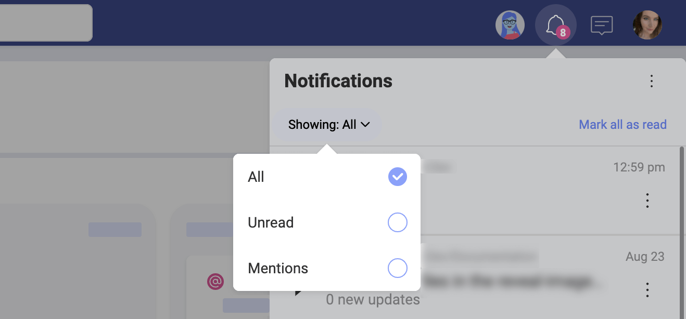

## Notifications

A notification can be defined as an indicator that a certain event has happened. This is a fairly common feature in smartphones, applications, and websites, providing new information to the user.

Sometimes notifications can become overwhelming, as an application can consistently send you  notifications that are not worthy of your attention. In Slingshot, we definitely want to avoid that feeling, so you start with cautious notifications settings. In any case, you can always modify the settings according to your preferences.

### So, what's a Slingshot notification?

It's an auto-generated indicator that is sent to you to let you know a certain event has happened. You can receive three different types of notifications: in-app, push, and email. This means you can get a notification while using Slingshot (in-app), on your screen when not using it (push notifications), or even by an email. Tweaking those settings and controlling what and how many notifications you receive is important for your experience.

### Customizing your notifications

As already mentioned, you can get informed by three different types of notifications in Slingshot: in-app, push, and email. Take a look at the table below to get a better idea of each of those types.

<table>
    <tr>
        <th>Type</th>
        <th>Illustration</th>
        <th>Description</th>
    </tr>
    <tr>
        <td><strong>In-App</strong></td>
        <td></td>
        <td>These notifications are displayed within the app in the <i>Notifications panel</i>.</td>
    </tr>
    <tr>
        <td><strong>Push</strong></td>
        <td></td>
        <td>These notifications are clickable pop-up messages displayed when you are not using the app. They will be shown on your mobile device or on your desktop screen (also called "banner" notifications).</td>
    </tr>
    <tr>
        <td><strong>Email</strong></td>
        <td></td>
        <td>These notifications are delivered to the e-mail address associated with your account.</td>
    </tr>
</table>

You can change your notification settings by going to your account settings and selecting the *Notifications* tab. 
Alternatively, open:

*Notifications panel* > three dots menu > *Settings*: 

 You will be navigated to the *Notifications* tab in your account settings:

Finally, by selecting the pencil icon for each category you can edit the settings or use the toggle on top to turn them off entirely (see the screenshot below). 

The *language* option at the bottom of the categories list allows you to choose between 13 languages for your notifications. 

Your choice will be saved automatically. So when finished, just close the *Settings* dialog. 

If you change your mind, you can restore the default settings. You will notice the *Reset to default* option in the bottom right corner of each dialog where notifications settings were modified. 
### Using the Notifications panel 

The *Notifications* panel is where you will find updates about workspaces, tasks, messages, mentions, and dashboards. You can learn, among others, that a task was assigned to you, that you are removed from a workspace, or even that someone sent a message in a discussion thread you're following.

You can access the *Notifications* panel by clicking the bell icon . 

Within the *Notifications* panel, notifications are shown in groups allowing you for finer adjustments. For example, all notifications about new comments in a topic will be shown together in a group. The comments for another topic will be collected in a different notifications group. 

You can *mute/unmute* or *mark as read/unread*  each group separately by selecting the three dots menu on the right (see in the screenshot below). 

### Turning notifications off

Slingshot allows you to turn off notifications:

 - by muting a particular group in the Notifications panel 
 - by turning off chosen notification types from the [Notifications Settings](#customizing-your-notifications). 

What's the difference? If you want to stop receiving notifications each time your manager changes the due date of a particular task, for example, you will have to *mute* this notifications group. However, if you want to turn off notifications about changes of the start/due dates of all tasks, you will need to go to the Notifications Settings and customize the notifications you receive for your *Tasks*. 

>[!NOTE] Push notifications for Slingshot Desktop are automatically turned off when your machine is in [Focus Assist](https://support.microsoft.com/en-us/windows/turn-focus-assist-on-or-off-in-windows-5492a638-b5a3-1ee0-0c4f-5ae044450e09#ID0EBD=Windows_10) mode. You will still receive all your in-app and email notifications.

### Choosing what you see in the Notifications panel

By default, when you open the *Notifications panel* you will see all notifications. However, your notifications can be filtered to display only:
 
- *unread* notifications, or 
- *@mentions* of you or your workspace. 

To filter the notifications: 

1. Open the Notifications panel .
2. Click/tap *Showing: All* on the left just over your notifications.
3. Choose a filter from the dropdown (see below). 

    

>[!NOTE] By default an unread notification is displayed with a pink dot next to it. 

### Following the pink dots 

Probably you have already noticed that the pink dots are yet another tool for staying informed inside Slingshot. 

Pink dots are displayed when there is something new in: 

- *private chats*; 
- *Discussions*;
- *Content*, or
- *Analytics*. 

Follow the pink dots as a breadcrumb. For example, if there are new answers in a topic, the pink dot will lead you through the workspace > discussion > topic where the new answers appear.

>[!NOTE] Pink dots will appear next to topics you are [not following](discussions-faq.html#how-can-i-make-sure-i-am-notified-of-new-answers) as well as the ones you follow. 