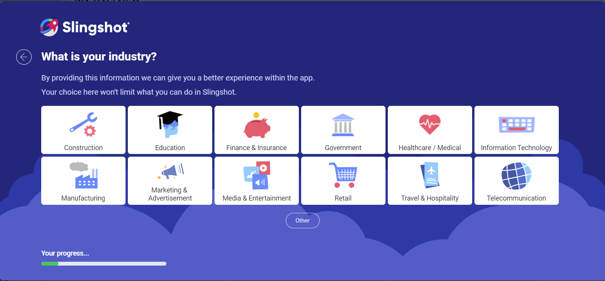
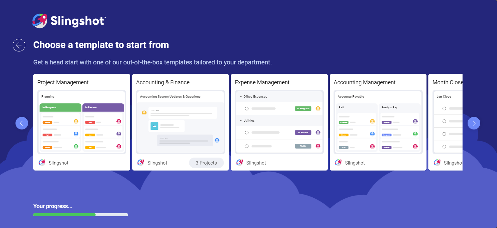
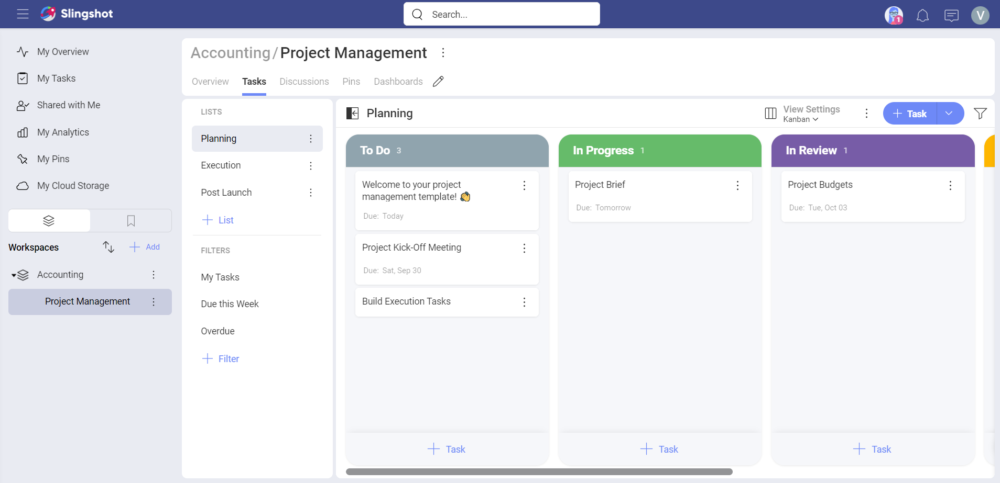

# Onboarding

When you start using a new app for the very first time, the process of getting used to it can feel a bit overwhelming. To avoid this, we implemented a new onboarding process in Slingshot.

## What Does the Onboarding Process Consist Of? 

During the onboarding process, you will be able to choose an industry, department and template in order to set up things in Slingshot.

When you log into your account for the first time, you will see the following:

1. A dialog where you can select your industry. In case you don't see it in the options, you can choose **Other** and add it manually.

 

2. In the next dialog you can choose the department you are working in. If you don’t see it in the list, you can add it manually when you choose **Other**.

 

3. After specifying your department, you will be presented with a list of out-of-the-box templates. You can choose a template to help you set your working space. 

 

 >[!NOTE] If you're invited to Slingshot, for example, via chat, you will be able to choose only your industry and department.

4. When you are done with the onboarding process, you will land on a project in your workspace to get you started faster.

  

If you want to find more information about Slingshot and all the features that it offers, head [here](https://www.slingshotapp.io/learning-center).