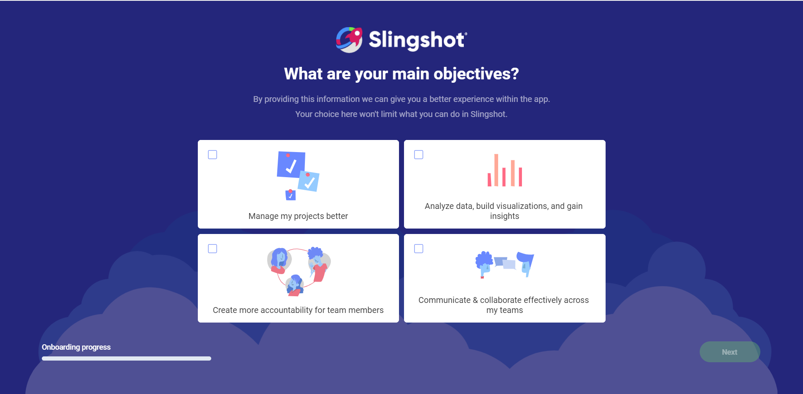
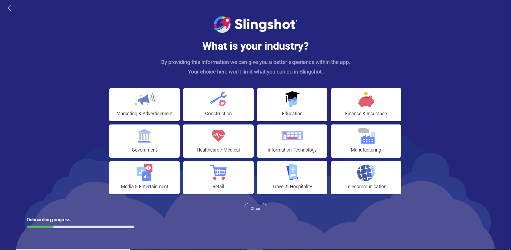
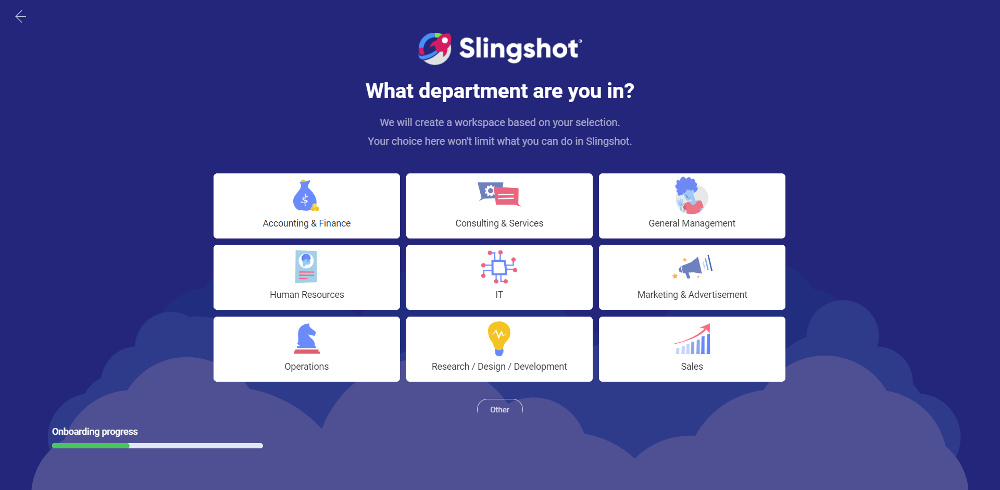
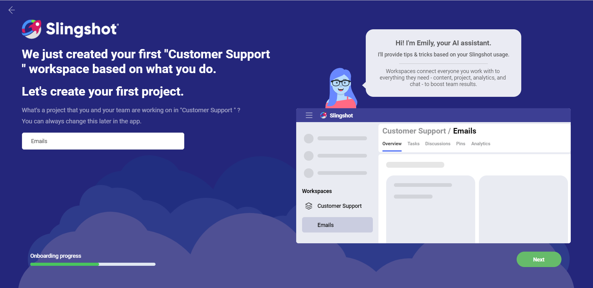
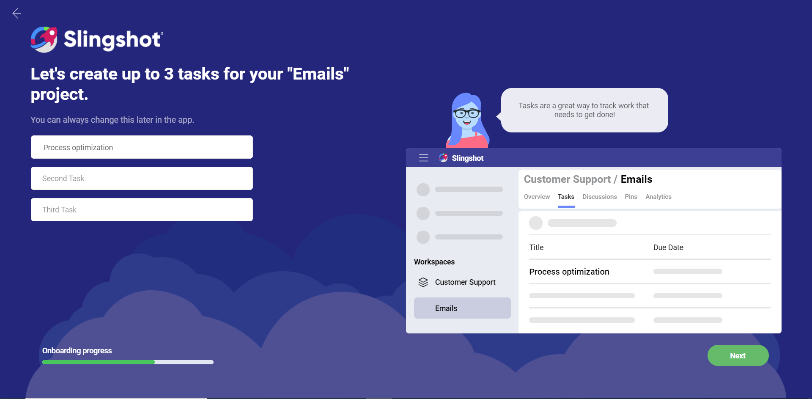
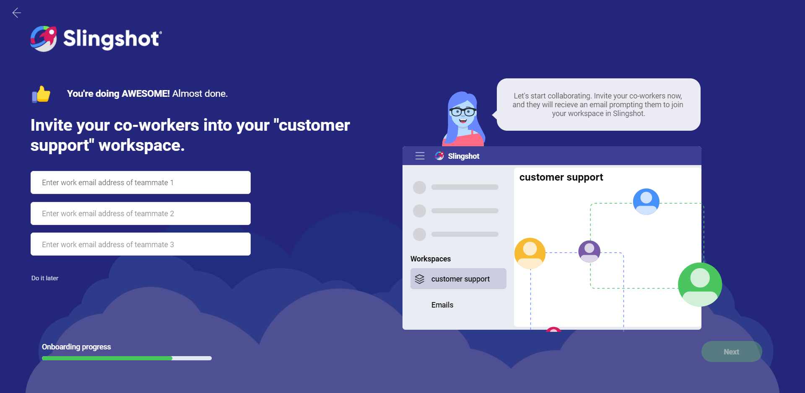
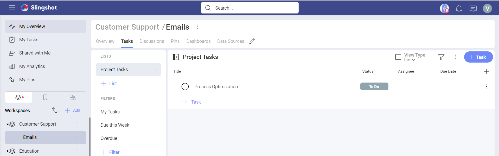

# Onboarding

When you start using a new app for the very first time, the process of getting used to it can feel a bit overwhelming. To avoid this, we implemented a new onboarding process in Slingshot.

## What does The Onboarding Process consist of? 

During the onboarding process, you will be able to set up things, such as your first workspace, project, tasks and even invite your team members to Slingshot.

When you log into your account  for the first time, you will see the following:

1. A dialog where you can choose your main objectives. You can select as many as you want.

 

2. Once you have done that, you can select your industry. In case you don't see it in the options, you can click on **Other** and add it manually.

 

3. In the next dialog you can choose the department you are working in. If you don’t see it in the list, you can add it manually when you click on **Other**.

 

4. After choosing your department, you can create your first project.

 

5.	Depending on your previous selections, you might see a dialog, where you can add tasks to the project. You can always change them later.  

 >[!NOTE] In case you have selected **Analyze data**, **build visualizations**, and **gain insights** as objectives, you won’t see this dialog.

 

6.	As a workplace is not really a workplace without your team, you can invite your team members to Slingshot. In case you want to do this at a later stage, you can click on **Do it later**.

 

When you are done with the onboarding process, you will land on the [tasks](https://www.slingshotapp.io/en/help/docs/tasks) in the project that you’ve created or in the [dashboards](https://www.slingshotapp.io/en/help/docs/analytics/dashboards/overview) section.

  

If you want to find more information about Slingshot and all the features that it offers, head [here](https://www.slingshotapp.io/learning-center).