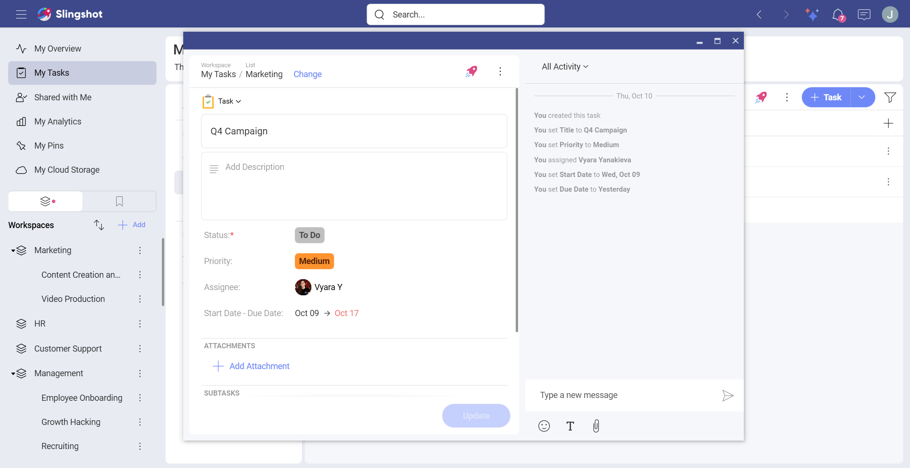

# Open in New Window

In order to improve productivity and save time, you can now open different items - from dashboards, workspaces and projects to tasks, discussions and bookmarks - in new windows (on the same monitor or on a second one). 

To open an item in a new window, you can open the overflow menu next to that item and choose **Open in New Window**. 

>[!Note] This feature is supported on Desktop, Mac, iPad and iPhone.

In the example below we opened a task in a new window and changed the size of the window. Keep in mind that you can always change the size of the new window of an item in order to organize your workplace.

