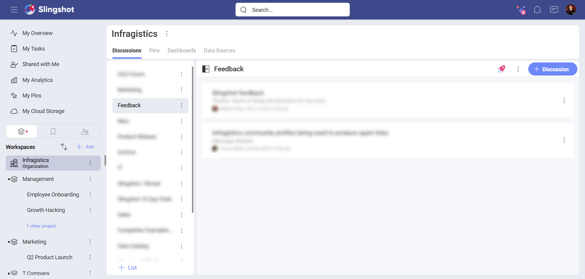
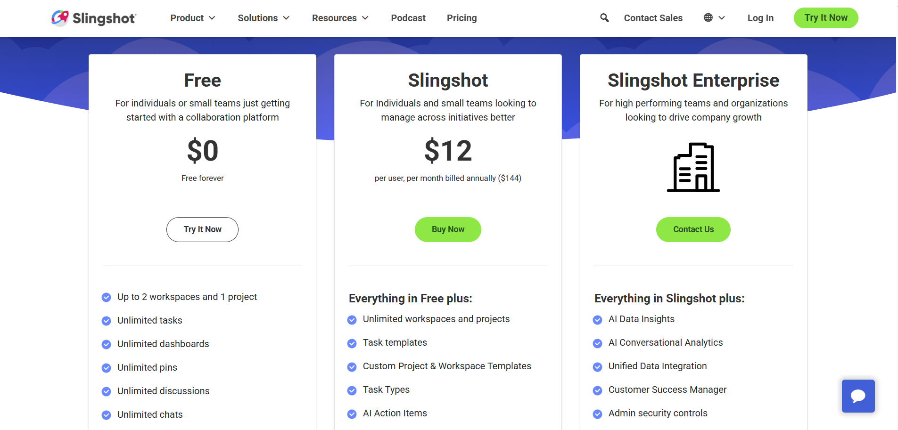
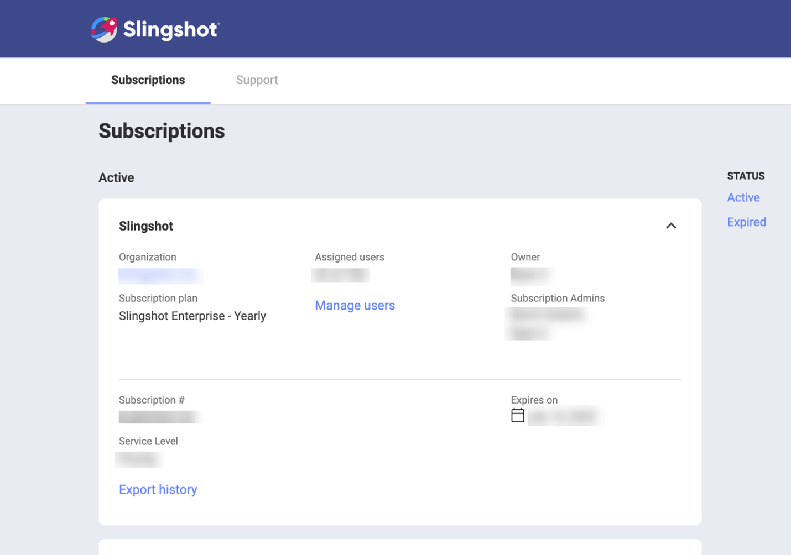
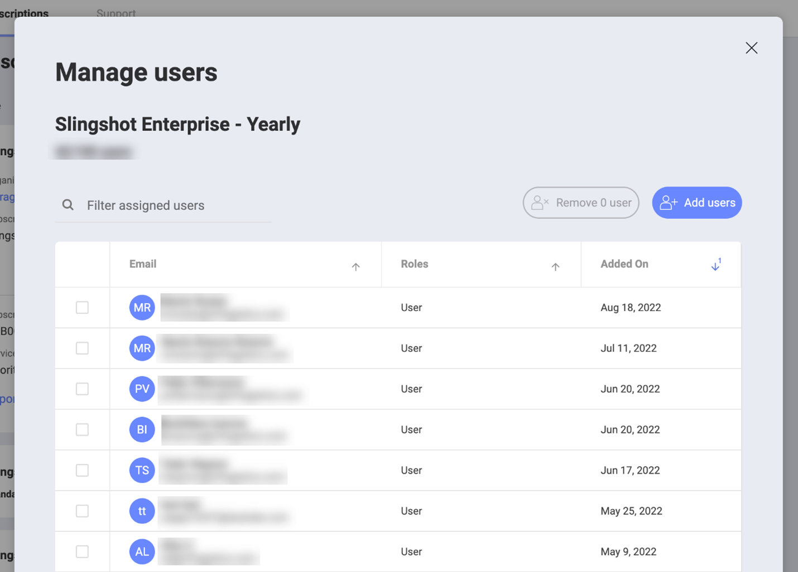
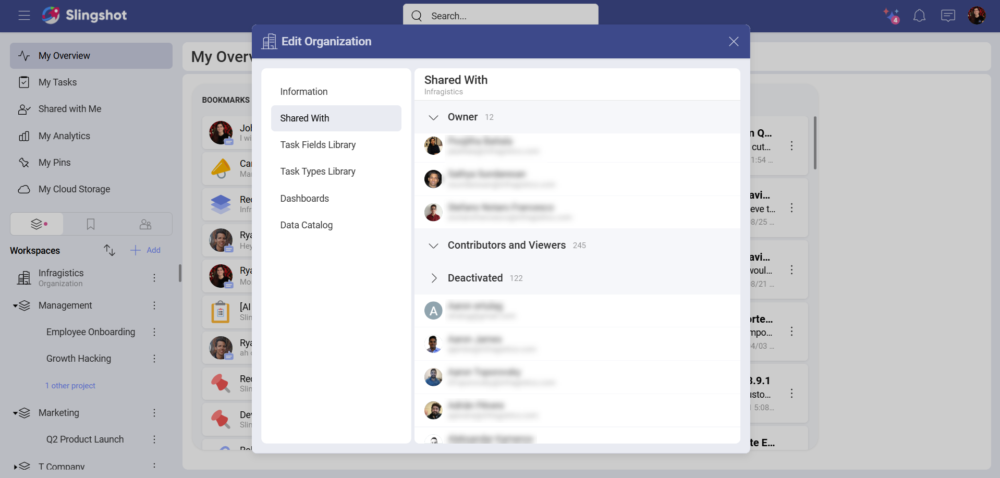
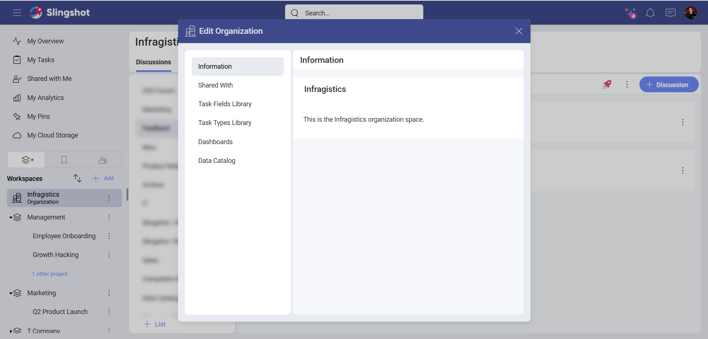

# Organizations 

An Organization in Slingshot is a digital workspace where you and your colleagues can quickly and efficiently find information, uploaded by your company. You can easily collaborate with everyone from your company and have everything in one place.

## What’s in an Organization?

When you open the Organization workspace (in the left side panel), you will find the following tabs:

-	[Discussions](discussions-faq.md): You can transparently collaborate with your colleagues while creating discussions or writing in an already existing discussion. With discussions, you can ask for help, check announcements, and stay informed about the latest company changes.

-	[Pins](pins.md): You can attach important URLs, files, dashboards, tasks, and more into your content lists, so everyone in your company can have a quick access to them. 

-	[Dashboards](./analytics/dashboards/overview.md): You can create and share dashboards with your colleagues to ensure that your company has all the information to make data-driven decisions.

-	[Data Sources](./analytics/datasources/overview.md): You can connect to different types of data sources to create beautiful and insightful dashboards.

-	[Data Catalog](./data-catalog.md): You can make data more accessible for your team members by organizing it in a data catalog. Here you can create lists of dashboards and data sources.

## Activating Slingshot Enterprise Subscription

>[!Note] A user can join only one Slingshot Enterprise subscription.

If you are not part of an Organization and you want to create one, you need to first activate the [Slingshot Enterprise Subscription](slingshot-enterprise-subscription.md).

To do that, you can:

1.	Go to our pricing page <a href="https://www.slingshotapp.io/upgrade" target="blank" rel="noopener"> here</a>. 

2.	Click/tap on **Contact Us** under Slingshot Enterprise Subscription to reach out to our team. They will be happy to assist you in activating the subscription.

If you have already logged into your Slingshot account, you can:

1.	Go to the upper right corner and select your profile image.

2.	Click/tap on **Upgrade**. 

3.	You will be directed to our pricing page. You can click/tap on **Contact Us** to reach out to our team. They will help you activate the subscription.

## Slingshot Enterprise Subscription Roles

There are three roles in the Slingshot Enterprise subscription: *Subscription Admin, Organization Admin* and *User*. To find more information about each role, please take a look at the table below.

| Permissions  | Subscription Admin             | Organization Admin            | User             |
| ------------   | ---------------- | ------------------ | ------------------ |
| Manage the subscription (activate and/or cancel the Enterprise subscription, invite users to the organization, remove users from the organization)| :white_check_mark: | :x:                | :x:                |
|Enable features within the application| :x: |    :white_check_mark: | :x: |
|Use the Slingshot app (Organization Admins will need to create new accounts in order to use the app)| :x: | :white_check_mark: | :white_check_mark: |

## Adding users to an Organization

If your company already has a Slingshot Enterprise subscription and you want to be added to the organization, the [Subscription Admin](slingshot-enterprise-subscription.md#what-role-can-i-have-while-using-the-slingshot-enterprise-subscription) has to invite you. To do that, they can:

1.	Go to the customer portal and click/tap on **Subscriptions**.

2.	Choose **Manage users**.

3.	A dialog will appear where they can click on the **Add users** button to invite you.

4. You can open the Slingshot app to accept the invitation. You will be asked to sign out and sign back in again. Once you have signed in again, you will see the organization’s workspace and will be able to use the enterprise subscription features.

>[!Note] 
>Organization members don’t have a *Data Privacy* section in their settings menu. This means that users cannot delete their accounts or export the data themselves.

The subscription admin is responsible for the accounts in the organization. They can delete an account as well as export its data on your behalf.

>[!Note] Deactivated users are users who no longer have a subscription assigned to them.

Organization members can see a list of deactivated users when they:

1.	Open **Organization Settings** from the overflow menu of an organization.

2.	Choose **Shared With**.

## Organization Settings

To access the organization settings, you need to:

1.	Open the overflow menu next to your organization.

2.	Choose **Organization Settings**.

3.	Here you can find the following sections:

-	Information about your company

-	List of the members of the organization

-	[Task Fields Library](custom-fields.md#task-fields-library)

-	[Task Types Library](task-types.md#what-is-a-task-types-library)

-	[Dashboards](./analytics/dashboards/overview.md)

-	[Data Catalog](data-catalog.md)

## Organization Permissions

There are two types of permissions in an organization:

-	*Owner*: Create, edit, share or delete organization assets (discussions, pins, dashboards, data catalogs, and data sources).

-	*Contributor*: Create, edit and share organization assets (discussions, pins, dashboards, data catalogs, and data sources).

## Additional Information

-	[Slingshot AI](slingshot-ai-overview.md) is turned on by default, unless you are part of an Organization and your Organization Admin has disabled it for the entire organization.

-	You can create [groups](groups.md) to quickly share information with your team members.

