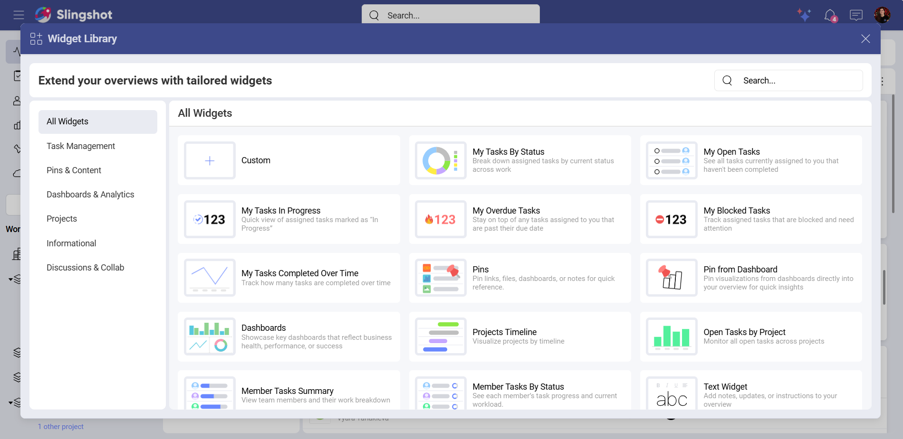

# Out-of-the-box Widgets

The Out-of-the-box Slingshot widgets help you tailor your overviews to best fit your internal flows and company goals.

They are organized in six categories:

-	**Task Management**: Tasks by Status, Open Tasks, In Progress Tasks, Overdue Tasks, Blocked Tasks, Tasks Completed Over Time

-	**Pins & Content**: Pins, Bookmarks

-	**Dashboard & Analytics**: Pin from Dashboard, My Favorite Dashboards, Dashboards

-	**Projects and Workspaces**: Projects Timeline, Open Tasks by Project

-	**Informational**: Member Tasks Summary, Member Tasks by Status, Text Widget

-	**Discussions & Collab**: Unread Mentions

*The Unread Mentions*, *Bookmarks*, and *My Favorite Dashboards* widgets can only be used for **My Overviews**.

Thw *Projects Timeline* and *Open Tasks by Project* widgets can only be used for **Workspace** overviews and overviews in the **My Overviews** section.

Depending on where you want to use the widgets, you will see different categories. Below you will find a table with all the out-of-the-box widgets that are currently available in Slingshot. 

|    Widget | Use Case |
-------------------------------------------------------------------- | ------------------ | ------------------ | ------------------ |
| Tasks By Status | You want to have a clear view on your team’s task distribution. With *Tasks By Status* widget, you can keep an eye on the backlog tasks and the overall progress of your team. |
|Open Tasks | You have an approaching project deadline and want to prioritize your tasks. With the *Open Tasks* widget, you can stay organized and stay ahead of your goals.|
|Tasks In Progress |You want to distribute new tasks evenly between your team members. You can use the *In Progress* widget to see how many tasks each person is working on in order to assign new tasks accordingly.|
|Overdue Tasks |Your team is developing a new feature. In order to avoid missing the deadline for the feature release, you can use the *Overdue Tasks* widget to prioritize tasks.|
|Blocked Tasks| You are managing different teams and notice that one of your teams can’t move forward with their tasks. You can go through the *Blocked Tasks* and resolve the blockers in order to improve the project flow.|
|Tasks Completed Over Time |You need to track how long it takes for your team to finish a project. With the *Tasks Completed Over Time* widget, you can see productivity trends and make changes if needed.|
|Pins |You have several types of documents saved in different workspaces. With *Pins*, you can pin key resources (images, files, URLs, analytics), so your team can have easy access to important items.|
|Pin from Dashboard |You want to have an overview on how much your team has spent on Facebook Ads and YouTube Ads. You can pin visualizations from different dashboards in order to compare costs.|
|Dashboards|You want your team to create a sales report for this month and track your overall progress. You can pin the *Sales* dashboard you have been working on to the workspace overview so your team can have an easy access to it.|
|My Favorite Dashboards |You want to have quick access to your most important dashboards. You can add your favorite dashboards to an overview in the *My Overviews* section in order to make fast data-driven decisions.|
|Projects Timeline |You are a part of multiple workspaces and want to monitor the progress of each of their projects. You can use the *Projects Timeline* widget to plan tasks and distribute workload.|
|Open Tasks By Project |You want to check the progress of each project in your workspace. With the help of the *Open Tasks By Project* widget, you can manage your projects and stay ahead of your deadlines.|
|Member Tasks Summary |You want to see which assigned tasks in your workspace are approaching a deadline. You can use the *Member Tasks Summary* widget to have a quick glance on the due date of each task.|
|Member Tasks By Status |You want to assess the team’s performance. You can use the *Member Tasks by Status* widget to break down each of your team members’ contributions. |
|Bookmarks |You want to have the most important items in Slingshot at your fingertips. You can use the *Bookmarks* widget to create shortcuts for easier navigation through information.|
|Text |You want to share onboarding information with your team. You can use the *Text* widget to explain the onboarding process in great details.|
|Unread Mentions|You are part of different projects and workspaces, so you need a way to track all the discussions and tasks you have been mentioned in. You can use the *Unread Mentions* widget to prevent messages from getting lost in endless threads.|

Each of the widgets mentioned above can be configured in a way that best fits your business goals. To find out more about how you can use the widgets with the help of different visualizations, please head [here](overviews-visualization-types.md).
