# Visualization Types

Different types of data need different visualizations. This is why overview widgets give you an option to choose from multiple visualizations to best represent important information.

Depending on the widget, you will be able to choose from various visualizations. Each visualization type has different elements  that can be configured. To find out more about each type of visualization, please read below.

*Pins*, *Pin from Dashboards*, *Bookmarks*, *Text Widget*, and *Unread Mentions* don’t use visualizations. 
*The Member Tasks Summary* and the *Member Tasks by Status* widget don’t use visualization types but you can change their default settings based on what your business goals are.

## Visualization Types

You can use visualizations for out-of-the-box task, project, and workspace widgets, as well as for dashboards and custom widgets.

## Task Widgets 

When you create custom task widgets or use the task widgets from the *Task Management* category, you can choose between all nine visualizations. 

## Pie

If you want to use slices to display numerical proportions, you can use the Pie visualization. While using the Pie visualization, you can add filters as well as show the legend.

For example, if you want to see how many tasks you have in a workspace, categorized by *Status*, you can:

1.	Select **Tasks By Status** from the list of widgets.

2.	Open **Locations** and choose the workspace you have in mind.

3.	Select the **Pie** visualization.

4.	Set the **Filter** value to **Dynamic Me**.

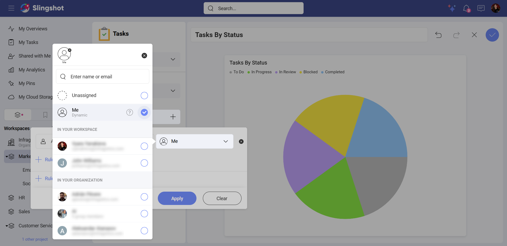

5.	Open the dropdown menu of **Show** and select **Status**.

6.	Enable **Show Legend**. This way you can see all the names of your statuses. 

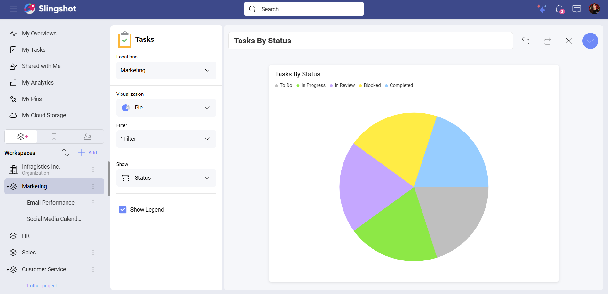

>[!Note]
> If you use the *Incomplete Tasks By Project* widget, you can also filter the tasks by **End Date**, **Start Date**, **Status** and **Title**.

>[!Note]
> When you choose a widget from the *Task Management* category in *My Overview*, you can also add a **Value** while using a Pie visualization. (screenshot)

## Doughnut

The Doughnut visualization provides you with the same customization elements as the Pie visualization. You can add filters, decide what data to show and enable or disable the legend.

You can also add a **Value** if you are using a widget from the *Task Management* category. 

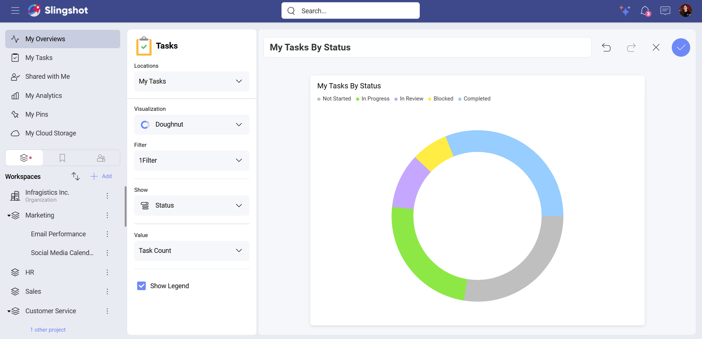

## Number

You can use the Number visualization to display data with the help of filters and conditional formatting. 

>[!Note]
>The **Number** visualization is available for the task widgets in the *Task Management* category as well as for custom task widgets.

For example, you want to see how many tasks are overdue in a workspace. To do that, you can:

1.	Select **Overdue Tasks** from the list of widgets.

2.	Open **Locations** and choose the workspace you have in mind.

3.	Select the **Number** visualization. 

4.	Set up the **Due Date** to **Today**.

5.	Create a **Status** filter that excludes **Completed** tasks.

6.	Add specific conditions. (optional) In our case, we wanted to have the number to be in red if it was greater than 3 and to be in green when it was less than 2.

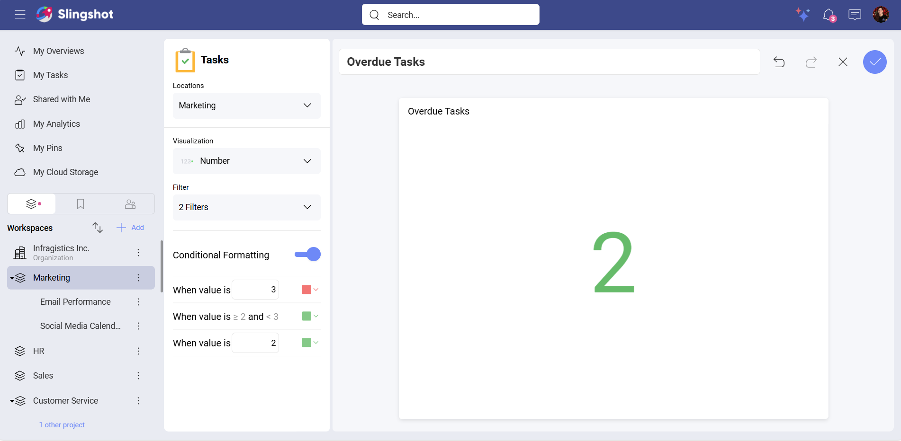

>[!Note]
> When you use a widget from the *Task Management* category in *My Overviews*, you can also add a **Value** while using a **Number** visualization. 

## Line

You can use the Line visualization when you want to display trends over time. You can add **Filters**, **X Axis** and **Y Axis** as well as set up the **Time Frame** and group by **Date**. For better overview of the data, you can also enable the **Legend**.

For example, you want to see the tasks you have completed over a specific time period. To do that, you can:

1.	Select **Tasks Completed Over Time** from the list of widgets.

2.	Open **Locations** and choose the workspace you have in mind.

3.	Select the **Line** visualization. 

4.	Set the **Filter** value to **Dynamic Me**. (screenshot)

5.	Open the dropdown menu of **X Axis** and select **Date Completed**.

6.	Add **Task Count** to **Y Axis**.

7.	Add the **Time Frame** you have in mind. In our example, we chose **Last 7 Days**.

8.	Set up the **Date Grouping**. In our example, we chose **Day**. 

>[!Note]
> You can set up **Time Frame** and **Date Grouping** only while using the **Tasks Completed Over Time** widget. The rest of the task widgets in the *Task Management* category don’t have these elements.

>[!Note]
>When you use the **Incomplete Tasks By Project** widget, you can also set up a **Task Filter**.

## Bar

You can use the Bar visualization when you want to compare values across multiple categories. You can add filters, X Axis and Y Axis, and hide/show the legend.

For example, you want to view all the open tasks in a workspace. To do that, you can:

1.	Select **Open Tasks** from the list of widgets.

2.	Open **Locations** and choose the workspace you have in mind.

3.	Select the **Bar** visualization.

4.	Create a **Filter** for **Status** with a value different than **Completed**.

5.	Open the dropdown menu of **Y Axis** and select **Status**.

6.	Add **Task Count** to **X Axis**.

7.	Enable the **Legend**. 

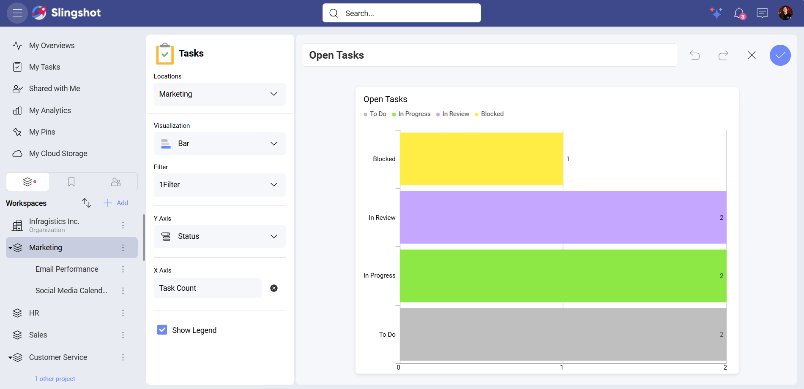

>[!Note]
>You can also set up *Time Frame* and *Date Grouping* only while using the **Tasks Completed Over Time** widget. The rest of the task widgets in the *Task Management* category don’t have these elements.

## Column

The Column visualization is similar to the Bar visualization in terms of customization. You can configure the same elements. The only difference is that you will see a dropdown menu for **X Axis** and will be able to select values, such as *Task Count*, for **Y Axis**. 

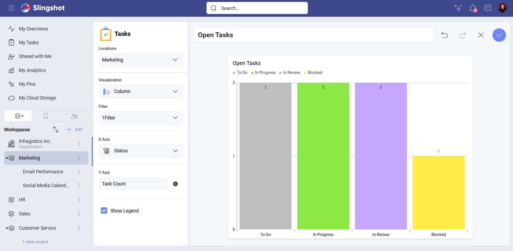

## List	

You can use the List visualization if you want to have the data displayed in a grid format. With the List visualization, you can filter, group and sort values.

>[!Note]
> **The Group By** element is available for the widgets in the *Task Management* category as well as for custom tasks. 

For example, you want to see detailed information about how many tasks in your workspace are overdue. To do this, you can:

1.	Select **Overdue Tasks** from the list of widgets.

2.	Open **Locations** and choose the workspace you have in mind.

3.	Select the **List** visualization.

4.	Create two filters: One for **Due Date** with the value that is before **Today** and one for **Status** with a value that is different than **Completed**. 

5.	Open **Group By** to select a value. In this example, we chose **Section**.

6.	Select fields. In this case, we chose the **Priority** and the **Status** field.

7.	Select a value for the **Sort By** element. (optional)

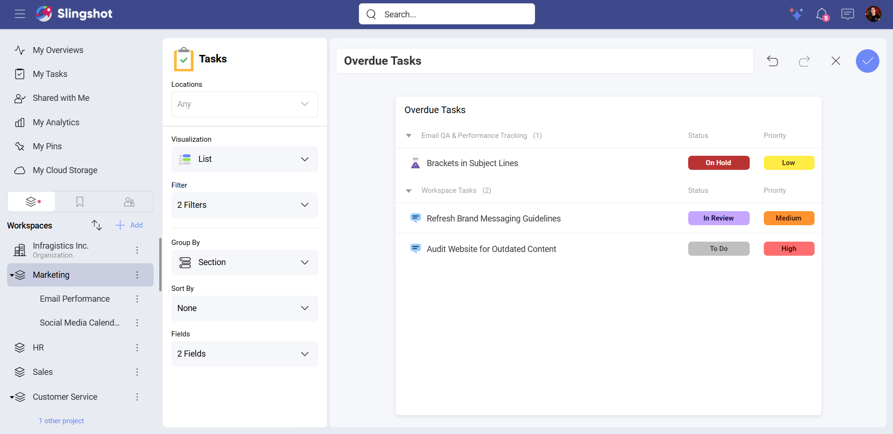

>[!Note]
> The **Group By** element is available for the widgets that are in the *Task Management* category, as well as for custom tasks. 

## Timeline

You can use the Timeline visualization to display data in a chronological order.

For example, you want to see detailed and organized information about all the open tasks per assignee in your project. To do that, you can:

1.	Select **My Blocked Tasks** from the list of widgets.

2.	Open **Locations** and choose the project you have in mind.

3.	Select the **Timeline** visualization.

4.	Create two filters: One for **Assignee** with **Dynamic Me** value and one for **Status** with a **Blocked** value. 

5.	Open **Group By** to select a value. In this example, we chose **Section**. 

6.	Select a timeframe. In our case, we chose **Weeks**.

7.	Select a color. In our example, we chose **Status**.

8.	Enable the **Legends**. (optional)

9.	Enable the **Weekends**. (optional)

10.	Select a value for the **Sort By** element. (optional) (screenshot)

>[!Note]
> The options to **Group By** and **Sort By** are available for the widgets that are in the *Task Management* category as well as for custom tasks. 

## Calendar 

You can use the Calendar visualization if you want the data to be distributed across days, weeks, or months.

For example, you want to see the tasks that are in progress in a workspace. To do that, you can:

1.	Select **Tasks In Progress** from the list of widgets.

2.	Open **Locations** and select the workspace.

3.	Select the **Calendar** visualization.

4.	Create a **Status filter** with the value **In Progress**.

5.	Open the dropdown menu of **Zoom** and select **Month**.

6.	Choose **Status** or **Priority** for the **Color**. In our case, we chose **Priority**.

7.	Select **Start Date – End Date** for **Date**.

8.	Enable **Legend**. (optional)

9.	Enable **Weekends**. (optional)

10.	Enable **Week Numbers**. (optional)

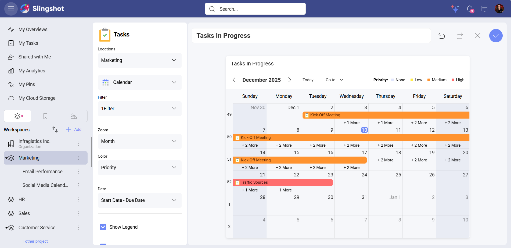

>[!Note] 
>The **Color** element is available only for the widgets that are in the *Task Management* category as well as for custom tasks.

## Project Widgets

The Projects category includes the following widgets: Project Timeline and Open Tasks by Project. Each of them uses all nine visualizations except the Number visualization.

If you want to have a breakdown of all the projects started this month as well as their statuses:

1.	Select **Project Timeline** from the list of widgets.

2.	Open **Locations** and choose the projects you have in mind.

3.	Choose a visualization. In our case, we chose the **Pie** chart. Depending on the chart type, you will be able to configure different elements.

4.	Create a **Start Date** filter and choose **This Month** for its value.

5.	Choose **Status** from the dropdown menu of **Show**.

6.	Enable the **Legend**. 

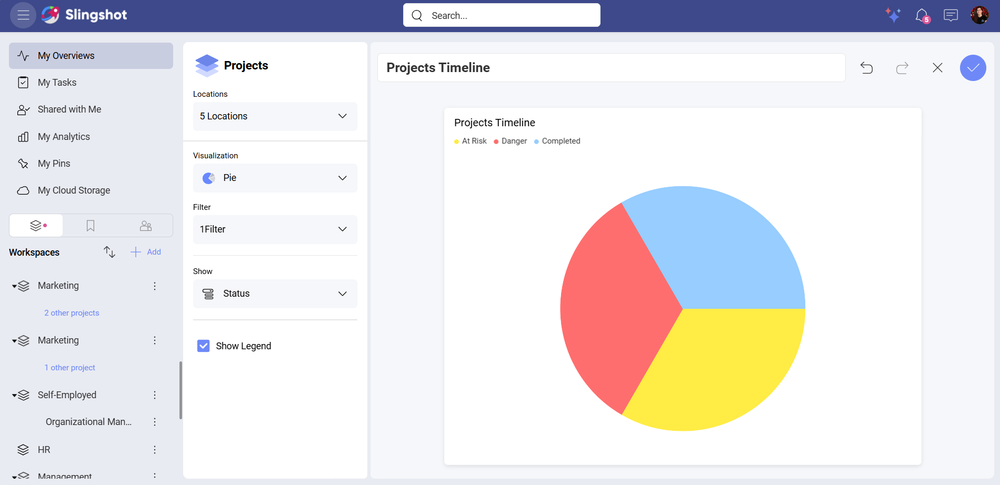

If you want to see a list of all the open tasks in a specific project, you can:

1.	Select **Open Tasks by Project**.

2.	Open **Locations** and choose the project you have in mind. You can also choose multiple projects.

3.	Choose a visualization. In our case, we chose the **Column** visualization. Depending on the chart type, you will be able to configure different elements.

4.	Open the dropdown menu of **X Axis** and select **Projects**.

5.	Create a **Status** filter that excludes **Completed** tasks.

6.	Add **Task Count** to **Y Axis**.

7.	Enable the **Legend**.

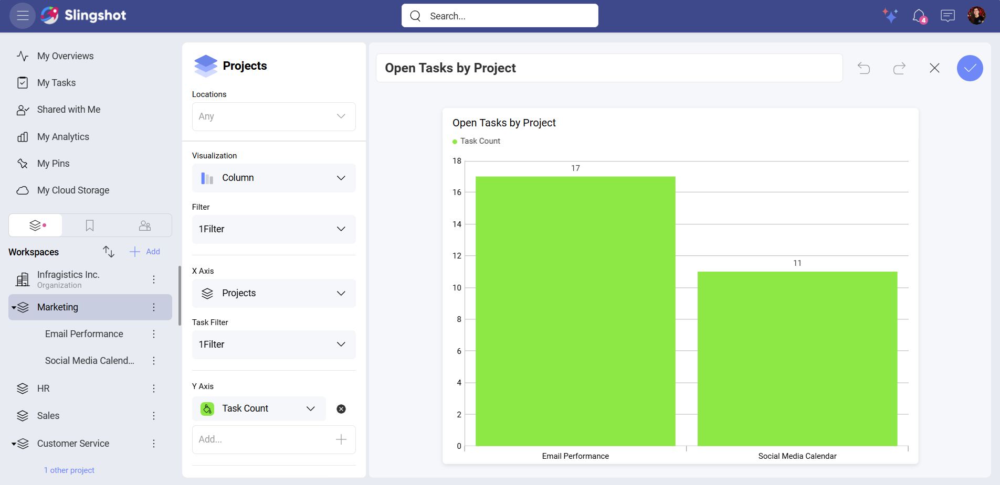

## Dashboard & Analytics Widgets 

The Data Analytics category includes the following widgets: *Dashboards*, *Pin from Dashboard*, and *My Favorite Dashboards* (available only for *My Overviews*).

>[!Note] 
>*The Pin from Dashboard* widget doesn’t use visualizations. However, you can rename the pin, unpin the dashboard or replace the dashboard.

My Favorite Dashboards widget has two visualizations that you can choose from: *List* and *Grid*.

If you want to have quick access to all of your favorite dashboards, you can use the **Grid** visualization.

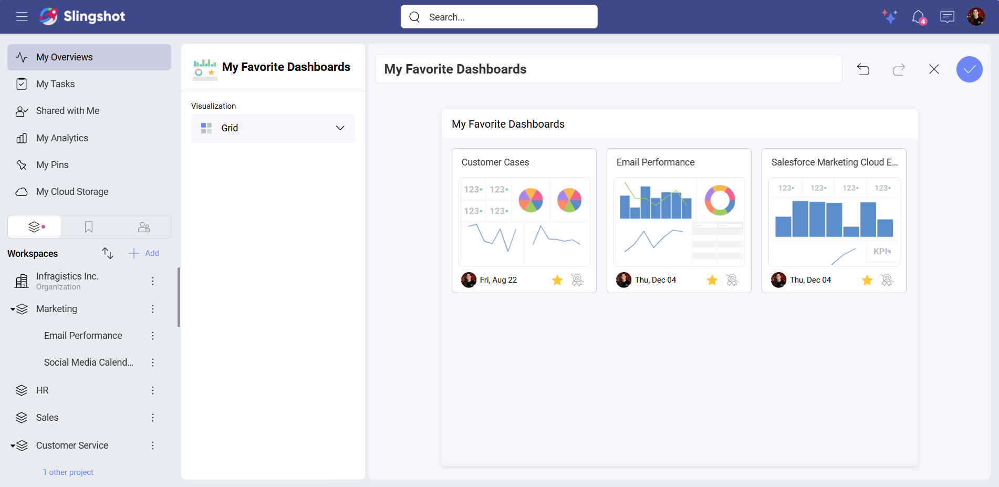

If you want to able to display fields, such as *Location*, *Last Modified*, *Certified*, *Access* or *Favorite*, you can use the **List** visualization.

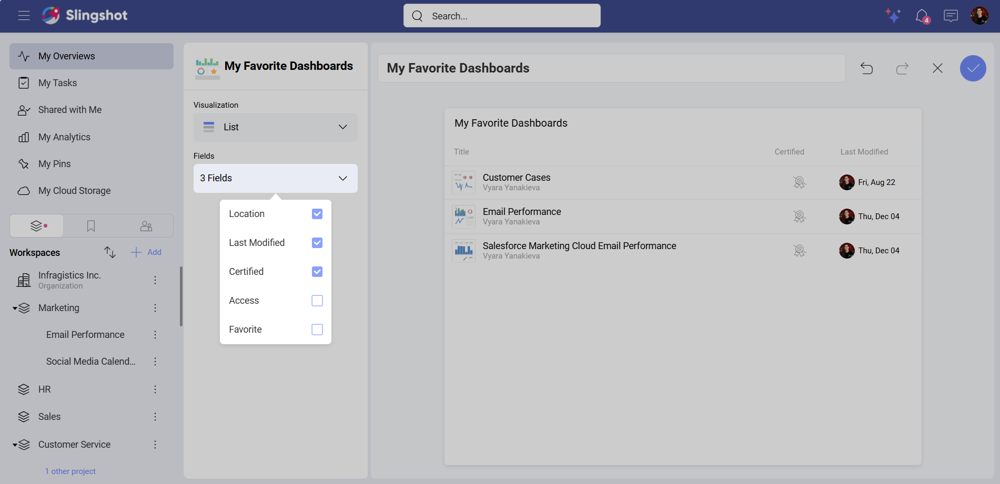

The Dashboards widget also has two visualizations that you can choose from: *List* and *Grid*. You can configure each of them in way that helps you make faster data-driven decisions.

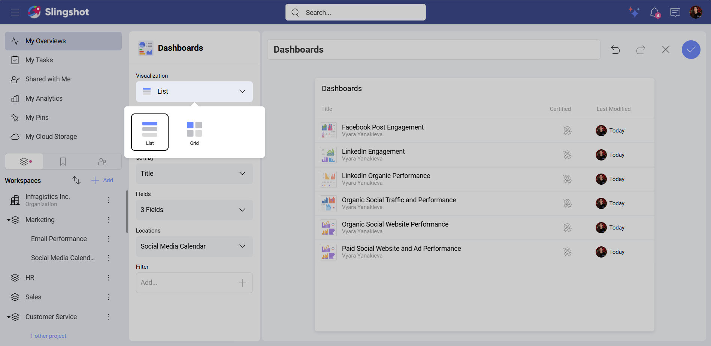

### Grid

There are two types of dashboard sources that you can use: *Filter* and *Hand-Picked*.

If you want to just add filters to the dashboards, you can use the **Filter** source. For example, you want to see all the certified dashboards that are in your workspace. To do that, you can:

1.	Select the **Grid** visualization.

2.	Select **Filter** under *Dashboards Source*.

3.	Choose a **Location**.

4.	Create a **Last Modified** filter with a value **This Week**. (screenshot)

If you want to hand-pick a visualization, you can:

1.	Select the **Grid** visualization.

2.	Select **Hand-Picked** under *Dashboards Source*.

3.	Add dashboards.

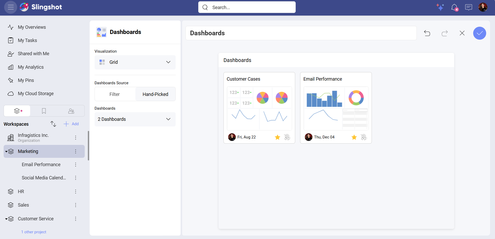

### List

The List visualization is also divided into two types of dashboard sources: *Filter* and *Hand-Picked*.

If you want to sort dashboards as well as add fields to the list, you can choose the **Filter** source.

For example, you want to sort your dashboards in a workspace by their title. You also want to be able to see if they are certified and when they were last modified. 

To do that, you can:

1.	Select the **List** visualization.

2.	Select **Filter** under **Dashboards Source**.

3.	Open the dropdown menu of **Sort By** and select **Title**.

4.	Open **Fields** and choose **Location** and **Last Modified**.

5.	Select your workspace.

6.	Create a **Last Modified** filter with a value **This Month**. 

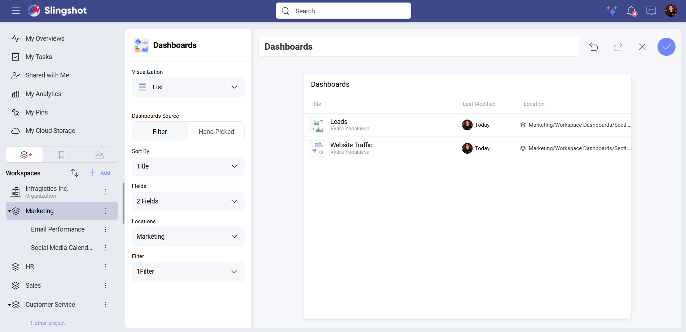

If you want to add fields to the list of hand-picked dashboards, you can:

1.	Select the **List** visualization.

2.	Select **Hand-Picked** under **Dashboards Source**.

3.	Open the dropdown menu of **Fields** to select which fields to display.

4.	Add the dashboards.

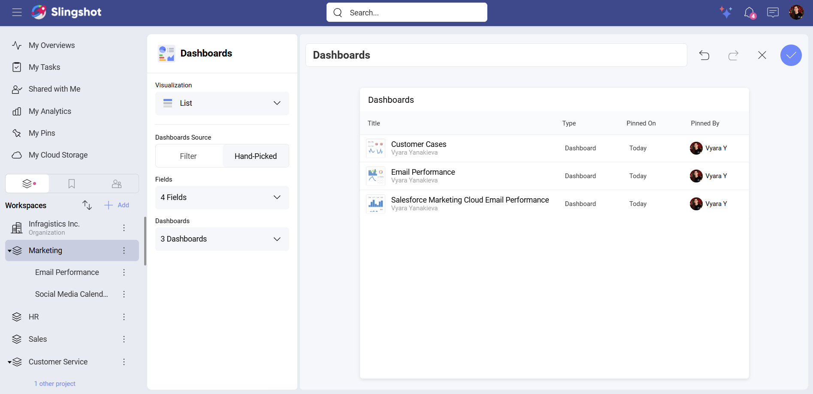

## Custom Widgets

There are three types of custom widgets: 

•	Tasks: When you create custom tasks, you can choose between all the visualizations mentioned above. You can include custom widgets in workspace and project overviews as well as in the overviews in *My Overviews*.

•	Projects: When you create custom projects, you can choose between all the visualization types mentioned above except **Number**. You can include custom projects in workspace overviews as well as in the overviews in *My Overviews*.

•	Workspaces: When you create custom workspace, you can choose also between all visualization types mentioned above except **Number**. You can include custom workspaces in the overviews in *My Overviews*.

>[!Note]
>Custom Projects and Workspaces don’t have an option to configure **Color** while using the *Timeline* or the *Calendar* visualization.

## Member Widgets

There are two types of member widgets: *Member Tasks Summary* and *Members Tasks By Status*. Both widgets don’t use visualization types. However, you can still configure their elements in order to display important information.

If you want to have a breakdown of all the overdue tasks for this week that your team is currently working on, you can:

1.	Select **Members Tasks Summary** from the list of widgets.

2.	Select members to include in the task’s summary.

3.	Select your workspace.

4.	Create a **Priority** filter with **High** value.

5.	Select **Due Date** for the **Date Field**.

6.	Select **This Month** for the **Time Frame**.

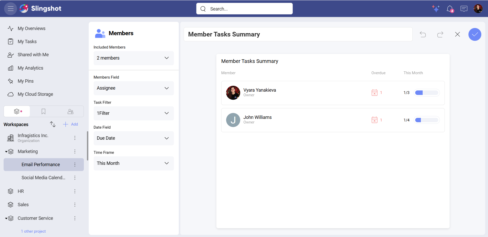

If you want to distribute the high priority tasks in your project equally among your team members, you can:

1.	Select **Member Tasks By Status** from the list of widgets.

2.	Select members to include in the task’s summary.

3.	Group the tasks by **Status**.

4.	Create a **Task Filter** with **High** value. 

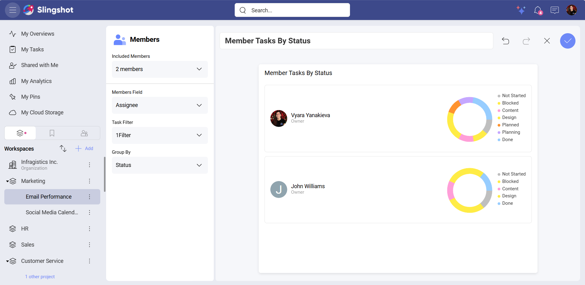

