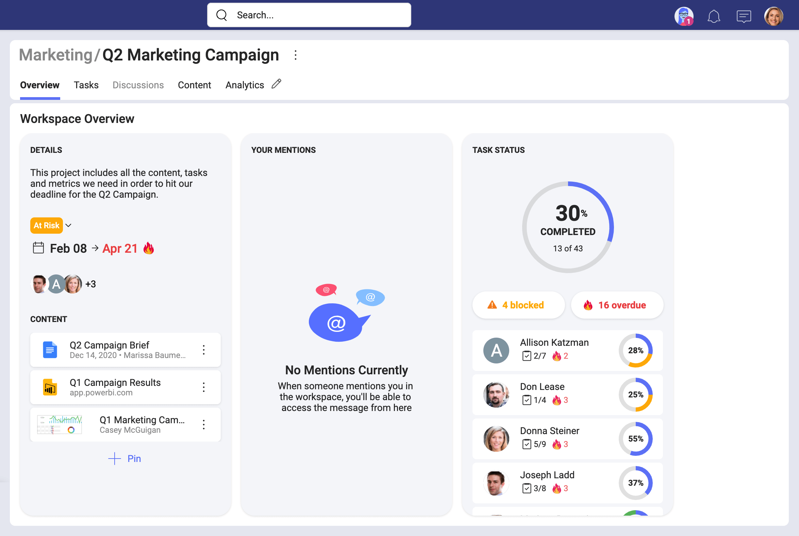
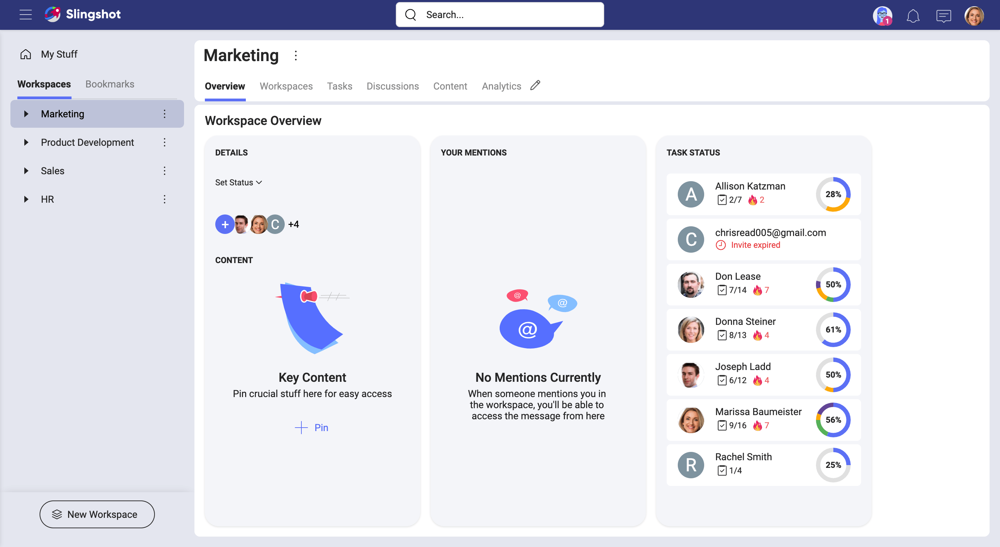
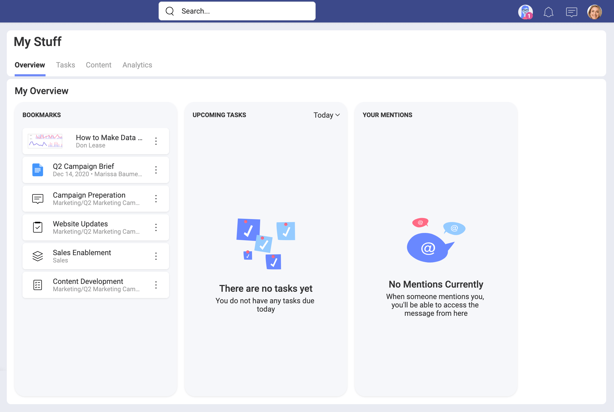

## Getting the Big Picture with Overviews

In short, an overview is a general review or summary about something, it helps you get the big picture, while leaving out details that are too specific.

Putting a little thought into to this, big picture thinking can be a big help for us to act proactively rather than reactively. A quick glance to the most important information around something can be a game changer. For example, taking advantage of a useful overview related to your team's work can push you towards high-performing teams ground.

### So, what's a Slingshot overview?

It's a quick snapshot of a workspace or your personal work. Slingshot overviews present you with the current status of one of those by displaying summarized information.

By looking at a **workspace overview** you can get a sense of a project's progress at a glance. Within seconds you get an overall status (_On Target, At Risk, Danger, Completed_), the start and due dates, and issues raised by someone working on the project. That information alone might be enough for you. If not, you can dig deeper by exploring specific tasks within the workspace or even mentions directed at you. Workspace content can be useful to add resources like links, documents, dashboards, etc.

From a **workspace overview** you can get a list of the workspace members and their tasks, all mentions directed at you, and links to relevant content for the collaborators in this workspace.

In _My Stuff_, you will find your **personal overview**. Here you can visualize your own work and organize yourself. All your tasks can be found here and you can open them without navigating away. You can even see tasks assigned to you in workspaces you haven't joined. 

Bookmarks are very useful to keep at hand those links that are really relevant to you. You can add links to workspaces, tasks, chats and also boards. As boards are just containers, bookmarking a board gets you access to all its pinned documents and web links.

### Why is visibility so important?

In an <a href="https://agilemanifesto.org/" target="_blank">agile world</a>, you can never go wrong by saying that trust and transparency are key elements for a team leader seeking effective collaboration. That being said, visibility is essential for allowing, if not actually creating trust and transparency within a team.  

Slingshot might be all about visibility yes, but overviews were specifically designed with visibility in mind. Besides helping build trust and transparency, overviews can help you turn challenges into opportunities. Using Slingshot overviews you are able to contrast and reframe current challenges while you adapt to a changing reality.   

When working in one or multiple workspaces you will frequently find yourself with many questions, including:
- Are we on time? If not, who should I ask and what to ask about?
- Did we bump into an issue? If so, what's the issue?
- Who's working on this workspace? How are they doing with their tasks?
- Where can I get documents or other resources about the workspace?

All those questions can be answered using the workspaces overviews.
