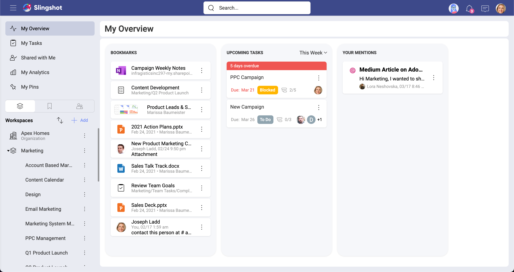
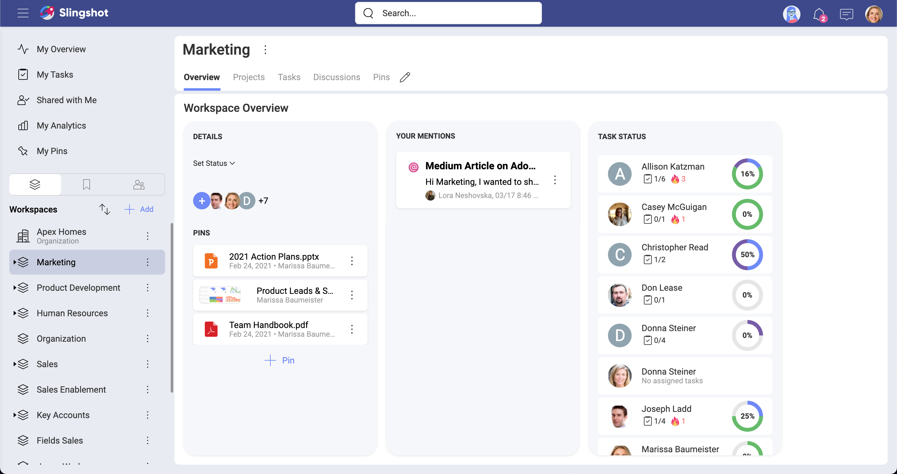

# Overviews

When working in multiple workspaces and projects you will frequently find yourself with many questions, including:
- Are we on time? If not, who should I ask and what to ask about?
- Did we bump into an issue? If so, what's the issue?
- Who's working on this project? How are they doing with their tasks?
- Where can I get documents or other resources about the workspace?

All those questions can be answered using workspaces and projects overviews.

## Overview Types
With Overviews you can have a quick glance at the most important information around work.  There are two types of overviews:
- **My Overview** - your personal overview (top left of the screen), is where you can visualize your own work and organize yourself.
- **Workspace or Project Overviews** - they provide you with a quick snapshot of a workspace or project, presenting you with the current status of everyone’s work by displaying summarized information.

## My Overview
Your personal overview is located on the top left of the screen. In My Overview you can organize yourself and visualize your own work in a summarized way. Here you can find:
- **Bookmarks** – Keep your most important items in Slingshot at your fingertips. You can add bookmarks to workspaces, tasks, chats and also content. Bookmarked lists get you access to all their pinned documents and web links.
- **Upcoming Tasks** – Help prioritize your day with your tasks that you can filter by Today, Tomorrow, This Week, This Month, and Overdue. 
- **Your Mentions** – @mentions directed at you from anywhere in Slingshot.

## Workspace and Project Overviews
When running projects and teams, you need to get the big picture to act quickly and in a proactive way. Having a quick glance at the most important information around your work is a game changer and will push you towards high-performing team’s ground.

The Overview can give both Project Managers and Leaders an overall status (On Target, At Risk, Danger, Completed), start and due date, and make key content top of mind to members. 

### Details
Starting on the left of the screen, you can find general details about the workspace or project, including:

- **Members of the project/workspace** – Here you can quickly access and manage all members and pending invitations to join the project or workspace.
•	Status – A workspace owner can change the overall status at any time, switching between On Target, At Risk, Danger, and Completed.
- **A short description** – Give your workspaces or projects a short description, so new team and current team members can know its purpose.
- **Start and due date** – If the workspace revolves around a project, visibility over the dates is very important for all the project’s stakeholders.
- **Pins** – Pin key resources (images, files, URLs, analytics) that you need the team to keep top of mind.

### Your Mentions
Here you can access @mentions directed at you from teammates within tasks and discussions in the workspace or project. It’s a great way to ensure visibility while also preventing messages from getting lost in endless threads.

### Task Status
Get the whole list of tasks for the workspace or project members. In a project you will find here all the tasks for that project only. Workspaces will include all tasks from the workspace and all its projects as well.
There is also a high-level view of the completion rate, showing the percentage and a summary of the task’s status.