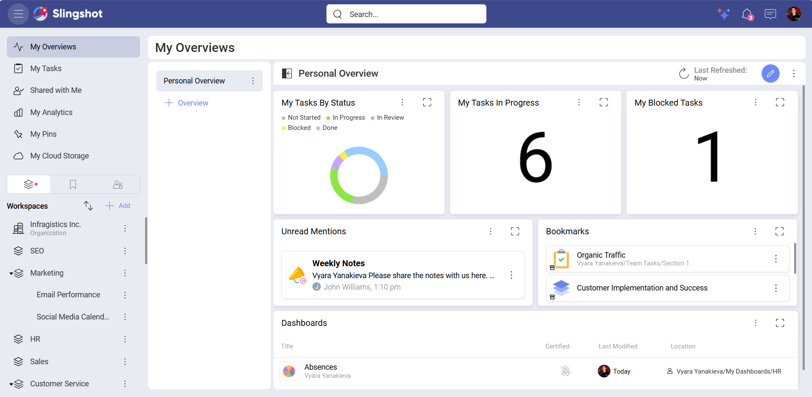
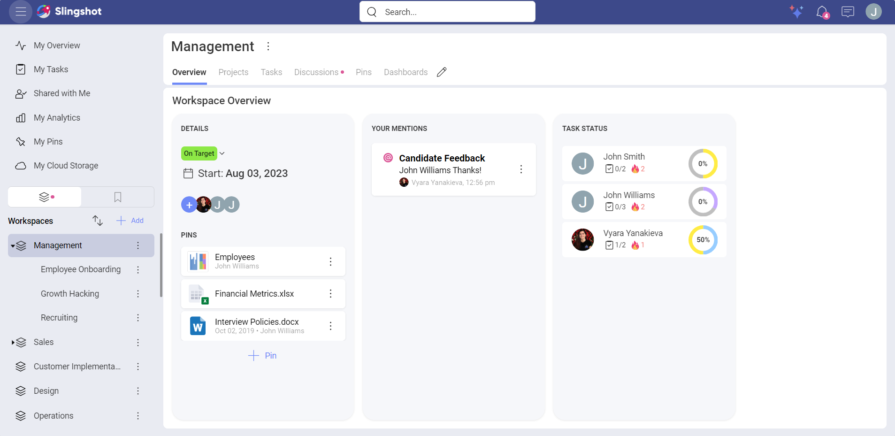
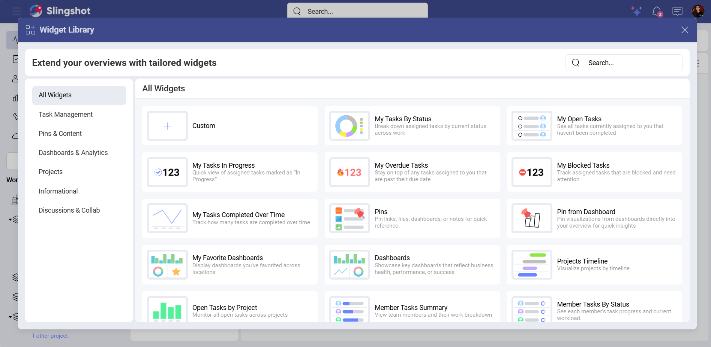
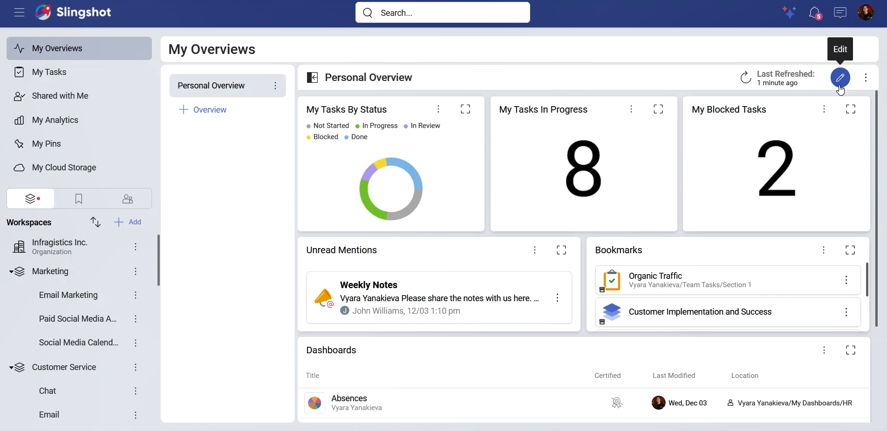
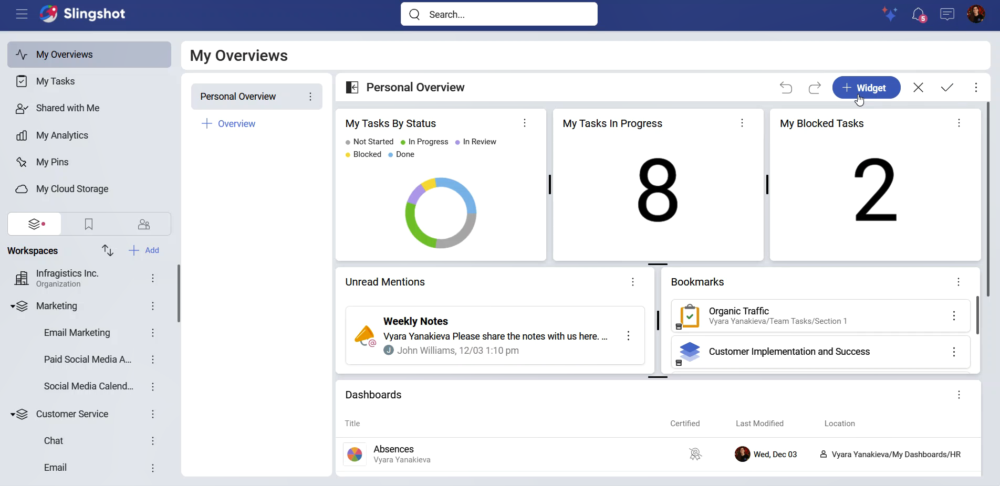
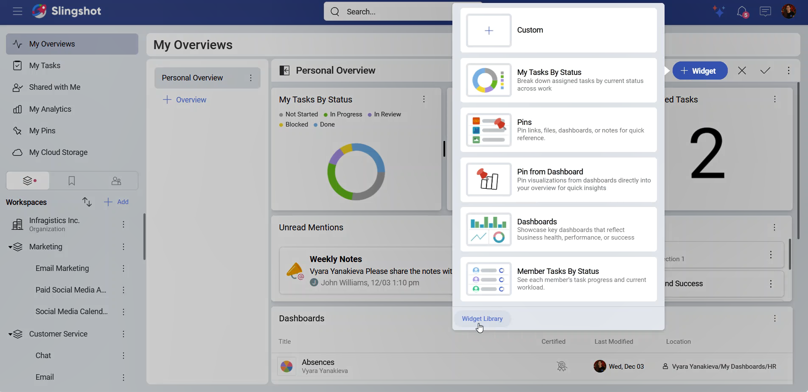

# Overviews

When working in multiple workspaces and projects, you will frequently find yourself with many questions, including:

-	Are we on time? If not, who should I ask and what to ask about?

-	Did we bump into an issue? If so, what's the issue?

-	Who's working on this project? How are they doing with their tasks?

-	Where can I get documents or other resources about the workspace?

-	How can I track statistics in order to make data-driven decisions?

All those questions can be answered using overviews. 

With Overviews, you can have a quick glance at the most important information around your work. This way you can make informed decisions, track the overall progress, and streamline your workflows.

>[!Note] 
>If you are using the Free version of Slingshot, you will be able to edit only the out-of-the-box Overview in **My Overviews**, in a workspace or a project but you can’t create a new one. With the [Slingshot](slingshot-subscription.md) or [Slingshot Enterprise](slingshot-enterprise-subscription.md) subscription, you can create multiple Overviews and edit them.

## Overview Types

Each workspace and project can have Overviews. Every user can also have their own Overviews visible only to them. 

-	**My Overviews**: You can visualize your own work and organize yourself.

-	**Workspace or Project Overview**: You can have a quick snapshot of a workspace or a project, presenting you with the current status of everyone’s work by displaying summarized information.

## My Overviews

Your personal list of Overviews is located on the top left corner of the screen in *My Overviews*. Here you can organize yourself and visualize your own work in a summarized way. You can customize your Overviews to best fit your goals.

## Workspace and Project Overviews

Your workspaces and projects are located on the left side panel. When running projects and teams, you need to get the big picture to act quickly and proactively. Having a quick glance at the most important information around your work is a game changer and will push you towards high-performing team’s ground.

Overviews can give both Project Managers and Leaders an overall status of a workspace or project and make key content top of mind to members.

>[!Note] Workspace and Project Overviews each have a default overview that can be changed. Only users with owner permissions can make changes to Overviews.

## Widget Library

To customize an overview, you can use the **Widget Library**. Here you can find tailored widgets that can help you shape your personal overview, the overview of a workspace, or a project. The widgets are divided into the following categories:

-	**All Widgets**: Here you can find a list of all the out-of-the-box widgets available to use as well as the option to create custom widgets.

-	**Task Management**: Tasks by Status, Open Tasks, In Progress Tasks, Overdue Tasks, Blocked Tasks, Tasks Completed Over Time

-	**Pins & Content**: Pins, Bookmarks

-	**Dashboards & Analytics**: Pin from Dashboard, My Favorite Dashboards, Dashboards

-	**Project and Workspaces**: Projects Timeline, Open Tasks by Project

-	**Informational**: Member Tasks Summary, Member Tasks by Status, Text Widget

-	**Discussions & Collab**: Unread Mentions

You can find more information about each out-of-the-box widget [here](overviews-out-of-the-box-widgets.md).

To open the Widget Library, you need to:

1.	Open an overview in the *My Overviews* section, an overview of a workspace or a project.

2.	Click/tap on the pencil icon in the top right corner.

3.	Click/tap on **+ Widget**.

4.	You will be presented with a list of all the widgets that you can use. If you want to see them organized in categories, you can click/tap on **Widget Library**.

5.	Once the widget library is opened, you can use the search bar to search for a widget by its name or choose a widget from a category.

