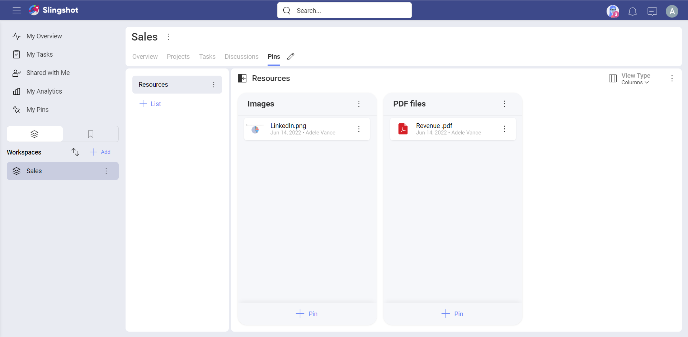
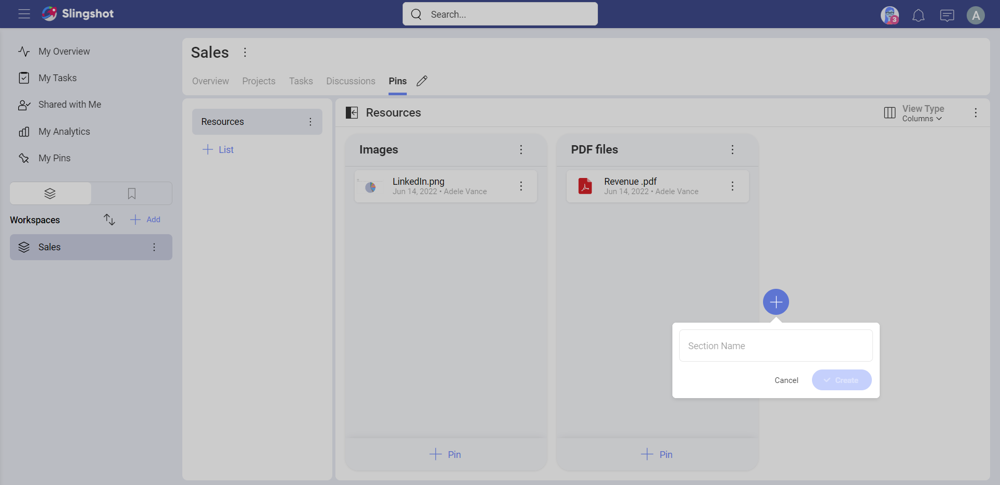
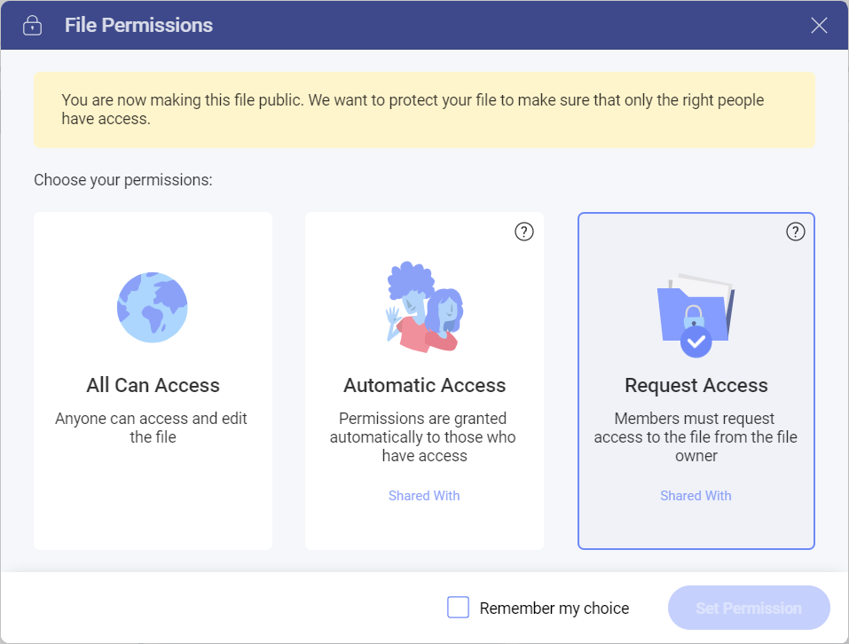
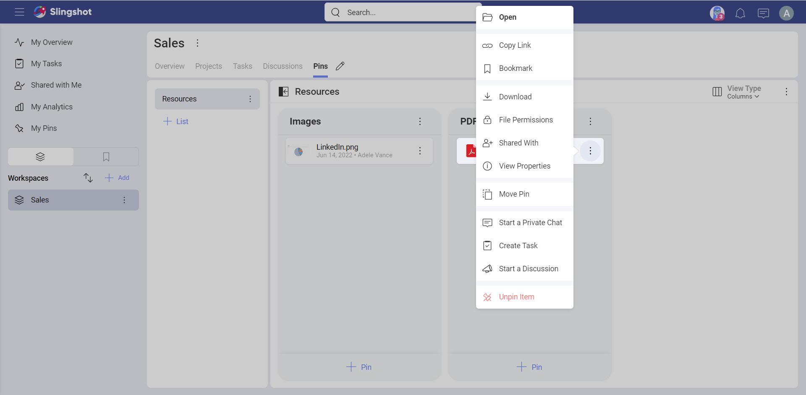

# Pins
Pins are key elements within Slingshot, that allow you to access and share relevant resources for yourself or your team. Resources that might be stored in different cloud storages or spread around the web, they can all be organized in Slingshot lists.

## What are Pins?
Pins are simple links to different types of resources, including files from cloud storages, URLs, and analytics dashboards. You can manage multiple lists of pins, designed to organize, manage and share your resources.

## How to Pin Content
Pinning content is one of the most common ways to share resources within Slingshot. You pin files or analytics dashboards by selecting them from cloud storages, existing pins, content shared with you, or uploading from your device. To pin URLs, you just add the URL and a title.

### Pinning from Anywhere

1. Use the “+Pin” button and then select “Content” or “Analytics”. 
2. Navigate to the file, which can be located in your cloud storages, existing Pins within Slingshot, Dashboards locations, or Shared with Me files.
3. Select the file you want to pin.

### Pinning by Uploading from your Device

1.	Use the “+Pin” button and then select “Upload File”. 
2.	After selecting the file, choose the cloud storage where you want to upload.
3.	Finally, choose the right permissions for sharing your file.

### Pinning from an Existing Pin

1.	Open the pin’s overflow and then select **Move Pin**.
2.	Navigate to the location where you want to add the new pin.
3.	Select the list, section, and then click on **->Move**.

### Pinning URLs

1.	Use the “+Pin” button and then select “URL”. 
2.	Type or paste the URL and add/change the title if needed.

## Organizing your Pins
The Pins tabs in workspaces and projects have lists of pins, which can be further organized in sections. You can use sections to add divisions and better layout your pins.

In addition, you can easily reorganize and move lists, sections and pins just by dragging them.

In the Overviews tabs you have a single list of pins, which are meant to be key resources for your team to keep top of mind.

## Cloud Storages
In Slingshot, you can add new connections to the following cloud storage providers:
- GoogleDrive
- OneDrive
- Dropbox
- Box
- SharePoint

You can configure cloud storages for personal use or to share content with others.

### Connecting to your Cloud Storages
You can add a new cloud storage from the Pin dialog or using My Cloud Storage tab.
1. Use the “+Add” button.
2. Select the Cloud Storage.
3. Sign in and grant Infragistics access.

>[!NOTE] Your My Cloud Storages tab can be enabled in Main Navigation (Settings).

### Types of Files Supported

In Slingshot, file types are represented using different icons. The most common are:

|**ICON**|**FILE TYPE**|**ICON**|**FILE TYPE**|
|---|---|---|---|
|| Microsoft Word file|| Google Doc file|
|| Microsoft Excel file|| Google Sheet file|
|| Microsoft PowerPoint file||Image file|
||Adobe PDF file|| Video file|
|| Web link|| ZIP file|

### How to set file permissions?

When you share files inside workspaces, you make these files available for the users inside the workspace. 
File permissions are meant to give the file owner control over who can access their files. Each time you pin a file, Slingshot will ask you what type of permission you want to set. You will see a dialog that looks like this: 

Here, you can choose between the following three permission types:

 - **All Can Access** - all Slingshot users can access the file.
 - **Automatic Access** - all users in the workspace can access the file.
 - **Request Access** -  all users, including the users in the workspace have to request access from the owner.

> [!NOTE] Giving access to a file in Slingshot means you give view and edit permissions to the file. 

Learn more about each file permissions type and how to manage members' access in [this topic](file-permissions-faq.md). 

### Using Drag and Drop
You can use drag and drop to quickly add files or links from an external source into Slingshot's lists. The files added to Slingshot are uploaded to a folder named Slingshot uploads in the cloud storage of your preference.

The first time you upload a file you choose a default cloud storage to be selected automatically in the future. If needed, you can change it later in the Drag and Drop location (General Settings).

## Working with your Content
You can open any file by clicking/tapping on it. MS Office files can be opened online or using a native app locally on your device.

In addition, you can set a default method using the Open Files setting (General Settings).

Finally, you will be editing your files often. Depending on the platform, you can use different applications like MS Word or Excel, as Slingshot relies on invoking 3rd party applications to do the job.