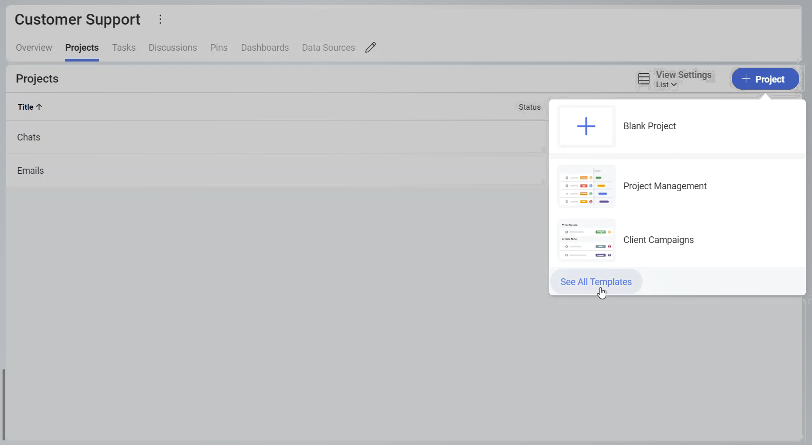
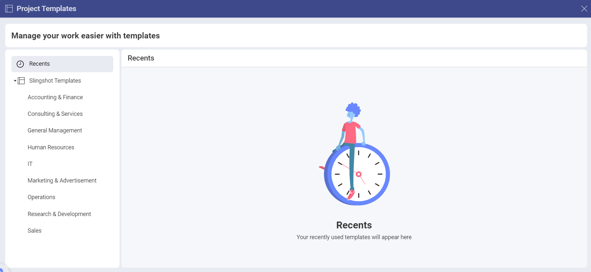
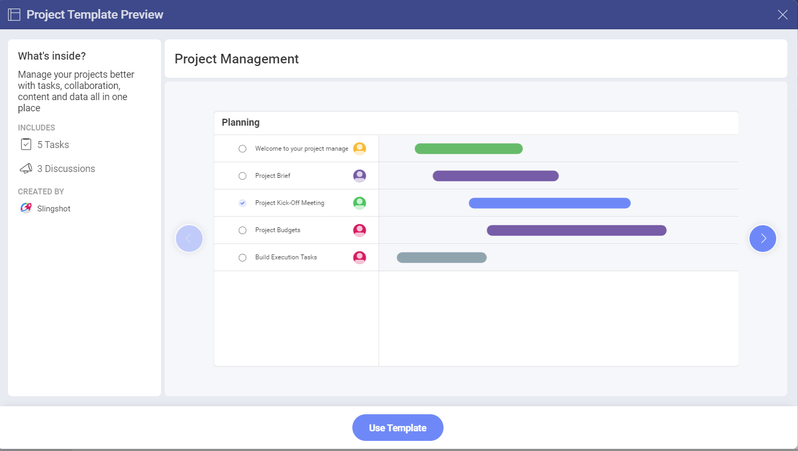

# Project Templates 

With Project Templates, you can quickly create projects for your teams. You can reuse the templates whenever you need them. 

## How can I access different Project Templates lists?

In order to access the templates, you need to:

1.	Open the list of projects in your workspace.

2.	Click/tap on the **+Project** button.

3.	Select **See All Templates**.

4.	The following dialog will pop up:

In the left panel you can:

- Check/use the templates that you have recently used.

- Check/use a template from the *Slingshot Templates*.

## How can I use a Project Template?

The *Slingshot templates* are organized based on different industries/departments. To use a template, you need to:

1.	Open one of the lists in the left panel.
2.	Click/tap on a template that best fits your needs. 
3.	You will be presented with a preview of how the project will look like. In this case we choose the **Project Management** template.

4.	Here you find a brief description of what’s inside the template, what it includes and who created it. You can also use the left/right arrows to see the thumbnails of each component (in this case *Tasks* and *Discussions*). This can give you a better overview of how your project will look like.
5.	When you are ready, click/tap on **Use Template**.
6.	You will be presented with a dialog, where you can change the title of your project and change the description by clicking/tapping on each text box. You can also save the project in a specific *Workspace* and set the starting date for the project from the drop-down menu. The starting date will also be used for configuring the task dates. 

7.	When you are ready, click/tap on **Create**.

If you want to find more information about how you can create and use projects, head [here](./workspaces.md#workspace-hierarchy).