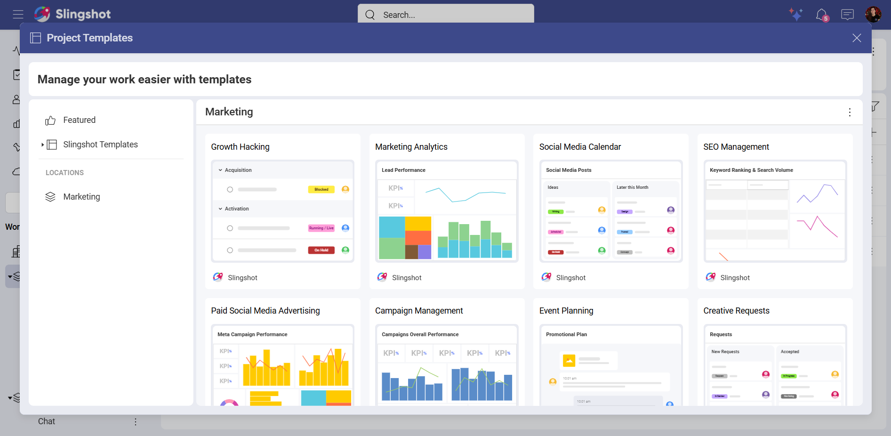
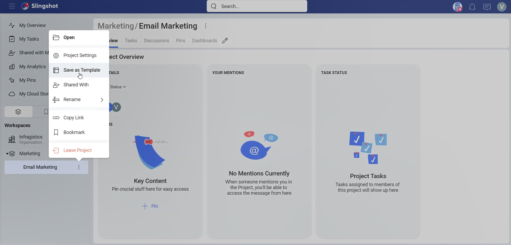
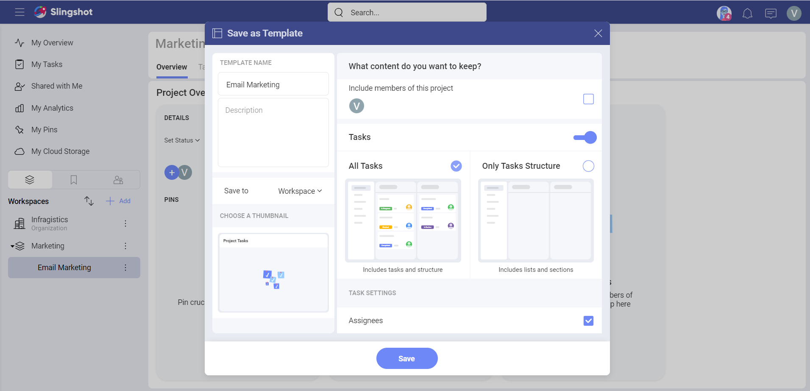
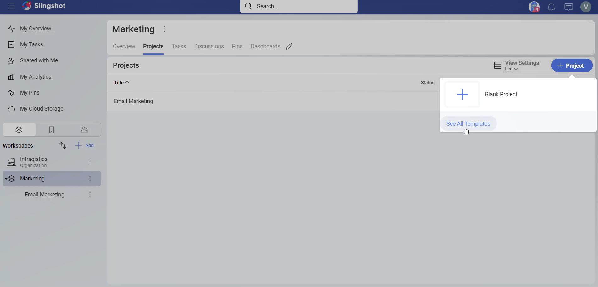
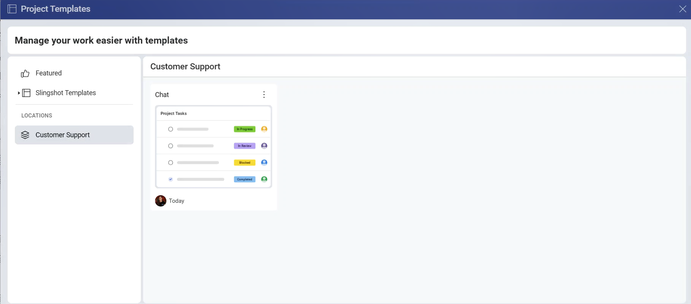

# Project Templates 

With Project Templates, you can quickly create projects for your teams. You can reuse the templates whenever you need them. 

## How can I access different Project Templates lists?

In order to access the templates, you need to:

1.	Open the list of projects in your workspace.

2.	Click/tap on the **+Project** button.

3.	Select **See All Templates**.

4.	The following dialog will pop up:

In the left panel, you can do the following:

- Check all of your templates.

- Check the templates that you have recently used.

- View all the featured templates.

- Use a template from the *Slingshot Templates*.

- Locate where you have stored your templates.

- Filter the templates by *Created by Me* or *Shared with Me*.

## How can I use an out-of-the-box Project Template?

The *Slingshot templates* are organized based on different industries/departments. To use a template, you need to:

1.	Open one of the lists in the left panel.

2.	Click/tap on a template that best fits your needs. 

3.	You will be presented with a preview of how the project will look like. In this case we choose the **Project Management** template.

4.	Here you find a brief description of what’s inside the template, what it includes and who created it. You can also use the left/right arrows to see the thumbnails of each component (in this case *Tasks* and *Discussions*). This can give you a better overview of how your project will look like. When you are ready, click/tap on **Use Template**.

5.	You will be presented with a dialog, where you can change the title of your project and change the description by clicking/tapping on each text box. You can also save the project in a specific *Workspace* and set the starting date for the project from the drop-down menu. The starting date will also be used for configuring the task dates. 

6.	When you are ready, click/tap on **Create**.

## How can I create a custom Project Template? 

To create a custom project template, you need to:

1.	Open the overflow menu of the project you want to use for the template.

2.	Click/tap on **Save as Template**. 

3. The following dialog will open up. Here you can choose what to keep from the project in order to use it for the template. You can also choose where to store the template from the drop-down menu in the left panel of the dialog. When you are ready, click /tap on **Save**.

4.	Once you have created the template, you can open your list of projects in a workspace and click/tap on **See all Templates**. 

You can find the template under **Locations** in one of the sections. In the example below, we saved the template with the title *Email Marketing* in the **Marketing** workspace.

Besides this, you can also open the overflow menu on the right side of the project template, that you have created, and take the following actions:

-	Open the template.

-	Copy the link to the template.

-	Add the template to *Bookmarks* or remove it from there.

-	Share the template.

-	Delete the template.

>[!Note] Keep in mind that the option to create custom project templates is available to Slingshot and Slingshot Enterprise users.

If you want to find more information about how you can create and use projects, head [here](./workspaces.md#creating-projects).