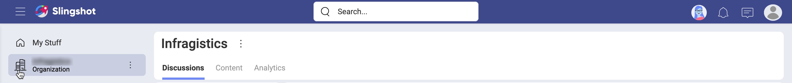
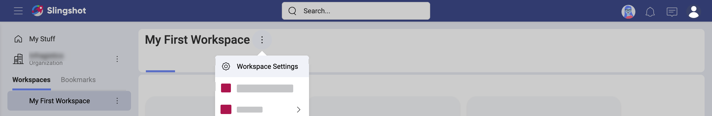

## Learn More about Roles & Permissions

Welcome! Read on to get answers to your questions about the roles and permissions in Slingshot.

### What are roles and permissions within Slingshot?

One of the main methods of access control in computer systems is known as role-based access control (RBAC). Basically, it's about restricting access to a system depending on the person's role. Multiple roles are created to satisfy the need of different access level for different groups of people. As roles have different permissions, it is possible to limit specific tasks like viewing, creating, modifying, or sharing files.

In Slingshot, users can join one or more workspaces, and can also be part of an Organization. 
Roles represent a set of permissions that a user has in a workspace or in the Organization. The role is assigned to the user when they join the workspace/Organization. There are three different roles in Slingshot - owner, member and viewer.

### How can I find my role?

You can have a different role in the different workspaces and the Org. Your role is given to you by the creator of a workspace at the moment you are invited. The creator is also the owner of the workspace. You will be notified what role they assigned to you in the invitation email. 

If you want to check your role in a workspace or the Org at a later moment, you can select the overflow menu of the workspace/Org > *Manage Members*. Find more about managing workspace members in the [Learn More about Workspaces](teams-starting.html#how-can-i-manage-workspace-members) topic.

### What can the different roles do in a workspace?

In the table below, you will find the permissions of each role in the workspace. 

| Permissions                                                          | Owner              | Member             | Viewer             |
| -------------------------------------------------------------------- | ------------------ | ------------------ | ------------------ |
| Can create and delete **workspaces**                                 | :white_check_mark: | :x:                | :x:                |
| Can create **sub-workspaces** under a workspace                      | :white_check_mark: | :white_check_mark: | :x:                |
| Can change **workspace information**                                 | :white_check_mark: | :x:                | :x:                |
| Can manage members of the **workspace**                              | :white_check_mark: | :x:                | :x:                |
| Can create, modify, delete **tasks**                                 | :white_check_mark: | :white_check_mark: | :x:                |
| Can create, modify, delete **task filters**                          | :white_check_mark: | :white_check_mark: | :x:                |
| Can create, modify, delete **discussions** and **topics**            | :white_check_mark: | :white_check_mark: | :x:                |
| Can send messages in **topics**                                      | :white_check_mark: | :white_check_mark: | :x:                |
| Can create, modify, delete **boards**                                | :white_check_mark: | :white_check_mark: | :x:                |
| Can pin/unpin content to **boards**                                  | :white_check_mark: | :white_check_mark: | :x:                |
| Can view **Analytics dashboards**                                    | :white_check_mark: | :white_check_mark: | :white_check_mark: |
| Can create, modify, and share **Analytics dashboards**               | :white_check_mark: | :white_check_mark: | :x:                |
| Can export **Analytics dashboards**                                  | :white_check_mark: | :white_check_mark: | :white_check_mark: |
| Can **bookmark** tasks, discussions, topics, content, analytics      | :white_check_mark: | :white_check_mark: | :white_check_mark: |
| Can **copy a link** to a task, discussion, topic, content, analytics | :white_check_mark: | :white_check_mark: | :white_check_mark: |

The Slingshot user who creates a workspace is automatically assigned as its **owner**. A workspace can have more than one owner. However, if you are the only owner of a workspace, you cannot leave it without assigning another member as an owner. 

**Owners** have full access to manage a workspace. This includes changing its main **information** - *name*, *description*, *privacy*, *status* and even deleting it. It also means owners have the right to **manage members** of the workspace - invite, remove and change their roles. They can create, edit and delete all content inside the workspace - tasks, filters, discussions, topics, boards, and Analytics dashboards.

**Members** are more limited than owners but they are allowed to create sub-workspaces under the workspace. They can also create, edit and delete tasks, filters, discussions, topics, boards, and Analytics dashboards. When [joining](teams-starting.html#how-can-I-discover-and-join-other-workspaces) a public workspace by yourself and not by invitation, you are assigned the member role by default.

**Viewers** are limited to view, bookmark and share content. To be a viewer in a workspace, you have to be invited with the viewer role.

>[!NOTE] Your permissions in the sub-workspaces are not affected by your role in the parent workspace. This means that even if you are an owner in the parent workspace, you can't have permissions exceeding your role in the sub-workspace. For example, if you are an owner in the parent workspace and a viewer in the sub-workspace, you cannot create or delete anything in the sub-workspace.

### What about roles in the Organization? 

Before you learn about the user roles and their permissions, you may want to know more about the Organization in Slingshot. 

In short, the Organization, also called *the Org*, is a workspace, but it's not like any other workspace in Slingshot. There you can collaborate with other members of, well, your real life organization - business or non-profit. 

Your Organization in Slingshot will appear right under _My Stuff_ (see below). You need sign in with Google or Microsoft using the email associated with your organization.

The roles in the Slingshot Organization are the same as in other workspaces - owner, member, viewer. Look at the table below to find more about the permissions of these roles in the Organization. 

| Permissions                                                            | Owner              | Member             | Viewer             |
| ---------------------------------------------------------------------- | ------------------ | ------------------ | ------------------ |
| Can edit the **Org information**                                       | :white_check_mark: | :x:                | :x:                |
| Can **manage members** of the Org                                      | :white_check_mark: | :x:                | :x:                |
| Can **create** discussions, topics, content, boards, and dashboards    | :white_check_mark: | :white_check_mark: | :x:                |
| Can **modify** discussions, topics, content, boards, and dashboards    | :white_check_mark: | :white_check_mark: | :x:                |
| Can **delete** discussions, topics, content, boards, and dashboards    | :white_check_mark: | :x:                | :x:                |
| Can **view** discussions, topics, content, boards, and dashboards      | :white_check_mark: | :white_check_mark: | :white_check_mark: |
| Can **bookmark** discussions, topics, content, boards, analytics       | :white_check_mark: | :white_check_mark: | :white_check_mark: |
| Can **copy a link** to discussions, topics, content, boards, analytics | :white_check_mark: | :white_check_mark: | :white_check_mark: |

Learn more about the Organization in the [Workspaces](workspaces-starting.html#organization-vs-workspace) topic.

### What about users with no Organization?

Having an Organization in Slingshot makes you a user with an Organization account or an **Org user**. If you use your personal email to sign into Slingshot, then you are a **personal account user**. Personal account users don't have an Organization. However, in real life, people from an organization structure sometimes need to work with external people. Slingshot allows you to create workspaces where both Organization users and users with personal accounts can be mixed together.

>[!NOTE] Just bear in mind that when inviting users with personal accounts to a workspace, you have to enter the email they use in Slingshot. They will receive an email invitation and they have to accept it to join the workspace.

Personal account users can be assigned the same roles in the workspaces - owner, member and viewer. These roles have equal permissions for both Org users and users with a personal account. 
### How do permissions around cloud storages work?

The content that is relevant to you might be stored in different cloud storages. Slingshot lets you create connections to those cloud storages to access that content, share it, and organize it in boards. Those connections can be private or shared and they are meant to be used in different scenarios.

In *My Stuff* > *Content*, you will find you *private cloud storage** connections. _Only you_ have access to these private connections and you can create/delete them whenever you want. That being said, you are able to **share private content with others** if you want.

When you pin content from a private cloud storage to a workspace board, that specific content becomes available for the whole workspace. But it does not mean that workspace members can access the rest of the private cloud storage contents.

_All the members of a workspace_ have access to **workspace cloud storage** connections and they can create/delete them whenever they want.

> [!NOTE]
> If you use your **Microsoft** account to log into Slingshot, you will start with your **OneDrive** configured. Same applies to logging with your **Google** account and starting with a **Google Drive**.

### What about public and private workspaces?

A newly created workspace is public by default, meaning that any member of the Organization can search and join the workspace. Trust and transparency are key elements for effective collaboration, and also help with ownership and accountability.  
That being said, sometimes you might need to have a private workspace. In this case, users can only join the workspace by getting invitations from an owner of the workspace. This is helpful for workspaces that handle sensitive information. In those cases the organization wants to restrict access.

To change a workspace privacy, select your workspace's **overflow menu** > **Workspace Settings** > **Information** > **Privacy**.

Change to **Private** and select **Update**.

