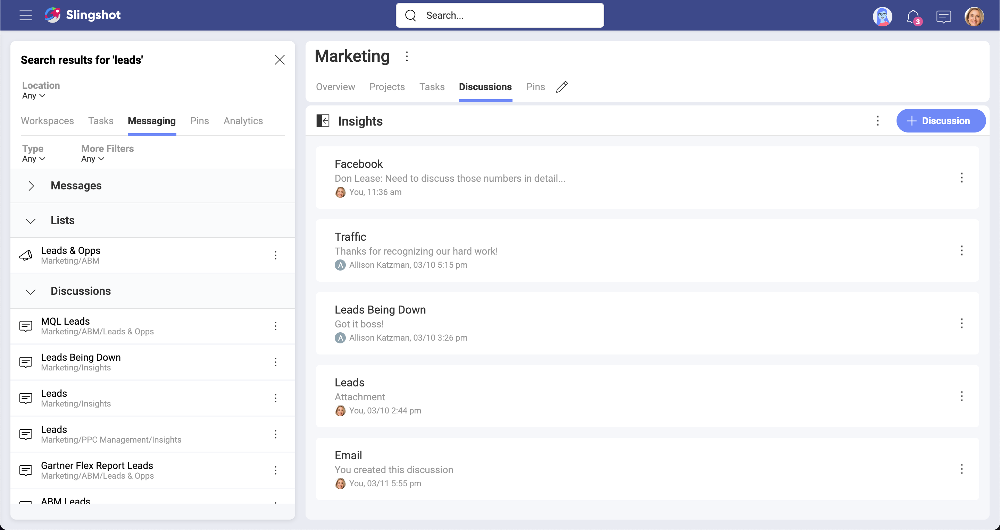
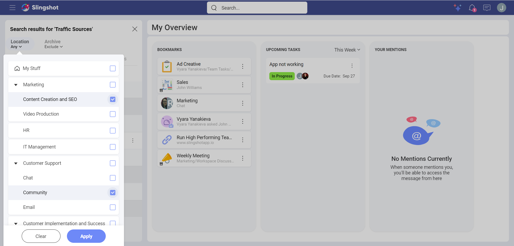

# Search

In order to run high performing teams that collaborate with different groups of people, finding the right information is a key feature. Slingshot saves time drilling through endless folder of content or sifting through email to find what you need. Even in Slingshot you need a faster way to find what you need – that’s where search comes in. 

Slingshot’s search provides neatly organized results from everything within Slingshot. The variety of filtering options ensures great precision and quickly finding exactly what you need.

## How to Search

You can quickly start your search from anywhere - a workspace, tasks, My Stuff, etc.

1. Go to the search box at the top.
 
2. Type in the name of the content/item. 

3. The search results pane will open on the left.

The search results pane shows results from everywhere inside Slingshot. The results are displayed separately in five tabs:

- [Workspaces](workspaces.md) - results from all workspaces and projects.

- [Tasks](tasks-faq.md) - results from My Tasks, my assigned tasks and all workspaces and projects are shown.

- [Messaging](communication.md) - shows results from messages in the chat and discussions.

- [Pins](pins.md) - shows results from all boards in My Stuff, Workspaces and the Organization.

- [Analytics](../docs/analytics/my-analytics.md) - shows results for dashboards and dashboard folders in My Stuff, Workspaces and the Organization.

>[!NOTE] In the *results* pane, you can open the overflow menu and save a result in bookmarks or share it with others.

## Filtering Results

Sometimes you may get too many results and need to refine your search. To help you with this, Slingshot includes a location filter on the top and a second tier of filters under each of the five tabs.

You can also browse through archived items when you use the Archive filter ([Slingshot](slingshot-subscription.md) and [Slingshot Enterprise feature](slingshot-enterprise-subscription.md)).

## Filtering by Location

The Location filter (top of the page) is applied to all results no matter which results tab you choose. For example, you can easily search all blocked tasks in two projects located in different workspaces. To do this, just select the two projects in the location dropdown and then in the Tasks tab filter by the Blocked status.

### Using More Filters

These filters are specific to the selected tab and type of result. For example, when selecting the Tasks tab, you can filter results by Creator, Assignee, Due Date, etc.

Filters are only reset when you close the search results, so you can search multiple times adding and removing filters as needed.