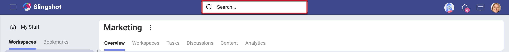
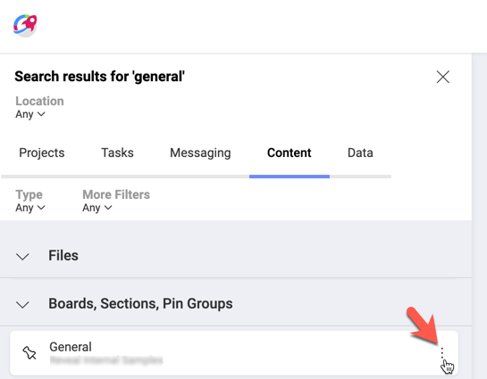
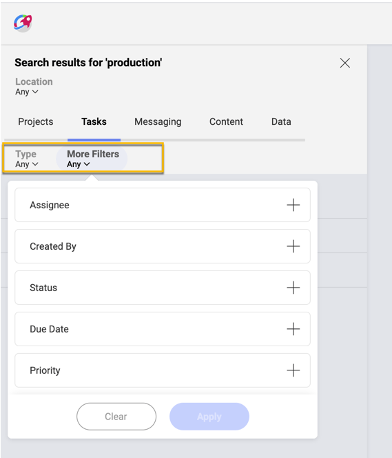
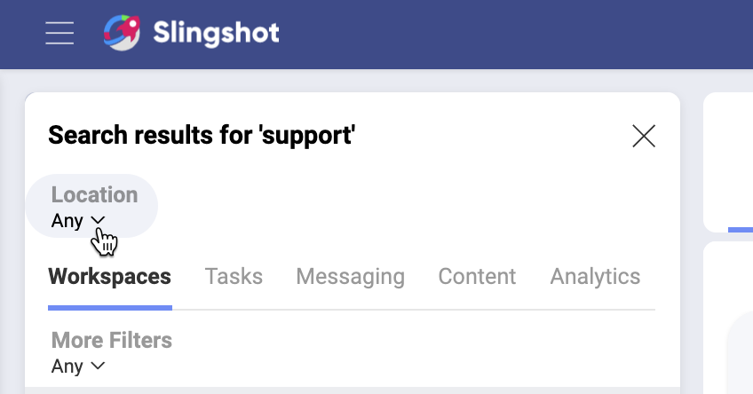

# Search

If you have been on the Internet at least once, you know it's all about finding the right information! And search is the tool to help you with this.  

## So, what's the Slingshot's Search?

The search provides neatly organized results from everywhere inside Slingshot. The variety of filtering options ensure great precision and quickly finding exactly what you need.

## How to start my search?

You can quickly start your search from anywhere - a workspace, tasks, *My Stuff*, etc. 

1. Click the search box at the top.

    

2. Start typing. Slingshot will start making suggestions. Press _Enter_ / select _Search All Results_ for a full list of results.

3. The search results pane opens on the left.

## Where can I search?

The search results pane shows results from **everywhere** inside Slingshot. The results are displayed separately in five tabs: 

* *Workspaces* - results come from all workspaces.
* _Tasks_ - results from tasks in _My Stuff_ and _Workspaces_ are shown. 
* _Messaging_ - shows results from messages in the chat, discussions and topics.
* *Content* - shows results from all boards in _My Stuff_, *Workspaces* and the *Organization*.
* _Analytics_ - shows results for dashboards and dashboard folders in My Stuff, Workspaces and the *Organization*.

## Can I share or save results?

In the results pane, you can open the overflow menu of a result (see the screenshot) and use the *Copy Link* option to share it with others. You can also save results in _Bookmarks_.

## How Can I Filter Results?

You may receive too many results and need to refine your search to find exactly what you need. For this purpose, you will find a second tier of filters under each result tab.

These filters are specific for the selected result type. For example, if you select _Tasks_, you can then use the filter to see only results in _Task Lists_ or to filter by task's creator, assignee, due date, etc.

>[!NOTE] Your filters' settings will be kept for your next search until you close the search results pane or refresh the page. So, if next time your search criteria change don't forget to check your search filters too.

### Filtering by location

If you need results related to a specific workspace, or from your personal space (_My Stuff_), use the _Location_ filter dropdown just above the result tabs (see below).

The _Location_ filter is applied to all results and is not affected by which result tab you chose.

For example, you may want to check all completed tasks containing your search word in the  _Marketing_ and _Sales_ workspaces. To achieve this, first, you need to select these two workspaces in the location dropdown. Then, open the _Tasks_ tab and choose _Completed_ in the status filter.
