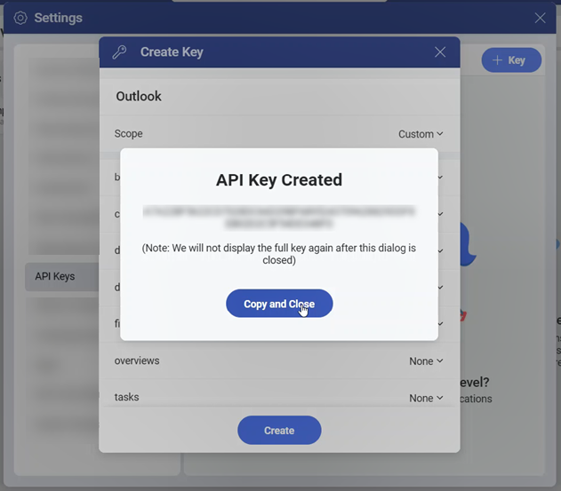
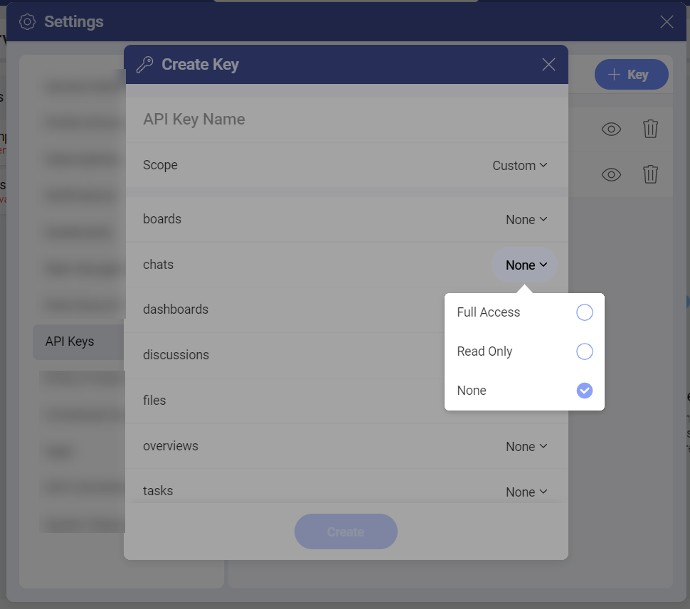

# Authentication
 
In order to access your data in Slingshot via the API, you need to first authenticate yourself. To do that, you can create a Slingshot API key. This can be done in the Slingshot app. 

## Creating a Slingshot API Key

To create a Slingshot API Key, you need to:

1.	Log in to your **Slingshot** account.

2.	Open **Settings** from the dropdown menu next to your profile.

3.	Open **API keys**. Here you will have a list of all the API keys that you have created.

4.	Click/ tap on the **+Keys** button to create a new API Key.

5.	You will be presented with the *Create Key* dialog, where you can name the API Key and set the scope. You can choose between *Full Access*, *Read Only* or *Custom*. 

    

6.	Once you have created the key, you can copy the full key code and then close the dialog. 

    >[!NOTE] As the full key can be displayed only once, make sure to securely store it.

    

    >[!NOTE] If you select **Custom** for a component, you can choose from *Full Access*, *Read Only* or *None*. If you select *None*, that component won’t be visible.

    

