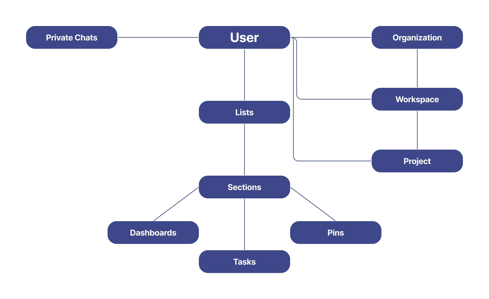
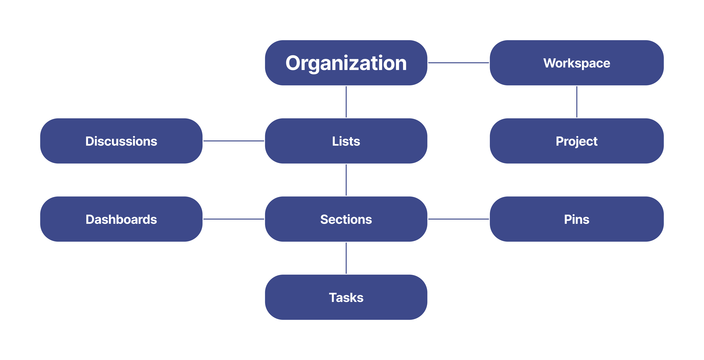
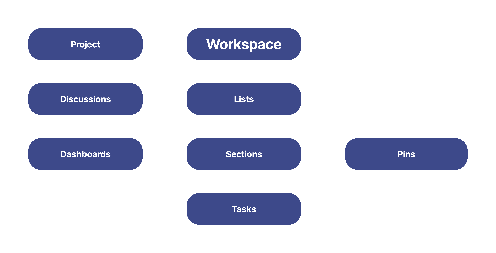
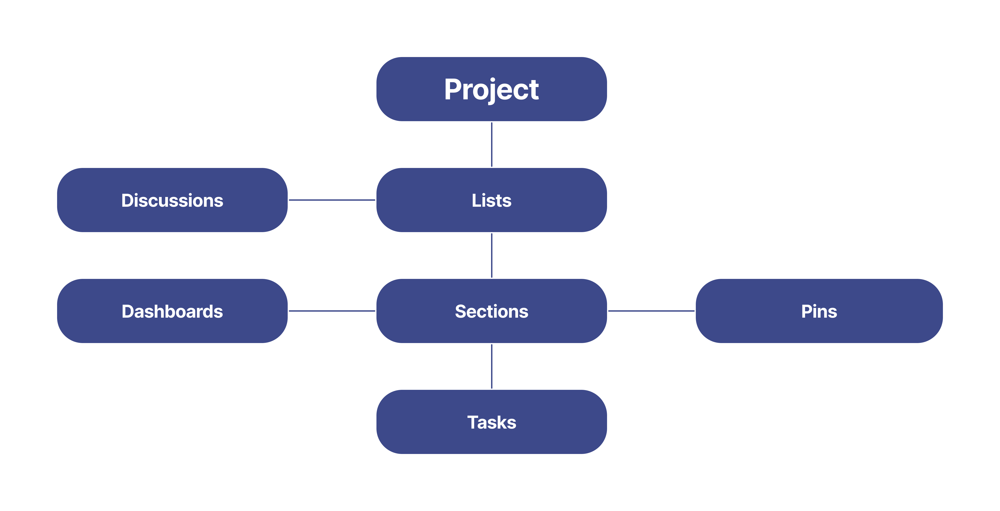

# Explore the Object Hierarchy 

In our data-driven world being fast, organized, and being able to communicate with others in an efficient way, is of utmost importance. 

With Slingshot you can not only organize your work with the help of different dashboards, workspaces, projects tasks, pins and bookmarks, but you can also communicate with your team members via chats and discussions. 

To find out more about how Slingshot works, you can take a look below.

### Users
In the object hierarchy, the *users* objects represent accounts in Slingshot. Every user can find their own information, such as credentials, profile information, settings and content in their account. 

- [User](./rest-api/user.md)

### Organizations

Organization is a workspace, where you and your colleagues can find information, uploaded by your company/workplace. 

- [Organization](./rest-api/organizations.md)

### Workspaces
Workspaces can be viewed as digital workplaces. One workspace can contain multiple projects. With workspaces you can collaborate with other users, prioritize work and share different types of content – all in one place. 

- [Workspace](./rest-api/workspace.md)

### Projects
In case you want to have a better overview of different initiatives and processes, bound to a group of people, you can create a project.

- [Project](./rest-api/project.md)

### Tasks
You can use tasks in order to better organize your work. For better visibility, you can organize them in different lists and sections.

- [Task](./rest-api/task.md) 
- [Task List](./rest-api/task-list.md) 
- [Task Section](./rest-api/task-section.md)

### Pins 
Pins are simple links to different types of resources that you can share or access. You can organize them in different lists and sections.

- [Pin](./rest-api/pin.md) 
- [Pin List](./rest-api/pin-list.md) 
- [Pin Section](./rest-api/pin-section.md)

### Dashboards
With dashboards you can display information with the help of beautiful visualizations. They can be used, for example, to show the performance of a business. You can organize them in sections and lists.

- [Dashboard](./rest-api/dashboard.md) 
- [Dashboard List](./rest-api/dashboard-list.md) 
- [Dashboard Section](./rest-api/dashboard-section.md)

### Private Chats
You can use private chats in order to communicate with other users. As they are workspace and project independent, the users don’t need to be a part of your organization.

- [Private Chat](./rest-api/private-chat.md)

### Discussions
Discussions can be created in projects and workspaces. As they are specific to workspaces and projects, you won’t be able to access all of the discussions in Slingshot. You can organize discussions in different lists.

- [Discussion](./rest-api/discussion.md) 
- [Discussion List](./rest-api/discussion-list.md)

