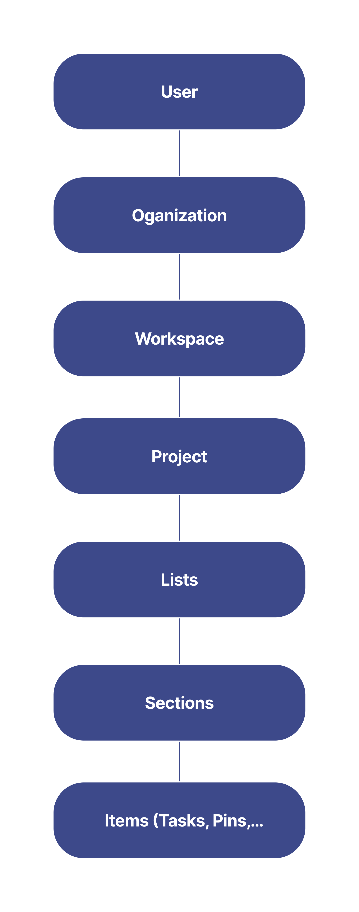

# Overview

In order to access your Slingshot data from another app, for example, a tasks list, a connection between Slingshot and that app has to be established. This connection can be built with the help of the Slingshot’s API.

The Slingshot’s API uses [REST](https://developer.mozilla.org/en-US/docs/Glossary/REST) principles. You can submit HTTP requests and the information will be returned in [JSON](https://www.json.org/json-en.html) format.

Keep in mind that the requests and responses support only one type of character encoding - [UTF-8](https://developer.mozilla.org/en-US/docs/Glossary/UTF-8). 

To start using the Slingshot’s API, you need to first authenticate yourself. [Here](authentication.md) you can find more information about the process of authentication. 

>[!NOTE] Below, you can find the general hierarchy structure of Slingshot. 

To learn more about the specific hierarchy options at each level, you can head [here](explore-object-hierarchy.md).

