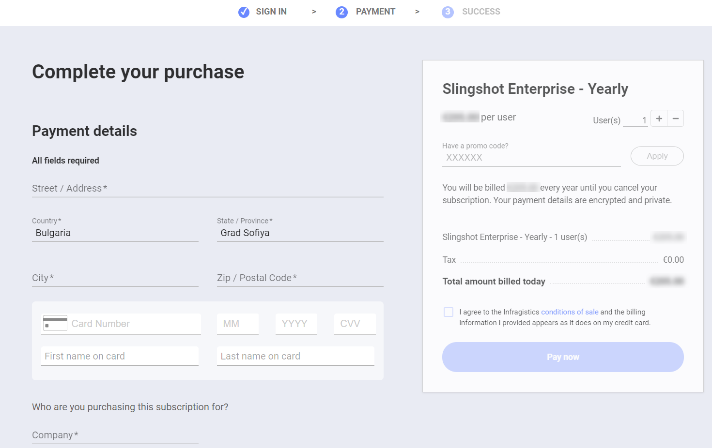
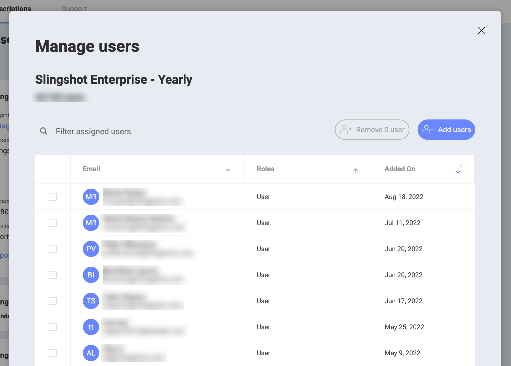
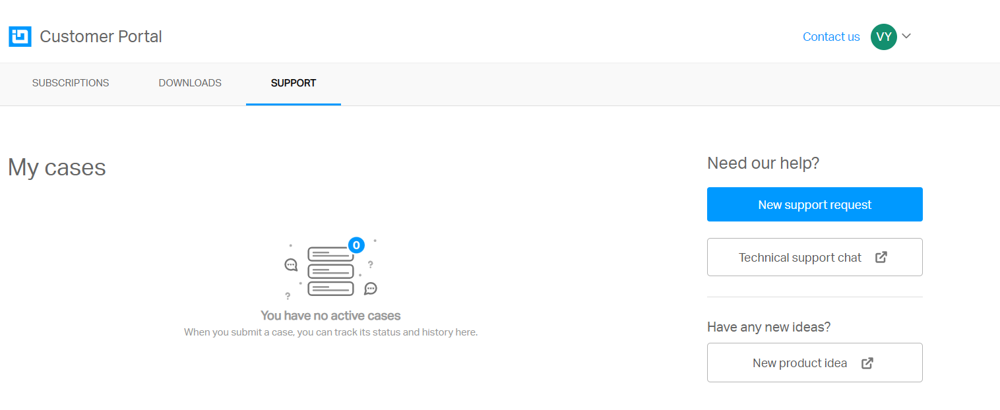
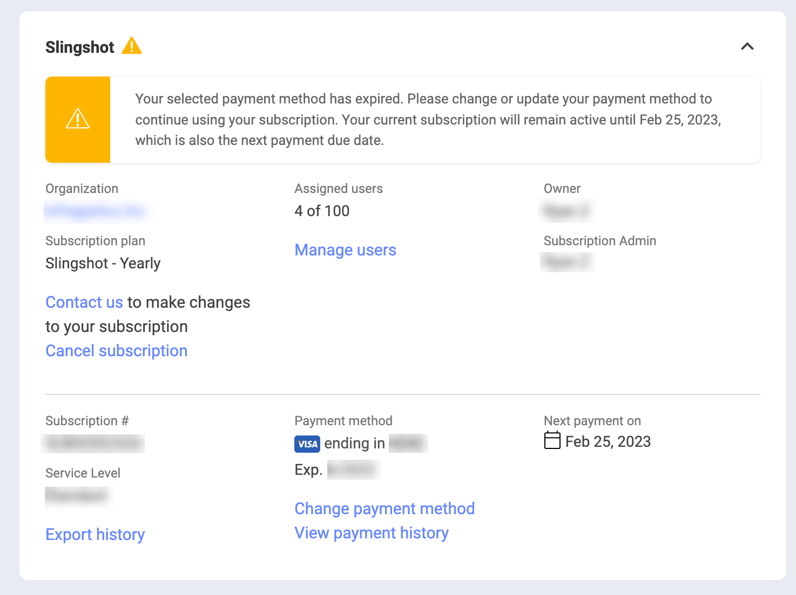
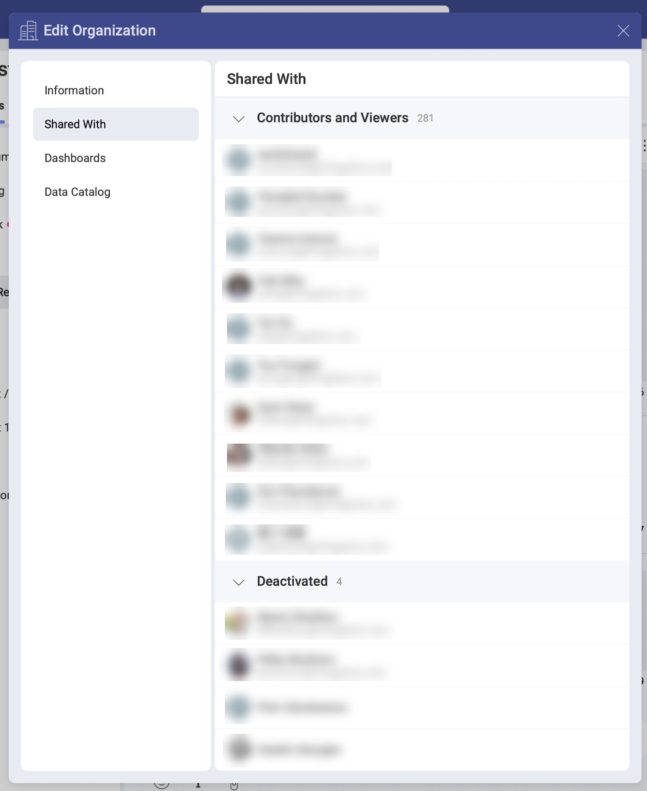

# Slingshot Enterprise Subscription

There are three different tiers available on Slingshot – *Free*, *Slingshot* and *Slingshot Enterprise*. To find out more about how to activate and use the *Slingshot Enterprise* subscription, you can take a look below…

## What role can I have while using the Slingshot Enterprise subscription?

| Permissions | Subscription Admin | Organization Admin | User          |
| ------------------------------------ | ------------------ | ------------------ | ----------------- |
| Manage the subscription (activate and/or cancel the Enterprise subscription, invite users to the organization, remove users from the organization) | :white_check_mark: | :x:  | :x:  |
| Enable features within the application | :x:  | :white_check_mark: | :x:                |
|Use the Slingshot app (Organization Admins will need to create new accounts in order to use the app)                                |  :x:   | :white_check_mark:            | :white_check_mark:               |

>[!NOTE] A user can be assigned more than 1 role when they have a *Slingshot* or *Slingshot Enterprise* subscription.

## How can I activate a Slingshot Enterprise subscription?

You can activate a Slingshot Enterprise subscription with the following steps:

1.	Log in to your *Slingshot* account.
2.	Go to your profile settings and choose **Subscriptions**.
3.	Click/tap on **Upgrade** to be presented with the pricing page.
4.	Click/tap on **Buy Now** to select your number of seats and complete your purchase. 

>[!NOTE] In order to complete your purchase, you need to type in the Company’s name. This name will later show up as the name of the Organization in your account.

## How can I invite a user to an organization and provide them with a license?

The *Subscription Admin* can send an invite to that user for the organization. To do that, you can give the steps mentioned below a go:

1.	Go to the customer portal and click on **Subscriptions**.
2.	Choose **Manage users**.

 

3.	A dialog will appear where you can click on the **Add users** button to invite someone.
 
 

If they accept the invite, they will be asked to sign out and sign back in again. When they sign in, they will see the organization’s workspace and will be able to view enterprise subscription features. 

If they choose **Reject**, an email will be sent to the *Subscription Admin* to notify them that the user has rejected the invite and that they should remove the user.

>[!NOTE] If you assign a subscription to a user who hasn't used Slingshot before, they will automatically be added to the organization once they have created a Slingshot account. 

## How can I move a user’s account from an organization to another organization?

You can contact our support team by clicking on **Contact Us** or submit a new support request. The team will help you move the account of the user to another organization.

 

 ## How can I cancel a user’s Slingshot Enterprise subscription?

 The *Subscription Admin* needs to remove the license from the user. 

 ## How can I cancel a Slingshot Enterprise subscription?

 The subscription owner/admin can cancel the Slingshot Enterprise subscription from the Slingshot portal.

 

 ## If a user gets removed from an organization in the app, what will happen to the user’s account?

 The account of the user will be deactivated but the data will be retained for the organization. The *Organization Admin* can manage the list that contains all the deactivated users from the **Shared with Me** section in the *Edit Organization* dialog.

## Can a user join different Slingshot Enterprise subscriptions?

No, a user can join only one Slingshot Enterprise subscription.

If you want to find out more about the difference between the different tiers, you can head [here](https://www.slingshotapp.io/pricing).