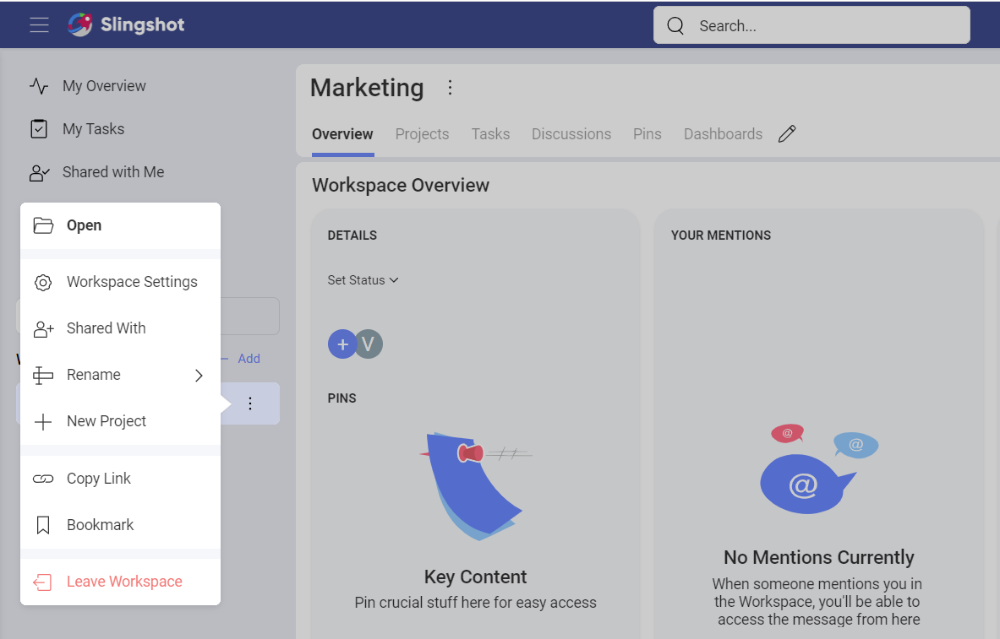
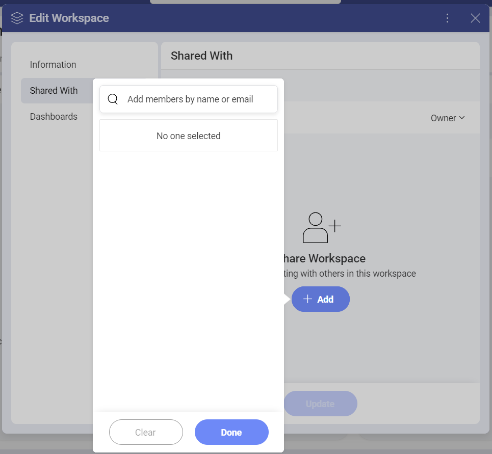
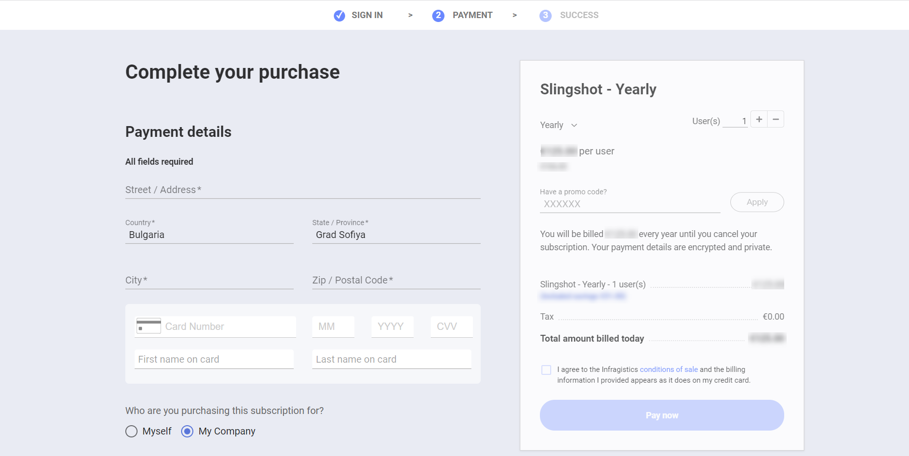

# Slingshot subscription

There are three different tiers available on Slingshot – *Free*, *Slingshot* and *Slingshot Enterprise*. 

As a new user, you will have access to 2 workspaces and 1 project as the account will be set to the free tier.
With the *Slingshot* subscription, you can create and use unlimited workspaces and projects. 

To find out more about how to activate and use the Slingshot subscription, you can take a look below…

## How can I activate the Slingshot subscription trial?

In case you haven’t activated a Slingshot subscription before, you will be eligible for the 15 days trial. You can activate it with the following steps:
1.	Log in to your *Slingshot* account.
2.	Open your profile settings.
3.	Click/tap on **Start Trial**.

## How can I invite users to my workspaces?

You can click on the overflow menu next to your workspace and choose **Shared With**.

A dialog will pop up where you can click/tap on the **Add** button to add members by name or email.

## How many users can I invite to my workspaces?

There is no limit on how many users can be invited to a workspace.

## What will happen with my account once the trial has expired?

Once the trial has expired, your account will be reverted to the free version of Slingshot. You will be able to choose 2 workspaces to have full access to. All the other workspaces you are a part of will become read only.

## How can I activate a Slingshot subscription once the trial has expired?

You can activate the subscription with the following steps:

1.	Log in to your *Slingshot* account.
2.	Open your profile settings and click/tap on **Settings** to open the settings of the app.
3.	Click/tap on **Subscriptions** and then on **Upgrade**.
4.	 You will then be prompted to choose between the *Slingshot* and *Slingshot Enterprise* license.
5.	Once you have chosen the *Slingshot* subscription, you will be directed to the *Slingshot portal* where you can complete your purchase.

## How can I cancel my Slingshot subscription? 

To cancel your subscription you can head [here](https://customer.infragistics.com/subscriptions?theme=slingshot) and click on **Cancel Subscription**. If you cancel on or before your next billing date you will not be charged. After cancelling you will revert to the *Free* version of Slingshot.

## Can I still see the discussions that are in workspaces where I am no longer taking part in?

Yes, but they will become read only.

## Will I still have access to the tasks that are in a workspace where I am no longer taking part in?

Yes, but they will become read only.

## Will I still have access to dashboards in workspaces where I no longer participate in?

Yes, but they will become read only.

## What is your refund policy? 

If for any reason you are not happy with Slingshot within 30 days of purchase, you can contact us and we will issue a full refund. 

If you have purchased a monthly subscription and wish to cancel your subscription before your renewal is up – we will refund you for that month!

To find out more about the difference between the different tiers, you can head [here](https://www.slingshotapp.io/pricing).

